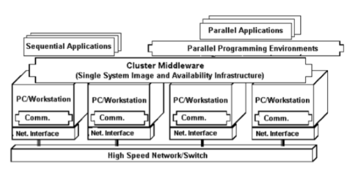
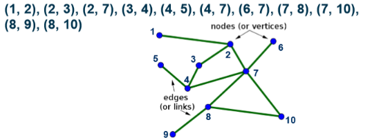

# Clusters

## Fundamentals

### Clustering
- Connecting stand-alone computers with high speed network
- High performance CPU and high speed neworking
- Using "off-the-shelf" components
- Good portablitly and scalability over mainframe computers
- Interest now as very high perofrmance components, highspeed networkign and software for parallel processing

## Cluster Manager
- Allocates reosurces to jobs, subject to jobs reesourece requirements and policy restrictions
- Main parties in a cluster:
  - User: submit job and job requirements
  - Administrator: describing policy restrictions in clusters
  - Cluster manager: monitoring state of cluster, scheduling jobs, tracking resource usage
- Activities:   
  - Queuing
    - Submission contains job description ( job name, location of executable, input data, output data)
    - Resource requirements ( CPU, memory, disk space, network bandwidth)
  - Scheduling
    - Determining at what time a job should be put into execution with which resources
    - Variety of metrics
      - System orientated: throuput, utilisation, average response time
      - User orientated: response time, etc
      - Can condradict
  - Monitoring
    - Status of jobs and resources
    - Resource usage
  - Resource management
    - Hadnling details of 
      - Starting the job execution
      - Stopping a job
      - Cleaning up temporty files after jobs completed / aborted
      - Removing / adding resources
  -  Accounting
     -  Accounting for which users are using what resources and for how long
     -  Eg:
        -  System usage, user usage reports
        -  Tuning the schedule policy
        -  Anticipating future resource needs
        -  Determining area of improvement

### Applications
- Scientifc applications solve linear equations
- Therefore calculating real numbers
- Repeating iterateive steps.

#### Features of scietifc applications
- Calculating real numbers
- Data to be processed often sotred using matrix data structure
- High data lcaolity (spatial locality and temporal locality)
- Cache is critical

#### Graphs
- Some applications, graph data structure is better as matrix can be sparse
- Structe consists of a set of ordered pairs (edges) of nodes
- 
- Good applications eg: neuro interaction
- Online shopping recommendation etc
- But has intensive memory access, as data locality is low
- Therefore not great for clusters

#### Graph 500
- Measure how fast a computer can traverse the edges of a grpah
- *gigateps*
- Billions of traversed edges per second
- Breadth first search used for benchmark.