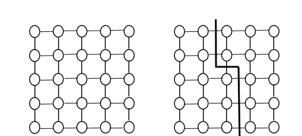

# Clusters

## Fundamentals

### Clustering
- Connecting stand-alone computers with high speed network
- High performance CPU and high speed neworking
- Using "off-the-shelf" components
- Good portablitly and scalability over mainframe computers
- Interest now as very high perofrmance components, highspeed networkign and software for parallel processing

## Cluster Manager
- Allocates reosurces to jobs, subject to jobs reesourece requirements and policy restrictions
- Main parties in a cluster:
  - User: submit job and job requirements
  - Administrator: describing policy restrictions in clusters
  - Cluster manager: monitoring state of cluster, scheduling jobs, tracking resource usage
- Activities:   
  - Queuing
    - Submission contains job description ( job name, location of executable, input data, output data)
    - Resource requirements ( CPU, memory, disk space, network bandwidth)
  - Scheduling
    - Determining at what time a job should be put into execution with which resources
    - Variety of metrics
      - System orientated: throuput, utilisation, average response time
      - User orientated: response time, etc
      - Can condradict
  - Monitoring
    - Status of jobs and resources
    - Resource usage
  - Resource management
    - Hadnling details of 
      - Starting the job execution
      - Stopping a job
      - Cleaning up temporty files after jobs completed / aborted
      - Removing / adding resources
  -  Accounting
     -  Accounting for which users are using what resources and for how long
     -  Eg:
        -  System usage, user usage reports
        -  Tuning the schedule policy
        -  Anticipating future resource needs
        -  Determining area of improvement

### Applications
- Scientifc applications solve linear equations
- Therefore calculating real numbers
- Repeating iterateive steps.

#### Features of scietifc applications
- Calculating real numbers
- Data to be processed often sotred using matrix data structure
- High data lcaolity (spatial locality and temporal locality)
- Cache is critical

#### Graphs
- Some applications, graph data structure is better as matrix can be sparse
- Structe consists of a set of ordered pairs (edges) of nodes
- 
- Good applications eg: neuro interaction
- Online shopping recommendation etc
- But has intensive memory access, as data locality is low
- Therefore not great for clusters

#### Graph 500
- Measure how fast a computer can traverse the edges of a grpah
- *gigateps*
- Billions of traversed edges per second
- Breadth first search used for benchmark.

## Cluster Networking

### Communication
- ommuncation has signficiant impact on application performance
- Communcation is overhead in parallel computing
- Can be improved by:
  - Hardware
  - Software:
    - Maintain data locality
    - Overlap communication and computation
    - Combine small messages into larger ones
  - Network topology
    - Interconnection networks play vital role in clusters

#### General Strcture for LANS
- Shared Network (bus)
  - All processes connected to a single bus
  - Every processor listentening to every message
  - Requires complex protocol
    - CSMA/CD: Carriers sense multiple access with collision detection
  - Collitions can occur - back off policies and retransmission
  - Suitalbe for small networks, communication load is low
- Switched Network
  - Point to point communcations between sender and reciever
  - Simulatenous interal transport - provides high aggregate bandwidth
  - Multuple messages sent simulaneosuly

#### BlueGene/L
- #1 int top 500 2004-2007
- Uses 3D torus
  - Each node connects to six neighbours (bidirectonal)
  - Each link with 1.4 Gbits/s
  - 1.4x 6 x 2 = 16.8 Gbits/s aggreagate bandwidth

#### Fugaku
- #6 
- 150,000 nodes
- 6D Torus
  - 12 nodes interconnected to 2x3x2 trous
  - Torus further connected by big 3d torus

#### Submit
- #9 top 500 2024 june
- 4608 nodes
- Fat tree topology

#### Pleiades
- #3 2008
- 11208 nodes, xeon
- 11D hypercube
  

#### Earth Simulator
- #1 2002-04
- 640 nodes
- crossbar topology

### Metrics

#### Scalability
- numbre of switches needed to interconnect a given number of nodes
- Cost per node

#### Degree
- Number of links to / from a node
- Measure aggregate bandwidth

#### Diameter
- Shortest path between furtest nodes
- Measure latency

#### Bisection width
- Minimum number of links that must be cut in order to divide the topolog into 2 independed networks of the same size
- Measure bottleneck bandwidth, if higher, the network will perform better under heavy load.

#### Graph 500
- Measure how fast a computer can traverse the edges of a graph
- Metrics: gigateps
  - Means billions of traversed edges per second
  - Breadth first search used for benchmark
  - Represents how fast a computer system access its global memory

### Toplogies

#### Cross Bar
- Low resource contention
- Switch scalability poor O(n^2)
- Lots of wiring, cost is high
- EG: Earch simulator (top 1 in 2002-2004)

#### Linear Array and Ring
- Need better scaling
- Can interconnect nodes inot linear array
- Switch scalability O(N)
- Wrap around end nodes to make a 1D torus
- Diameter: O(N) high latency
- Bisection width of 1D linear array: O(1)
- Diameter of 1D torus O(N/2); Bisection width of 1D torus O(2)

#### 2D mesh and Torus
- 2D grid of nodes
- 
- switch scaling O(N)
- Average degree 4
- Diameter for 2D mesh: O(2N^1/2)
- Bisection width for 2D Mesh
  - N is even numebr
    - O(N^1/2)
  - N is odd number
    - O(N^1/2 - 1) = O(N^1/2)
  
  

#### Hyper Cube
- Binary encoding and iterative graph expansion
- K dimension. switches N = 2^k
- Diameter: O(k)
- Bisection width: O(N/2)
- 

#### Binary Tree
- Scaling 
  - n = 2^d processor noodes
  - d = depth
  - 2^(d+1) -1 swiches
- Degree = 3
- Diameter = O(2d)
- Bisection width = O(1)

#### Fat Tree
- Branches near the top of the tree are fatter than branches further down
- Links such that the number of down links of a switch is the saem number of uplinks
- Same diameter as binary tree
- Bisection width = 2^(d-1)
- Degree:
  - Internal nodes 2^(k+1)
  - Lead nodes: 1
  - Root nodes: 2^k
  - k is the level from the bottom

#### Summary

### Switching Techniques

#### Store and forward
- Each switch recieves an entire packet before it forwards onto the next switch 
- useful for non dedicated environment
- Since buffer size is limited, packets will be droopped under heavby load
- Large in-switch latench
- Can detect errors in packets
  

#### Wormhole routing (cut through switching)
- Packet divided into small "flits" flow control digits
- Swtich examines first flit (header) contains destination address, sets up a circuit and forwards the flit.
- Subsequent flits of the message are forward as they arrive (near wire speed)
- Reduces latency and buffer overhead
- Less error detection

#### Perforamnce Model Store and Forward:
- Ts - startup time - time require to handle a message at the sending nodes
- Th - Per hop time, time examing the head of the message
- Tw - Transfer time per byte - if the link bandwidth is r, then Tw = 1/r
- Model of communciation time of sending a message of size L through D Links

](imgs/clusters/image-11.png)

#### Perforamnce Model Cutting Throguih:
- Each message broken into flits
- Size of lfit is f
- First flit that contains destination is examined
- Rest follow same path estabilished
- Model of communciation time of sending a message of size L through D Links

#### Perofmrance model summary
