# GPUs & Parallel IO

## GPUs

### GPU Architecture
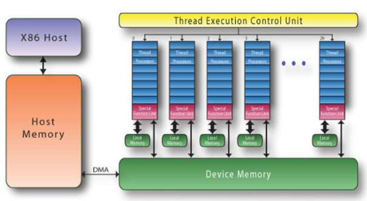

#### CPU design
- First need to understand CPU design
- CPU design focus is to optimise performance of sequential code
- CPU contails CU, control unit
  - Complex instructions + logic:
    - Execute instructions out of order, 
    - Branch prediciton
    - Data forwarding
  - Large cache to reduce data access latencies
  - Powerful ALU
  - Cost of increased chip area and power
- **Latency orientated Design**
  - Minimuse average latency of instructions in sequential code


#### GPU design
- Gpu use large number of simple ALUs for total **throughput**
- Large number of threads (collectivly called a **grid**)
- SOme threads wait for long latency operations (memory access etc), GPU runs over threads
- **Throughput Orientated Design**
  - Maximumse total throughput of large number of threads
  - Allowing indiviudal threads to take longer time

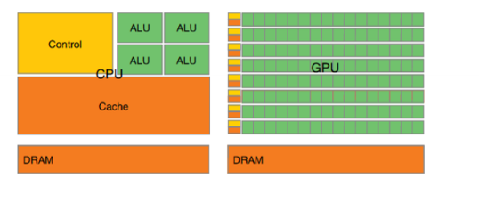


## CUDA
- CUDA program
  - Host code - part run on CPU
  - Device code - part run on GPU
- Use CUDA keywords to mark fucntions
  - `__global__` - function to run on GPU
  - `__host__` - function to run on CPU (host) - by default, all functions host (if no keyword)
- Function to run on GPU = kernal function

### Function Flow
- Allocate memory on GPU - `cudaMalloc()`
- Copy data from host to device - `cudaMemcpy()`
- Launch kernal code to perform computation on GPU
- Copy data from device to host. Free memory on device - `cudaFree()`


### Cuda Threads, Blocks, Grids
- CUDA threads are grouped into blocks, and blocks are grouped into grids
- Grid and blocks can be multidimensional
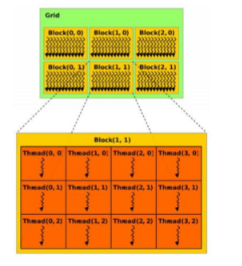

#### Execution Configuration
- Grid size and block size.
```
dim3 grid(3,2,4), block(128,1,1);
vecAdd <<< grid, block >>> (a, b, c);
```
- Threads generated: 128 * 1 * 1 * 3 * 2 * 4 = 3072
- If single values are specified in configuration, it means the grid or block is specified as 1D. 
```
// Run ceil(n/256) blocks of 256 threads each.
vecAdd <<< ceil (n/256.0), 256 >>> (a, b, c);
```


#### Workload Distribution
- Multiple threads run same kernal functions simultaneosuly
- Different threads to process different data items
- Which threads run which data items?
- Threadidx = multiply diemensional index to get i of array. (use thread and block indexs)
- 
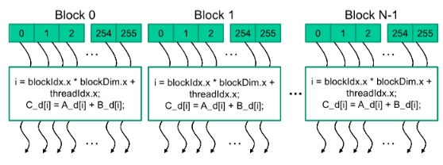
- Use if statement as only first $n$ threads perform the addition (size of array)
- Local variables are private to each thread

### Timing
- Use `cudaEvent_t` for timings on GPU
- As asynchronous executions between CPU and GPU
- After CPU laucnh kernal functions:
  - Places command of running kernal to command queue (maintained by CUDA)
  - CUDA runtime runs commands at its own pace
  - CPU continuse to run subsequent code
  - CPU does not wait for GPU to complete function.
- So synchronisation is needed
  - `cudaDeviceSynchronize()` - wait for all commands in CUDA command queue to finish
  - `cudaEventSynchronize()` - wait for specific event to finish 
  - `cudaEventRecord()` - record event in CUDA command queue after kernal commands, so when we synchronise with this event, we know the other processing has been done.


### CUDA Compilation
- NVCC compiler uses CUDA keywords to seperate host and device code
- Compiles host code with standard C compiler
- Device code with NVCC to PTX code, further compiled by NVCC to executatle at runtime. (Just in time)
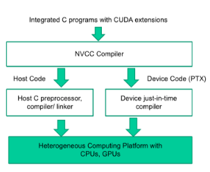


## Parallel IO
- Multiple processes accessing different parts of a common file at the same time
- I/O operations, major bottleneck in some parallel applications
  - Processing sensor data in earth science
  - Biological sequenc analyis in computational biology

### Types of Parallel IO
Say, compute elements in a matrix in parallel, and results need to be written to disk.

#### Early Parallel IO
- All processors send data to process 0 (which writes to disk)
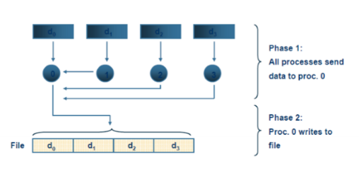

Advantages:
- IO systme only needs to deal with IO from one process
- Doesnt require specialised IO library
- REsults in easier to manage single file

Disadvantages:
- Single node bottleneck
- Single point of failrure
- Poor performance
- Poor scalability


#### Version 2
- Each process writes to its own file
- Now can do things in parallel, better performance.
- But:
  - Small files to manage
  - How to read data back with different number of processors?
  - Does not interoperate with other applications

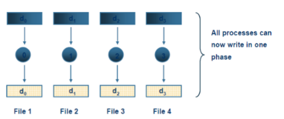

#### Version 3
- Multiple proceses access (read and write) to a common file.
- Advantages:
  - Simulatenous I/O from any number of processes
  - Execelleent performance and scalability
  - Resutls in single file - easy to manage and interoperates well with other applications
  - Maps well onto collective operations
- Disadvantages:
  - More complex to implement - requires complex IO library
  - Tradiationally when one process is acceessing file, other processes are blocked
  - Needs the support of simultatneous access by multiple processes.


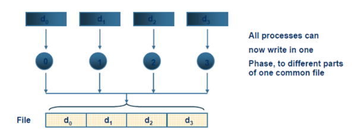

### I/O optimisation

#### Data Sieving
- Combine lots of small accesses into a single larger one
- Reduces number of I/O operations
- Read, just read entire region
- Write:
  - More complicated
  - Read entire region first
  - Then make change
  - THen write block back
  - Requires **locking**

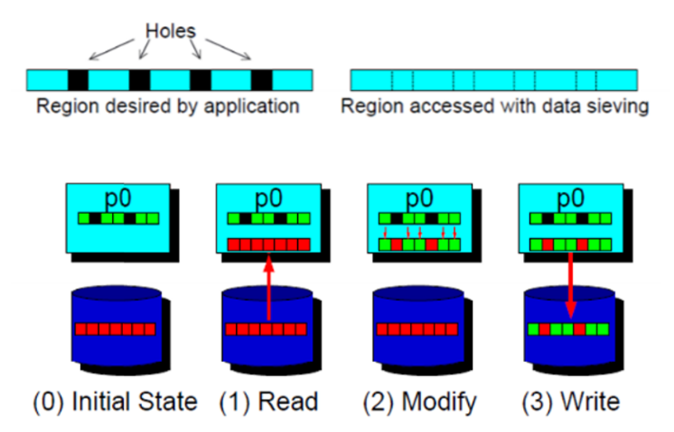


#### Collective IO
- Cooridated access to storage by group of processes
- All collective functions must be called by all processes at the same time.
- Allows IO layers to know more as a whole about the data to be accessed.
- Underlying IO layers know what data are being requested by each process
- First phase reads the entire block
- Second phase moves the data to final destinations
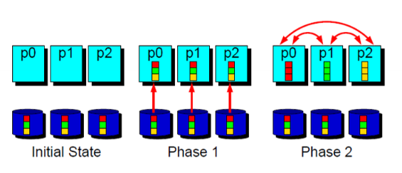

  
### Access Patterns
Consider 16x16 array stored in disk in row major order. Each 16 processes accesses 4x4 subarray.
Aim to combine small IO requests to bigger requests (more efficient)


#### Access Pattern 1 - Independent
- `MPI_File_seek`
  - Updates the individual file pointer according to offset and `whence` (update mode)
  - `whence`: 
    - MPI_SEEK_SET - set file pointer to offset
    - MPI_SEEK_CUR - set file pointer to current position + offset
    - MPI_SEEK_END - set file pointer to end of file + offset
- `MPI_File_read`
  - Read using individual file pointer, into buffer. read out count and datatype, with a stutus.
- One indepenet read request done for each row in the local array. 
- Therefore 64 independent I/O requests.
- Indivudal file pointers per process, per file handle.
- Each process sets the file pointer with some offset
- Data is read into local array. Not a collective operation
- 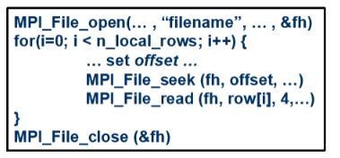

#### Access Pattern 2 - Collective
- Collective version of MPI File Read
- `MPI_File_read_all`
  - Reads out all data at once (of count and datatype)
- All processes that opened the file will read data together (with own access information) (each process accesses the file at the same time)
- Blocking read
- May be useful as indepenet IO operations do not convey what the other procs are doing at the same time.
- 16 indepenet I/O requests.

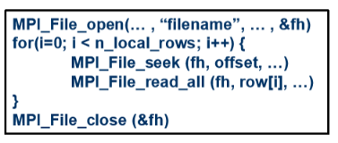


#### Access Pattern 3 - Complementary Views
- File view
  - Set of data visiable to a process in a file
  - Defined:
    - displacement
      - Defines location of where view begins
      - Position relative to beginning of file
    - etype (elementary datatype)
      - Unit of data aceess and positioning
      - Can be predefined or derived datatype
    - Filetype
      - Defines template / pattern in file accessible by a process
- View is a repeated pattern defined by filetype (in units of etype), beginning at the displacement.
- Use `MPI_File_set_view` to set the view

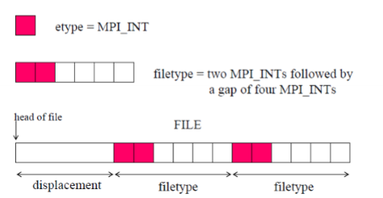


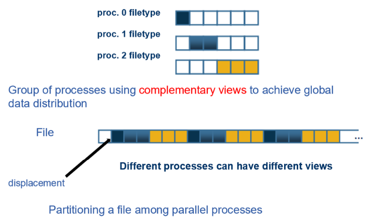

- Each process creates a derived datatype to desribe non-contiguous access pattern
- Thus have a file view and indepentent access.

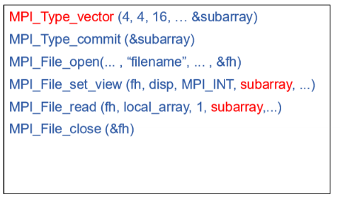
- Creates derived datatype
- Commits datatype
- Open the file as before
- But now changes the process's view of the file
- Set_view is collective
- ALthouhg reads are still independent
- 16 independent requests (each requests conttains 4 non-contigueous accesses)

#### Access Pattern 4 - Collective View
- Instead reads with collective, therefore single collective I/O request.
- Potentially offers the best performance


### Data Access Routines
- Different forms of data aceess routines

#### Positioning
Three postioning methods do not affect each other.

- **Indiviudal File Pointer**
  - When a file is opened by a process - the file pointer is created and owned by the process
  - Accessing with read and write, no positional qualifier (at current file pointer seek position)
- **Explicit Offset**
  - Data access routines that accept explict offsets contain `at` in their name
  - EG: `MPI_File_read_at`
- **Shared File Pointer**
  - When a file is opened collectivly by a group of processes, a shared file pointer is created and shared by processes
  - Data access contain `shared` in their name
  - EG: `MPI_File_read_shared`
  - Use `MPI_COMM_SELF` for a process to open a file indepenedtly of other processes

#### Synchronism
- **Blocking**
  - Call will not return until IO is complete
  - Normal commands eg: `MPI_File_read`
- **Nonblocking**
  - Call initiates IO operation and returns immediatly
  - Add the letter `i` to the start of the command
  - EG: `MPI_File_iwrite`
  - Use `MPI_Wait` to wait for completion
- Thing to note
  - Dangerous to access the buffer before the IO is complete
  - Use MPI wait to ensure the IO is complete


#### Nonblocking Collective I/O
- Also called Split Collective I/O
- Begin routine begins operation (much like a nonblocking operation, MPI_File_iwrite)
- End routine completes the operation (much like matching wait MPI_Wait)
- Eg: 
- 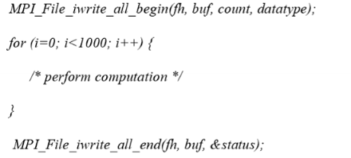


### IO Consistency
- When one or more processes write to a file, need to ensure conssitency
  - One process writes a data, the same processes read the data later
  - One process writes data, another process reads the data
  - Two processes write to the same data
- Routine is considered completed when teh application buffer is copied to the system buffer. 
  - But system will only write to disk when neccessary (or can be forced by closing and opening)
- MPI Automatically guarantees the conssitency in some cases.
- When it does not, the user must ensure the consistency

#### Example 1
MPI guarantees consistency. Both processes work on own data.
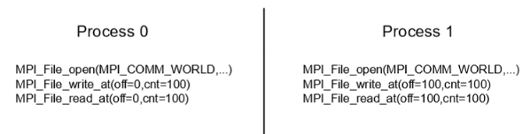

#### Example 2
- Each process has overlapping accesses.
- MPI does not guarantee consistency (even with MPI barrier)
  
  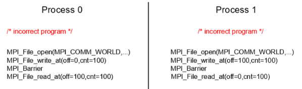

Therefore user needs to maintain consistency

#### User Implemented Consistency
- 3 options
  - Set atomicty to true
  - Close and open file
  - MPI File Sync

**Set Atomicity**
- Set atomicity to true
- Step of writing data to the system buffer and the step of transfering data to storage devices becomes an atomic operation
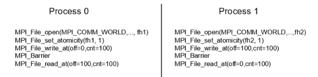


**Close and Open**
- Closing and opening foraces all previous writes to be transfered to storage devices

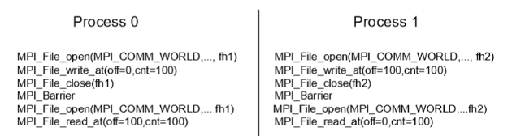

**MPI File Sync**
- Causes all previous writes to be transfered to storage devices
- Does not close the file
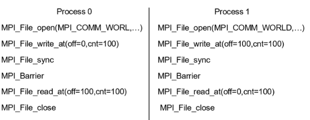


### MPI File Infor Hints
- MPI_Info
  - Key value pair
  - Parameter for set view and open.
  - Provides hints to enable an implemntation to deliver increased IO performance or minimize use of system resources
  - All implementation is free to ignore the hints

### Data Representation
- Parameter for set view and open
- Representations are related to file interoperability (the ability to read the data previously written to a file)

#### Native
- Data is sored ina  file exactly as it is in memory
- Pros:
  - Data precsiion and IO performance (used in homogeneous environemnt)
- Cons:
- Not portableLoss of transparent interoperability
  - (Cannot be used in a heterogeneous environment)

#### Internal
- Data is stored in an implementation dependednt format
- Perform type conversion if neccessary
- Can be used in an heterogeneous environment

#### External32
- Data on storage medium is always in standard representation (big-endian IEEE format)
- Data can be recognised by other applications
- 