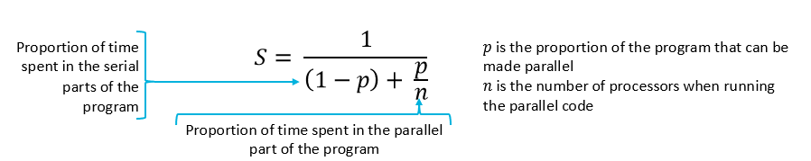

# Introduction

HPC is the study of performing huge calulcations on massive  machines as fast as possible.

To increase performacne
- Improve parallel code
- Transistors smaller (more in same space)
- More cores to processors
- More smaller machines to overall

## Methods

### Moores Law
Moores law states that the number of transistors on a chip doubles every 18 months. This means that the performance of computers will double every 18 months. This is not true anymore, as we are reaching the limits of silicon technology.

### Amdahls Law
Proposesd in 1967 by Gene Amdahl

Serial improvements - increase clock speed, core complexirty
Parallel imrpovements - increase number of cores

### Flynss Taxonomy
Classification of computer architectures based on the number of instruction streams and data streams.

- Instruction stream: provides list of operations
- Data stream: Provides List of data

Each can be accessed by a single or mutiple processorr uni

#### SISD
- Single Instruction Single Data
- Simplest, serial processors
- Mainly seen on older machines
- To improve:
  - Increase clock speed (requires higher voltages and more cooling)
  - Increase number of transostrs (hitting the limit)
  - Increased complexity (already complex)
- Expensive to design and improve

#### SIMD
- Single Instruction Multiple Data
- One instruction stream, multiple data streams
- SSE or AVX
- Also GPU vectorization

#### MISD
- Multiple Instruction Single Data
- One peice of data operated upon by multiple instructions within same clock cycle
- Not common

#### MIMD
- Multiple Instruction Multiple Data
- Most common
- Allows for independence across unrelated inscructions

## Levels of Parallelism

## Supercomputers
- One big processor bad
  - Expensive
  - Difficult to design
  - Thermal output hard to manage
  - Single point of failure
- So connect lots of small computers together. 
- 

### How to imrpove supercomputers
- Improve computer architecture (better pressors in compute nodes)
- Improve interconnects
- Improve compiler
- Improve algortihm in program
- Allow for multiple jobs and resoure s to work at the same time

### CPU architecture
- Clock speed
- Transistor count
- More cores
- Multiple chips

#### Intel Xeon Phi Knights Landing
Took inspiration from GPUS, so made hupride
For CPU-type paralleisim
- Huge amount of cores
- Faster access to data
- Code was designed to utilise

#### ARM Marvell ThunderX2
- Faster interconnect between cores, cache and main memory (as memory bandwith big issue)
- Thunder X2 Arm based has multiple interconnects, multiple paths to cache.

#### GPUs
- High bandwith memory, lots of small cores.

### Networking

Data needs to be passed between nodes and files systems.
- To reduce network time:
  - Faster communication methods removing unnecessary packets etc
  - Reduce number of network switches
  - Reduce amount buffer time on network cards
  - Reduce congestion on network

#### 100 Gigabit Ethernet
- Copper and fibre optics
- Relativly new

#### Infiniband
- 80 Gbps
- Older but much more common
- Proprietary connectors, fibre optics

#### Paradigms
- Dragonfly
  - Multiple interconnected group
  - Expensive to design and implment
- Fat Tree
  - Tree structure 
  - Compute nodes = leaves
  - Switches = nodes
  - Can have large congestion
- Torus
  - nodes connected in looping cube
  - Very complex and expensive

## Compilers

- programs translate human readable code into machine code
- More complex processors -> more complex instructions
- Compilers constantly need to develop to:
  - Better optimise code
  - Make use of new architectures and instructions
  - Exploit hardware optimisation

#### Intel DPC++ / oneAPI
- Many PCS built with intel Xeon CPUS
- Intel built to exploit new features, hidden knowledge, better optimisations
- Can be used on other processors, may not be optimal.

#### Clang and LLVM
- many compilers closed-source proprietary
- So LLVM: compiler language to interconnect programming langauges and processors using **intermediate representation**
- Clang: C compiler based on LLVM
- Open source, active

## Algorithms
Algorithms need to be designed to be parallelised.
- Loops have no dependeices
  - Flow dependency: one loop depends on the result of another $a=x+y \quad$ $b=a+c$
  - Anti-dependency: one loop depends on the result of another $b=a+c \quad$ $a=x+y$
  - Output dependency: one loop depends on the result of another $a=2, x=a+1, a=5$
  - Control dependency: branching statements
- Loops can be run together

Discussed more later

## Workload and Resource Manageer
Inefficient for single person to be only person allowed to use machines, dont want free access for everyone.

### SLURM
- Most common
- Open source
- Normal Use;
  - Installed on login node
  - Allocate jobs to queue
  - When resources available, job is run
  
### PBS
- Portable Batch System
- Proprietary
- Allows more control over how queue is manage
- Can be difficult for new users
- Large super computer *Archer2* uses this