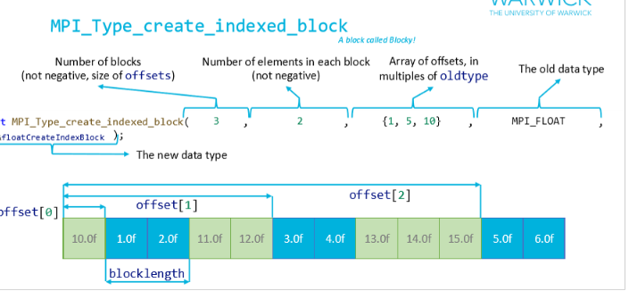

# MPI

## Comparison with OpenMP
- Open MP paralellsises on shared memeory
  -  great on single computer, not on supercomputers (data may be stored on another computer)
-  Open MP implemented at compile time (makes code easier, and fine grinded control)
-  MPI passes **messages** between processors
-  Messages are passed, therefore dont need to be on the same computer.
   -  Sent over network if remote
   -  Stored in memory if local
  

## What is MPI?
MPI is an interface, therefore lots of implementations and built for FORTRAN, C and C++.

### MPI initialisation
First initialise the environemnet, get some basic ifnromation about the environement (rank = current processer number, and total number of processors.). Then can do computation and finialise to tidy up.

#### MPI_COMM_WORLD
Allows to split processors up into differnt sections (*MPI Communicators, MPI_COMM*).
-  MPI_COMM_WORLD is the default communicator, which includes all processes.
-  Only really needed for more complex things 
 

### Data Passing
Pacekts of data are transmitted, could be anywhere on the newtwork. 
THerefore need an **envelope** containing:
- message length
- flags
- tags
- Rank
- Context etc

MPI manages all the routing and ackhlodgement of messages.

### Communciation Modes
Flexbility of how communications are achieved.
- **B**uffered - send instructions can start at any point, and may complete before a corresponding recieve instruction is ececuted
- **S**ynchronous - send instructions can start whenver but can only comple successfully when a recieve instruction is executed. 
- **R**eady - Send can only start if the recieve has been executed.

Can be incorporated to blocking or non blocking.

#### Barriers
-  All processes must reach the barrier before any can continue
-  Can be used to synchronise processes
-  Can be used to ensure all processes have completed a task before moving on

### MPI Types
MPI has built in types, but also can combine types to create new types to optimise data flow for non-contigiuous data.

Options to deal with non-contiguous memory:
- CAll MPI send for each block - lots of messaged - overhead, congestion
- Copy all data into contiguous block - better than above, but still overhead. not great when dealing with large amounts of data, where memory is limited.
- Or derived datatypes

#### Derived Datatypes
Geneate own datatypes. 
- Useful as can send a message with different types of data and / or contiguos memmory
- Key types:
  - `MPI_Type_contiguous` - contigous memory
  - `MPI_Type_vector` - non-contigous memory
  - `MPI_Type_create_struct` - non-contigous memory
  - `MPI_Type_create_indexed` - non-contigous memory
  - `MPI_Type_indexed` - non-contigous memory

#### MPI_Type_contiguous
- Collection of eleements with variable amount of counts
- Allows for better reuse and and less calculations.

#### MPI_Type_vector
- Conesecutive block of contiguous data
- Each block between blocks need to be equally space, the same size and all the same type.

#### MPI_Type_create_indexed_block
- Sometimes need multiple offsters.
- Requires the same number of elements in each block, and them all the same type.

#### MPI_Type_indexed
- Sometimes the data blocks arent the same size
- Requires all the elements to be the same type

#### MPI_Type_create_struct
- Sometimes the blocks are different types
- Requires the elements within each individual block to be the same tiype

#### Overview

## Multi Message MPI

#### Broadcasting
- One message to all
- `MPI_Bcast`

#### Scatter
- Scatters buffer between all the processors
- Each rank gets different bits of data

#### Combinations
Combine broadcasts, scatters and gathers together if needed
- `MPI_Allgather` - a gather than broadcast of result
- `MPI_Alltoall` - an all gather but where different ranks recieve different data

#### MPI Reduce
- Similar to OpenMP reduction
- Has different types of reduction
  - Can create custom if needed
  - `MPI_Allreduce` reduces then broadcasts. one of the most expensive instructions - but slighly more efificently than doing seperatly.
  
### Packets
- MPI does not specify how data should be sent. 
  - Depenednt on the network card, interface, memory etc

- **Smaller Packets**
  - Copying data from memonry to network can be interspers
  - Packets available more qucikly
- **Larger Packets**
  - Ratio of data to metadata is better
  - Cost of copying memory vs the injection rate of messages to the network

- So there is not really optimal packet size. 
  - Many factors affect optimal
  - Network card, memory, network interface, network congestion, etc
  - MPI treats all messages the same - so in theory shouldnt matter
  

### Domain Decomposition
- Split the domain into smaller sections, each processor needs its own block of data to operate on
- For physics applications
  - Relativly same sized
  - Data is only sent when required.

#### 1D Domain Decomposition
- Split along 1 edge, each processor gets a block of data
- Edge data needs to be sent to neighbours
- IE, 0 and 3, need to send 8 cells, 1 and 2 need to send all cells (16)

#### 2D Domain Decomposition
- Split along 2 edges, each processor gets a block of data
- Each data needs to send data to all neighbours

#### Halos
- Trying to merge data can be difficult and expensive
- Therefore fix, each block has a halo
  - Duplicate of data from neighboruign ranks
  - Flexible size depending on access patterns.
  
