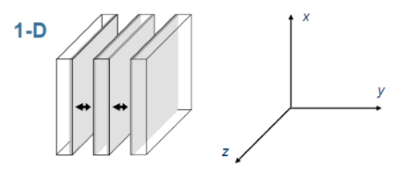
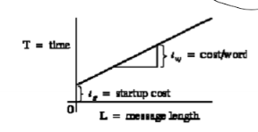
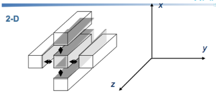
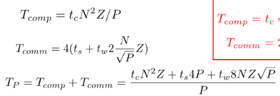
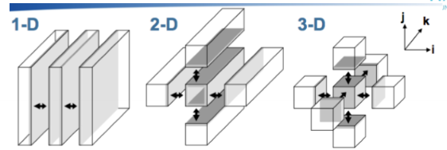
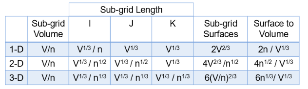
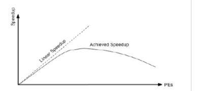
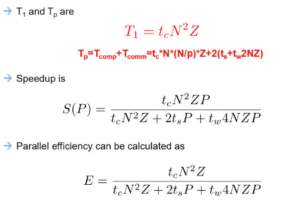
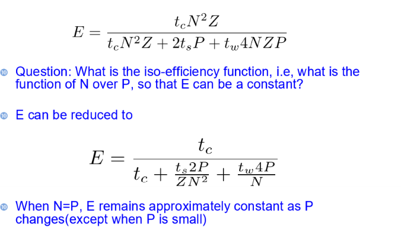
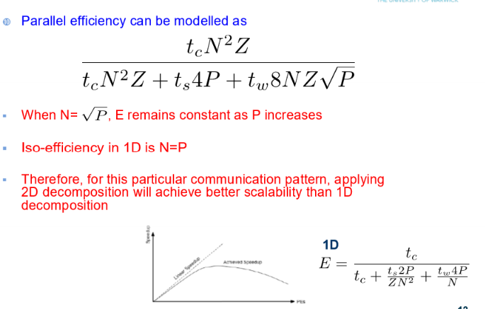

# Programming Models & Performance Modelling

## Performance, Protability, Productivity
- Comparing different paralllisim methods is diifficult
  - How does it affect compile time
  - How does it affect runtime
  - How does it trnaslate between different hardware software model
  - What is the overhead / cost to utilisng a prallesiation model
  - How easy is it to develop in
  - How easy is it to incorporate into already exisisin code

### Performance Portability
> A measurement of an aplications performance efficiency for a a given problem that can be executed correctly on all platforms in a given set.
- Application effiicency = achieved time / fastest time
- Archiecture efficiency = Achieved GLOPS / Theoretical peak GLOPS
    - Or memoery bandwidth efficiency

$$
P(a,e,H) = \frac{|H|}{\sum_{i\in H} \frac{1}{e_i(a,p)}} 
$$

- If $i$ is supported $\forall i \in H$ otherwise $P(a,e,H) = 0$
- $H$ is a set of platforms
- $a$ is the application
- $p$ is the parameters for a
- $e$ is the performance efficiency measure

## Modelling

### Communication Pattern & Decomposition
- Problems need to be decomposed into smaller problems
- Commmonly use a 5-point stencil that uses surrounding points
  

### 1D Modelling
- Grid of size $N \times N \times Z$ points along y axis among $P$ processors
- 

#### Subgrid Size
- Each processor responsible for $N\times (\frac{N}{P}) \times Z$ points along y axis
- Makes sense as whole volume is N*N*Z, so divided by P.

#### Time for computation
- Each processor computes $N\times (\frac{N}{P}) \times Z$ points
- Takes $t_c$ average time to calculate a sigle point

$$
T_{comp} = t_c \times N \times (\frac{N}{P}) \times Z
$$

#### Time for message sending
$$
T_{msg} = t_s + t_{w} L
$$

- $T_{msg}$ - Time spent on sending one message
- $t_s$ - Startup time
- $t_w$ - transfer time per byte
- $L$ - size of message in bytes

#### Communication time for caluclating a subgrid 
$$
T_{comm} = 2 (t_s + t_w \times 2 \times N \times Z)
$$
As 1D needs to send 2 messages, one to the left and one to the right. The size is one strip of the grid 

#### Performance Model of Execution Time
$$
T_{p} = T_{comp} + T_{comm} = t_c \times N \times (\frac{N}{P}) \times Z + 2 (t_s + t_w \times 2 \times N \times Z)
$$

- As increase p, execution time decreases - the propotion of the communication cost increases.
- As N, Z, t_c t_s, t_w increase, execution time increases.

### 2D Modelling
- Grid of size $N \times N \times Z$ points along x and y axis among $P$ processors

#### Performance odel of Exectuion Time

### Surface to Volume Ratio
Boundary surfaces between subgrids. Data needs to be communicated. 

- The lower surface-to-volume ration, the better
  - As surface = communication
  - As volume = computation
  - Means lower proportion of communication time in total execution time,

## Speedup
- Ratio of exeuction time of serial implementation to execution time of parallel implementation
- Good speedup:
  - Linear is optimal
  - Max speedup for parallel implementation is $P$ (number of processors)
  - As splitting serial application among p processors
  - Assume no overhead / communication etc.
  
#### General Trend
- First, speedup increases as number of processors increases,
- After reaches a maximum speedup
  - Adding more processors can harm performance
- Gap from maximum speed also increases
- Because:
  - Surface to volume
  - No program is 100% parallel efficient.

### Iso Efficiency
- How the amount of computation performed (N) must scale with the processor number P to keep parallel efficiency E constant.
- $E = \frac{N}{P}$
- Lower order of P, higher scalability
- Eg:
  - $N = O(P)$ - linear function / algorithm p - eg increase p by factor of 5, only need to inrease N by factor of 5. therefore **more scalable**
  - $N = O(P^2)$ - quadratic function / algorithm p - eg increase p by factor of 5, need to increase N by factor of 25. therefore **less scalable**

#### 1D Iso Efficiency
When $N=P$, E remains approxmailtly constant as P changes (expect with small P)

#### 2D Iso Efficiency
When $N=\sqrt{P}$, E remains constant as P increases. Therefore better scalability (for this communication pattern)

### Speedup Approach
- Speedup approach - we can say:
  - "this algorithm achieved a speedup of S on p processors with problem size N"
- But cannot judge quality of algorithm by single speedup data.
- So use Amdahl's law that takes into account elements that are not parallelised.

### Amdahl's Law
- Applications may contain elements which arent parallelisable.
- Max achievable speedup is limited by the serial portion of the application.
- Where $f$ is serial fraction of the application
- $S(n)$ is speedup on n processors
$$
S(n) = \frac{n}{(1-f) + \frac{f}\times {n}} \leq \frac{1}{f} 
$$

- Limitations:
  - Can only tell upper bound of speedup
  - Cannot tell if algoithms with better parellsism exist

### Asymptotic Analysis
- Asymptotic analysis is used to determine the performance of an algorithm as the size of the input increases.
- Ignore lower-order term
- Only tell order of execution time. not actual
  - 