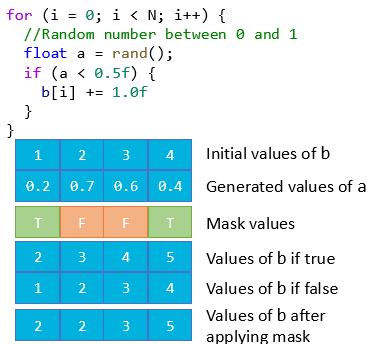
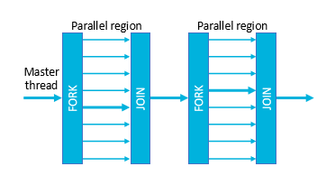

# Thread Level Parallelism

#### Thread
An execution context for a processsor, including a stream of instructions
- Limited to particular **Non Uniform Memory Access (NUMA)** region.

#### Control Dependency
Actions of further instructions depenedent on curretn state. 
- Easiest way to fix is to design algortihm to remove branches.
- Or masking:
    - Run both sides of the branch at the same time, and keep the results that accutally occur at the end.

### Data Dependency
Multiple instructions act on the same piece of data
  - Flow dependency: one loop depends on the result of another $a=x+y \quad$ $b=a+c$
  - Anti-dependency: one loop depends on the result of another $b=a+c \quad$ $a=x+y$
  - Output dependency: one loop depends on the result of another $a=2, x=a+1, a=5$
- Some can be fixed.

### Synchronisation
- Threads need to be synchronised to ensure that they are not trying to access the same data at the same time.
- Threads run asynchornously
- Mutex Locks - stops other treads from accessing the data until the lock is released.
- Cooperation - wait and notify

### Problems with Multithreading

#### Race Condition
Threads update the same data at the same time. Fixed with a lock.

#### Deadlock
Two threads are waiting for each other to release a lock. Make sure threads dont take all the locks

#### Starvation
One thread is always waiting for another thread to release a lock. Fixed by switching threads explicitly

#### Multithreading vs Multiprocessing
Porocess records running state (managed by the OS), threading is just concerned with the memory stack.
- Threads exist within process (as many as you want)
- Not time slice for each thread, time slice for each process (dont have to worry aout starvation)
  - Threads usually switch faster, 
  - Threads can hold all the time. 

### Pipelining
Instructions broken into multiple statges / functional units. Therefore directly conecting = **pipeline** or superscaler
- Aim to fill pipeline
- But difficult:
  - Dependicenies across instructions (horizontal
  - Long latency instructions (vertical)
  - Branches (control dependency)

#### Superthreading
Aim reduce vertical waste. Each clock cylce contains onle threads instructions. 

Switch between threads each clock cycle. (AKA fine grained multithreading)

#### Hyperthreading
Aim reduce all waste. Each clock cycles contains multiple threads instructions.
- AKA simultaneous multithreading (SMT)
- Fouund in most modern processors
- Appears as multiple cores to the OS (4 core machine, 8 threads)

## OMP
Pragma based multithreading library
- Compiler manages threads
- Just use pragamas to tell compiler what to do

### Fork Join Model
Threads are created (forked) and destroyed (joined) as needed.

Althernativly thread pool: a collection of persistent threads that work should be allocated to. Not used by OpenMP.

### Private Variables
Specifies list of variavbles that are local to that thread. can be performant as dont need to share
- Private, not given an initial state
- firstprivate, initial variable set to the value of the variable at the start of the thread
- lastprivate, last value of the variable is copied back to the original variable from the primary thread.

### Schedules
Specify how work is split up between threads. Most common:
- Static - workload split evenly between threads before compute
- Dynamic - workload split into even sized chunks, threads request chunks when required.
- Guided - same as dynamic, but size of chunks decreases as time goes on.

Great for load balancing and or reducing overhead.

### Syncing Threads
Critical - Runs the code in a single thread - allows for multi-line statements.
Atomic - Ensures memory location is accessed without conlit - lower overhead

### Reductions
Allows for the same operation to be applied to the same variable across multiple threads.
Often faster than atomic or critcal

