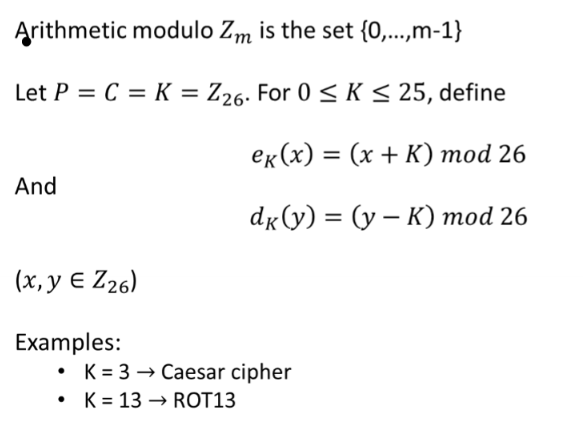
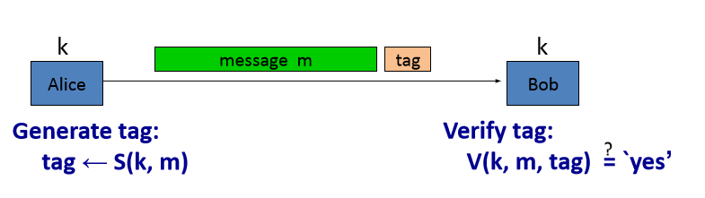
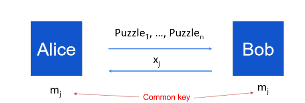

# Elementary Cryptography

<equation-table>

| [Classical Cryptography](#classical-cryptography) |                                                                                     |
| ------------------------------------------------- | ----------------------------------------------------------------------------------- |
| [Modular Arithmetic](#modular-arithmetic)         |                                                                                     |
| [Data Range](#data-range)                         |                                                                                     |
| [Cipher](#cipher)                                 | Crypotgraphic algorithm to encrypt and decrypt data                                 |
| [Key](#key)                                       | Ysed for encryption and decryption                                                  |
| [Keyspace](#keyspace)                             |                                                                                     |
| [Cryptanalysis](#cryptanalysis)                   |                                                                                     |
| [Types of Attack](#types-of-attack)               |                                                                                     |
| [Confusion](#confusion)                           | Obscures the relationship between plaintext and cipher text - IE substituing        |
| [Diffusion](#diffusion)                           | Dissipates reducnecy of plaintext by spreading out over the cipher text. IE tran... |
| [Substitution Cipher](#substitution-cipher)       | Monoalphabetic: replace each letter with another letter                             |
| [Shift Cipher](#shift-cipher)                     | ERR                                                                                 |
| [Vigenere Cipher](#vigenere-cipher)               |                                                                                     |

| [Stream Cipher](#stream-cipher)                                   |     |
| ----------------------------------------------------------------- | --- |
| [Perfect Secrecy](#perfect-secrecy)                               |     |
| [Recurrence](#recurrence)                                         |     |
| [Weakness](#weakness)                                             |     |
| [Basic structure](#basic-structure)                               | ERR |
| [Iterated Construction](#iterated-construction)                   | ERR |
| [Pseudo Random Function (PRF)](#pseudo-random-function-prf)       |     |
| [Pseudo Random Permutation (PRP)](#pseudo-random-permutation-prp) |     |
| [Invertible Design](#invertible-design)                           |     |
| [Double DES](#double-des)                                         |     |
| [Triple DES](#triple-des)                                         |     |
| [Sub Bytes](#sub-bytes)                                           |     |
| [Shift Rows](#shift-rows)                                         |     |
| [Mix Columns](#mix-columns)                                       |     |
| [Key Schedule (AES128)](#key-schedule-aes128)                     |     |
| [Varietns of AES](#varietns-of-aes)                               |     |
| [Electronic Code Book (ECB)](#electronic-code-book-ecb)           |     |
| [Cipher Block Chaining (CBC)](#cipher-block-chaining-cbc)         |     |
| [Cipher Feedback (CFB)](#cipher-feedback-cfb)                     |     |
| [Output Feedback (OFB)](#output-feedback-ofb)                     |     |
| [Counter (CTR)](#counter-ctr)                                     |     |

</equation-table>

<div class="equations">

## Classical Cryptography

### Quick Maths

#### Modular Arithmetic
- a, b integars, and m is positive integer
- $a \equiv b \mod m$ if m divides by b-a
- Phrase is called **congruence**
  - Read as "a is congruent to b modulo m"
- Integer m is called the **modulus** 

#### Data Range
- Some langauges define $a \mod m$ in the range of -m to m, but we define as always not negative.
- 

### What is Cryptography?
- Art and science of keeping information secure
- Classical Cryptography = based on characters - human 26 elements
- Modern Cryptography = based on binary - computer - 2 elements

#### Cipher
Crypotgraphic algorithm to encrypt and decrypt data

#### Key
Ysed for encryption and decryption

#### Keyspace
- Range of the kye

#### Cryptanalysis
- Analysis of weakenesses of cipher algorithms
- Attack
- Cryptology = Cryptograph + cryptanalysis


#### Types of Attack
- Ciphertext only
- Known plaintext
  - WW2, german ciphertext started with a data
- Chosen-plaintex
  - Breadking secret code
- Chosen-ciphertext
  - Job to deduce the key
  
#### Confusion
Obscures the relationship between plaintext and cipher text - IE substituing

#### Diffusion
Dissipates reducnecy of plaintext by spreading out over the cipher text. IE transposing plain text.


### Example Ciphers

#### Substitution Cipher
Monoalphabetic: replace each letter with another letter

Polyalphabetic: Made up of several monoalphabetic ciphers


- K consists of all possible permuations.
  - Therefore the keyspace is $26!$ 
- But large key space does not mean secure
  - As can be broken by frequency analysis
  - Substitution ciphers only provide confusion, need both confusing and diffusion.

#### Shift Cipher


- Not secure, can be broken by **exhaustive search**
- Only 26 possible keys
- One average 26/2 = 13 tried.

EG:
- Caesar Cipher
  - Shift each letter by a fixed amount
  - Key = shift amount
  - Keyspace = 26
  - Weakness: frequency analysis
- ROT13
  - Shift by 13
    - As can shift either direction to get back to original
  - Keyspace = 26
  - Weakness: frequency analysis


#### Vigenere Cipher
- Polyaphabetic cipher - based on combining few caesar ciphers into one.

**Cryptanalysis**:
- Two steps:
  - Find out the key length $m$
  - Find out each letter in teh key.

**Kasiki Test**
- First method, search for identical segments and count how many positions apart.
- IE: 15 positions apart, therefore key length is either 3 or 5.

**Index of Coincidence**
- Second method
- Index of coincidence of a string of characters is the probability that two randomly selected characters are the same.
- String of $n$ with 26 characters, the index of coincidence is:


where occurrence of A = f_0, occurrence of b = f_1, etc.

- Normal Enlish text: 0.065
- Random text: 0.038
- Normal english text shifted by a fixed number: 0.038
- English text encrypted by vigenere cipher: ??

Then feed the text into matrix [n, m] where m is the guessed key length and find the index of coincidence for each column. Find the m that gives the result closest to 0.065

Then break each shift cipher. 

</div>

<div class="equations">

## Stream Cipher
- Encrpts individual characters one at a time.

### One Time Pad
- Simplest cipher with perfect secrecy
- 1917, Gilber Vernam

$$
c_i = k_i \oplus m_i
$$


#### Perfect Secrecy
- A crytosystem has perfect secrecy if $P(m|c) = P(m)$ 
- Probabily of plaintext given ciphertext is equal to the probability of plaintext.
- Therefore, the ciphertext does not give any information about the plaintext.
- Therefore one time pad has perfect secrecy. 
- However, perfect secrecy requires the size of the keylenght be larger than the message length.
- Hence why called one time.
- Thus "perfect" but impractical"

### Synchronous Stream Cipher
- Unable to recover from loss of synchronisation
- Idea: use a short secret key to generate a very long key stream
- Start with $m$ bits (k1, k2, k3 ... km)
- Then generate the key stream using a linear recurrence of degree m.


- Can be produced with **Linear Feedback Shift Register (LFSR)**
  
  

#### Recurrence
- After a period, the same key stream will recurr.
- And using the same key twice, can be broken.
  


#### Weakness
- Example
  - CSS: Content Scrable System
  - Used in DVDs, to prevent piracy
  - 40 bit key
  - But only 16 bits for security
  - So can break
    - Try all 17 bit LFSR to get 20 bytes output
    - Subtract from the first 20 bytes of stream output
    - If consistent with the 25-bit LFSR, then found the key.
  - Security through Obscurity doenst work 

### Self-synchronising Stream Cipher
- Able to recover from loss of synchronisation


## Block Cipher

### Overview

#### Basic structure


#### Iterated Construction

Where R(K_x,. ) is a round function, K is the key, and n is the number of rounds.
- DES 16 rounds, 3DES 48 rounds, AES128 10 rounds

DES = Data Encryption Standard

### Functions

#### Pseudo Random Function (PRF)
- Defined over (K, X, Y)
- $F: K \times X \to Y$
- Such that:
  - Exists an "efficient" algorithm to evaluate F(k,x)

#### Pseudo Random Permutation (PRP)
- Defined over (K, X)
- $E: K \times X \to X$
- Such that:
  - Exists an "efficient" algorithm to evaluate E(k,x)
  - The function E(k,.) is **one to one**
  - Exists an efficient inversion algorithm D(k,.)


A PRP is a PRF where:
- X=Y
- It is invertible

### Fiestel Network
- Need better efficiency
- Can we use the same circuit for both Encrypting and decrypting?


#### Invertible Design
- Can do the inverse operation by swapping L and R
  


On the last round, dont swap the left and right sides, so the decruption can be applied without swapping them.


### DES 16 Round Fiestel Network


- 32 bit input pddeded to 48 bits
- Padded inpit added to the key
- Input divided into 8 groups of 6 bits of input sent to S boxes (look up tables)
  - $S_i: \{0,1\}^6 \to \{0,1\}^4$
  - Take row corresponding to the outer 2 bits and the column corresponding to the inner 4 bits, and find where they intersect.
  - Provides confusion. 


- P box - defines permutation over 32 bits
  - $P: \{0,1\}^{32} \to \{0,1\}^{32}$
  - Provides diffusion
  - 


- Choosing S and P boxes
  - Choosing random = results in insecure block cipher
  - No ouput bit should be close to a linear function of the input bits
  - S-Boxes are 4-1 mapping


### More Secure DES
- 56 bit DES is too weak - can be brute forced

#### Double DES
- Encrypt twice, with 2 keys
- Double key = 112 bits
- $c = E(k_2, E(k_1, m))$

- But vulnerable to meet in the middle attack - knowing a few (m, c) pairs


#### Triple DES
- More secure combination
- Few varients:
  - $k_1 \neq k_2 \neq k_3$ - keysize of 168 bits, security 112 bits
  - $k_1 = k_3$ - keysize of 112 bits, security 80 bits
  - $k_1 = k_2 = k_3$ - keysize of 56 bits, security 56 bits


### AES
- Advanced Encryption Standard
- Substituiton permutation network (not feistel
  - Mix together all the bits rathaer than just half at each round
  - Needs fewer rounds as a result


#### Sub Bytes
- Substitiion cipher
- See lectures for math backing (Block Cipher II)
- $a$ is an element of $GF(2^8)$ (finite field)
  - inverse = $a^{-1} = {a_7 a_6 a_5 a_4 a_3 a_2 a_1 a_0}$ 
- For $i = 0, 1,2, \ldots, 7$,
  - $b_i = (a_i + a_{i+4} + a_{i+5} + a_{i+6} + a_{i+7} +c_i) \mod 2$
- Output:
  - $b_7 b_6 b_5 b_4 b_3 b_2 b_1 b_0$
- Can be proven to be **one to one** mapping
- Not random unlike DES
  - Defined in a finite field
- Doesnt have to be hard coded (like DES)
  - Compact software implementation
- Flexible tradeoff between code size and perforamnce.

#### Shift Rows
- Shift each row by a number of bytes
- 

#### Mix Columns
- Each byte in a column is replaced by 2 times that byte plus 3 times the next byte plus the byte that comes next plus that byte that follows
- $u_i$ = f(s_0, s_1, s_2)


#### Key Schedule (AES128)
- Expanding 16 bytes eleven times to 176 bytes
- Defines a word as consistending of 4 bytes


- Function: 
  - Rotate a byte to the left
  - Substitute each byte with the S-box
  - XOR the result with some constant


#### Varietns of AES
- Block size = 128 bits
- Different key sizes: 128, 192, 256
  - AES128 = 10 rounds
  - AES192 = 12 rounds
  - AES256 = 14 rounds
- AES128 is the most common
  - Key scheduling algorithm is the best 

### Modes of Operation
- Defines how a block cipher is applied to encrupt data
- Electronic Code book (ECB)
- Cipher Block Chaining (CBC)
- Cipher Feedback (CFB)
- Output Feedback (OFB)
- Counter (CTR)

#### Electronic Code Book (ECB)
- Simplest
- Encrypt each block independently
- Deterministic - same plaintext block will always encrypt to the same ciphertext block
- Problem: blocks of plaintext that are the same will encrypt to the same ciphertext
- Therefore, if the same block is used multiple times, it will be easy to see.


#### Cipher Block Chaining (CBC)
- Most common
- Ciphertext of the previous block is XORed with the plaintext of the current block before encryption
- Therefore, the ciphertext of each block depends on all previous blocks
- Uses initialisation vector (IV) to ensure that the first block is different
- IV is random, and not secret
  - Therefore same plaintext will encrypt to different ciphertext

$$
c = E(k, IV \oplus m) \to m = IV \oplus D(k, c)
$$
- Padding
  - Padd the last block with $n$s where $n$ is the number of bytes used to pad 
  - If the plaintext is a multiple of the block size, then pad with block size (one whole block)
- If a plaintext block is changed, all subsequent blocks will be changed
- If a whole block of ciphertext is lost, cbc can synchronise itself ( but not if a byte is lost.)
- Cannot be parallelised (as serial chain)
- If the decrypted padding is found to be invalid, the server rejects the whole message with an invalid padding error.

**Padding Error Attack**
- Feed modified ciphertext to the server
  - IV, C1, C2 $\oplus$ R, C3
- Where R is 16 bytes: $R = {r0, r1 \ldots, r15}$
- So try r15 from 0 to 255
- 255 times will decryption fail, expect when p3 ends with 01. 
- Therefore last byte of p3 is $r15 \oplus 0x01$


- Then recover the second last byte of P3
  - Fix last byte to $r15 \oplus 0x01 \oplus 0x02$
  - Try r14 from 0 to 255
  - 255 times will decryption fail, expect when p3 ends with  02 02.
  - Therefore the second last byte of p3 is $r14 \oplus 0x02$
- Repeat
- Total calls = 16x256 (instead of random 2^128)

**Countermeasures**
- Remove padding-error oracle
- Generic erro
- (Could still use timeing attack)
- Use authenticated encryption

#### Cipher Feedback (CFB)
- Turning block cipher into a stream cipher
- 
- If a whole block size of ciphertext is lost, CFB will synchronise by itself
- But if a byte or a bit is lost, CFB will lose synchronisation
- Only encryption operation is used for ENC/DEC
- Encryption cannot be parallelised, but decryption can


#### Output Feedback (OFB)
- Essentially a stream cipher
- Encryption and decryption are the same - same as ontime pad
  


#### Counter (CTR)
- Increasingly popular
- Also essentaially stream cipher
- Encryption and decryption are the same 
- Both encryptioon and decription can be parallelised (big avantage over CBC).


## Hash
- Compress an arbitrary message into an output of fixed length
- To facilitate detecting errors or data compression
- Cryptographic hash function invented for digital signature
  - Provide assurance of integrity
- Ideally we want the output to be completely randomly distributed (each output represents only one input message), but this is theoretically impossible
  - Message space size is much larger than the output space size
- Practical solution - ensure that it is computationally infeasible to find two messages with the same output

### Security Requirements for Hash
- Pre-image resistance
  - Given a hash value, it is computationally infeasible to find a message that hashes to that value
  - $H(m)$ cant find $m$
- Second pre-image resistance
  - Given a message, it is computationally infeasible to find a different message that hashes to the same value
  - $H(m_1)$ cant find $m_2$ such  that $H(m_1) = H(m_2)$
- Collision reistance
  - Cant fiind two different messages that given the same hash
  - $H(m_1) = H(m_2)$

### Birthday Paradox
- Probability of two people having the same birthday is much higher than you would expect
- To guarantee a collision, you only need 366 people

#### Birthday Attack on Collision Resistnance
- Assume hash function with n bits
- Use Birthday attack algorithm
  - Select $2^{n/2}$ random messages
  - Hash each message
  - Look for collisions
    - If not found then go back to step 1
- For n-bit security, the output has must be at least 2n bits long.
  - Standard is 128 bits - output must be atleast 256 bits long
  
### Hash Function Design
- 3 key components:
  - Operation Mode
  - Compression function Structure
  - Confusion-diffusion operations
#### Merkle-Damgard constructions:
Theorem: If teh compression is collision-resistant, then the hash function is collision resistent.


Proof


#### Compression Functions - Davies Meyer
- E is a block cipher
- Use message as key
- Compression
  - Input size: keysize + block size
  - Output size: block size
$$ 
h(H,m) = E(m, H) \oplus H
$$


#### SHA256 - Example
- Merkle-Damgard function
- Davies-Meyer compression function
- Block cipher = SHACAL-2
- 


  

#### Hash Applications
- Digital Signatures
  - Hash the message, then encrypt the hash with the private key
  - Send the hash and the message
  - The receiver decrypts the hash with the public key and compares it to the hash of the message
- Data integrity
  - Hash the data and store the hash
  - When the data is retrieved, hash it again and compare it to the stored hash
- Random number generator
- Data privacy
  - Protect plain password
  - Hash the password and store the hash
  - When the user logs in, hash the password and compare it to the stored hash
- Mining cryptocurreny

#### Dictionary Attacks
- Given H(pw, salt) and salt
- Try all possible passwords
- Hash each password with the salt
- Compare the hash to the stored hash
- If a match is found, the password is found
- This is a brute force attack
- The attack is feasible because passwords have low entropy 


## Message Authentication Code (MAC)
- Goal: **Integrity** not confidentiallity
  - Integrity = data has not been modified
  - Confidentiality = data is not readable
- Example
  - Protecting binaries of a program

### Message Integrity

- MAC $I = S(k, m)$ defined over (K, M, T)
  - S(k,m ) outputs t in T
  - Verify: $V(k, m, t)$ outputs "yes" or "no"
  - Integrity requies a key - otherwise an attacker can easily modify message m and recompute MAC.
- Eg:
  - CRC (Cyclic Reduncancy code) - detects **random** errors (not malicious)
  - No key, so attacker could modify and recompute crc.
  

### Secure MACs
- Attackers power: chosen message attack
  - For $m_1, m_2, \ldots, m_n$ attacker is given $t_i \leftarrow S(k, m_i)$
- Attackers goal
  - Existential forgery
  - Produce some new valid message /tag pair (m,t)
  - Such that not in the set of messages or tags chosen
- Example:
  - System files
  - Tag for each system file, with tag stored on tamper resistant chup
  - late a virus infects the system and modifies files
  - If the MAc is secure, the virus cannot forge a valid tag for itself.
  - All modified files will be detected by the chip

### MAC Constructions

#### CBC-MAC

- Always use a fixed IV - otherwise attacker can modify the first part of the message to produce a new (message, tag) pair, violating the secure MAC definition

#### Hash Based MAC
- Build a MAC from a hash function
  - EG SHA256
- Suppose:
  - MAC Tag = $H(k, m[0] || m[1] || m[2])
    - Could append another blocjk m[3] and compute
      - $H(k, m[0] || m[1] || m[2] || m[3])$
      - But this is not secure 
      - As it's a new message tag pair
- Securing
  - Need to have a secret key to protect the **front**
  - Need to have a secret key to protect the **end**
- EG:
  - $H(k1, H(k2, m))$ where k1 and k2 are different keys
- Or HMAC.
  - Use only one secret key (more efficient)
  - Define ipad and opad constants
  - $HMAC(k, m) = H(k \oplus opad || H(k \oplus ipad || m ))$


#### Verification Timing Attack on HMAC:
* Example:
```python
def verify(key, msg, sig_bytes):
    return HMAC(key, msg) == sig_bytes
```
* The problem: `==` is implemented as a byte-by-byte comparison
   * Comparator returns false whent the first inequality is found
* Timing attack:
   * Step 1: Query server with random tag
   * Step 2: Loop over all possible first bytes and query server. Stop when verification takes a little longer than step 1
   * Step 3: Repeat for all tag bytes until a valid tag is found
* Defence 1: make string comparator always take the same time
```python
def verify(key, msg, sig_bytes):
    result = 0
    for x, y in zip(HMAC(key, msg), sig_bytes)
        result |= ord(x) ^ ord(y)
    return result == 0
```
* Can be difficult to ensure due to compiler optimising
* Defence 2: as above
```python
def verify(key, msg, sig_bytes):
    mac = HMAC(key, msg)
    return HMAC(key, mac) == HMAC(key, sig_bytes)
```
* Attacker doesn't know values being compared
* Lesson: an attacker often bypasses cryptography and exploits weaknesses in the implementation
* In the real world, encryptions are often done in authenticated mode
   * Produce a MAC as part of the encryption process
   * Provides both confidentiality and integrity
* Examples of authenticated encryption: CBC mode encryption + CBC-MAC, Counter mode encryption + CBC-MAC


## Key Agreement

### Goal of Key Exchange
- Shared key for secure communication
- Is it possible to share a secret key when the evesdropper can hear everything?

### Merkle Puzzles
- Main tool: puzzle
- Problems that can be solved with some effort
- EG:
  - E(k,m) - symetric cipher with 32 bit key
  - Puzzle P = E(k, "message")
  - Goal: find k by trying all 2^32 posibilities
- Alice:
  - Prepare 2^32 puzzles
  - For i 1 to 2^32
    - random 32 bit k_i and 128 bit x_i (identifier), m_i (key)
    - Send all 2^32 puzzles to Bob
- Bob:
  - Chose a random puzzle and solve it
  - Obtain (x_j, m_j)
  - Send x_j to Alice.
- Alice:
  - Lookip puzzle with number x_j
  - Use m_j as the shared key.

 
- Alice's work
  - O(n) prepare n puzzels
- Bobs work
  - Solve one puzzle
- Evesdrooper
  - O(n^2)
  - Quadratic gap


### Basic Discrete Logarithm
- A primative root modulo p is a number whose powers generate all the nonzero numbers mod p.
- $g^x mod p = y$
- 
- 

### Diffie Hellman Key Exchange Protocol
- Let p a prime and g a primative root modulo p
- 
- Evesdropper can see  p, g, A=g^x (mod p), B=g^y (mod p)

#### Security
- Supose prime p is n bits long
- Best known algorith m(GNFS) run time exp(O(n^(1/3)))
- 
- So stransitioning away from mod p to elliptic curve.

#### Man in the middle attack


#### How to prevent
- Fundementally unauthenticaed
- So needs authentication
- Not easy
- Lots of authenticated key echange protocols proposed and broken


#### Encrypted Key Exchange 1992
- Each player uses password s to encrypt the Diffie-hellman key exchange process
- 
- Can be used to narrow down the password range if evesdropper can see the key exchange
- The assumption in EKE is that the content in the encryptuon is random
- But it is not:
  - A = g^x mod p, value falls between 0 and p-1
  - In practice A is preresented as {0,1}^n eg n = 2048
  - If the decrypted result falls in the [p, 2^2048] can be rulled out
  - Problem is worst if elliptic curve is used.