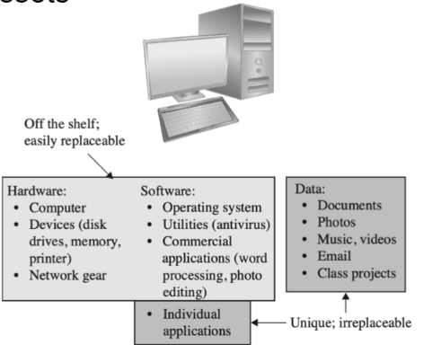
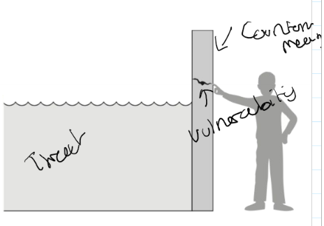
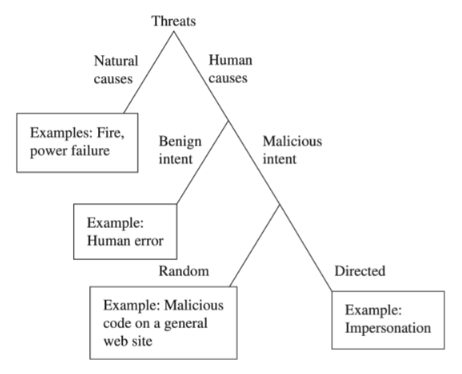

# Introduction

## Computer Security
- Protection of items of value, assets:
  - Hardware , software, data

### Values of Assets

### Basic Terms
- **Vulnerability** - weakness in the system, could be *exploited to cause* harm
- **Threat** - Set of circumstances that could cause loss or harm.
- **Control/Countermeasure** - To prevent threats from excersising vulnerabilities

### Basic Goals of Computer Security

#### CIA Triad
- **Availability**
  - Authorised useres should not be prevented from accessing required information + assets
  - **System Availability** - affected by deveice or software failure - or malicious DDOS attack
- **Integrity**
  - Detection of unauthorised modification of information
- **Confidentiality**
  - Prevention of unauthorised disclosure of information
  - IE: Information oly accessible to authorised users
  - Usuaully done with encrypting data.
  - Although other threats include:
    - shoulder surfing
    - electronic magnetic emanation
    - acoustic side-chanlel
    - Social engineering.

#### Other Security requirements
- Authentication
  - Something you know: password
  - Something you have: token
  - Something you are: biometrics
- Non-repudiation
  - Digital signuture - Garantee you are the only one who can open it.
  - Real meaing is often disputed.

#### Types of threat

### Secuirity Engineering
- Building systems to remain depenedable in the face of malice, error or mischance
- Cross displinary - crypto, hardare, security economics etc.
- Challenge is dealing with changing environement and requirements
- Weakest link

#### Weakest Link Property
- Security of a system is only as strong as the weakest link
  

#### Challenges
- Security vs Efficiency
  - Security engineer treats security is top
  - But optimising efficiency is also improtant but often comes second
  - Failures from over optimisation
- Security vs Usabilitu
  - An unusable system is not secure
- Security vs features
  - Complexity is the worst enemy of security

#### Security Principles
- No such thing as perfect security
- Secure systems can be expensive
- Principle of least privledge
  - Need to know and seperation of duty
- Minimise number of trusted components
- Keep it simple
- Be skeptical
- Be processionally paranoid
  - Imagine you are in the attackers shoes.