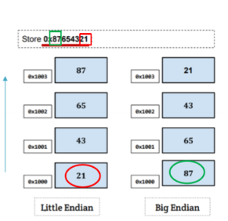
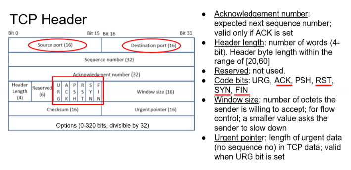
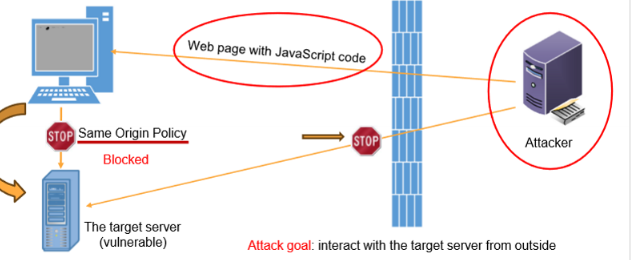
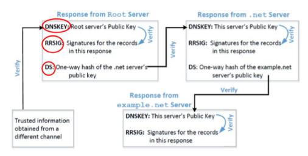

# Network Security

## Packet Sniffing and Spoofing

### How are Packets Recieved
- Machines connected to network with network interface card (NIC)
- NIC has a unique MAC address
- Each NIC hears all frames on the wire
- Only copies into buffer and dispatched to OS if match is found

#### Promiscuous Mode
- Noramlly frames that are not detinied to a given NIC are discarded
- Promiscuous mode: every frame recieved is passed to kernel
- Sniffer program then registered with kernal and is able to see all packets
- Usually requires root

#### Wireless - Monitor Mode
- WiFi called: Monitor mode
- However, as interference, WiFi card cant copy everything (too much data)
- Wifi operates on channels
- Only monitors on given channel

### Filtering
- Normally only interested in certain types of packets (so can filter out)
- Could first capture all and then discard unwanted, but this is inefficient
- Better to **filter unwanted packets** as **early as possible**

#### BSD Packet Filter (BPF)
- Allows user program to attach a filter to the socket
- Tells the kernel to discard unwanted packets
- 

### Packet Sniffing
- Describes the process of caputring live data as they flow across network

#### PCAP API
- Recieving data with socket is not portable
- Setting filtes is not easy
- PCAP API is a portable API for capturing packets
  - Uses raw sockets internally, but API standard across all platforms
  - Allows to set filters using boolean expressions

### Packet Spoofing
- Critical information in a packet is forged
- Many network attacks use packet spoofing
- EG, change IP header and change source and destination addres.
- Or UDP can cahnge UDP data

#### Implementation
- Python + Scapy
  - Pros: constructing packets is very simple
  - Cons: Muchc slower than C code
- C (using raw socket)
  - Pros: faster than python
  - Cons: more difficult to construct packets
- Hybrid Approach
  - Use scapy to construct packets
  - Use c to slightly modify packets and then send

### Endianess
- Order in which multi-byte data is  stored in memory
- **Little Endian** - put the small end in memory first
- **Big Endian** - put the big end in memory first
- Most x86 systems are little endian
- AVR32, IBM, mainframes etc use big endian

#### Endianness in Network Communciation
- Computers with different endianness could misunderstand communcation
- Therefore use **network order** which si the same as **big endian**
- All computers convert between host order and network order

## TCP Attacks
TCP = Transmission Control Protocol
- Above Ip layer and transport layer
- Host to host communcation services
- Reliabel and ordered communaction
- (UDP is lightweight with lower overhead, used for applications that do not require reliability)

### Data Transmission
- Allocates buffers for data, splits up into packets
- Data has a sequence number, used to reorder packets
- Usually application blocking read, waiting to recieve
  

### TCP header

- Data and fields with information

### TPC 3 Way Handshake
- Syn packet: sends random genearted x as sequence number
- Syn-ack packet: sends reply packet using own random number y and ACK with x+1
- ACK packet: sends ACK with y+1 and sequence x+1

- When server recieves first SYN packet, it uses TCB (transmission control block) to store information about the connection
- **half open** connection
- Stores ina  queue
- When ACK packet is received, the connection is established, taken out of queu.
- If no ACK packet is received, the server will wait for a while and resent SYN ACK.
- After a while will be discarded.

#### SYN Flooding
- Idea to fill the queu with half open connetions
- So that no new syn packets can be reiceved.
- Continuously send SYN packets (with no ACK packets)
- 
- Can use random source IP address to make it harder to block
- IP address may not beassigned, so could be dropped as RST picket is sent out
  - Less likely to happen so overall most stay in the queue.

##### Countermeaures SYN Cookies
- After SYN packet is recieved, server calcualtes keyed hash (H) from inoformation in the packet and secret key (server)
- The hash is sent to the client as the initial sequemce number
- Server not store the half oepn connection in its queue
- If the client is an attacker,H will not reach the attacker
- If the client is not an attacker, it sends H+1 in the AK field
- The server cheks and if correct, it will create the connection

### Closing TCP Protocols
- TCP Fin (civilised)
  - A sends a FIN packet with seq x to B
  - B sends back an ACK packet with seq x+1
  - This ends A-B connection
  - B sends a FIN packet with seq y to A
  - A sends back an ACK packet with seq y+1
  - Entire connection is closed 
- TCP RST (uncivilised)
  - One parties sends RST packet to immediatly break the connection
  - For cases of error or emergancy

#### TCP Reset Attack
- Goal to brak TCP connection
- 
- 
- Use wireshark to capture packets
- Get sequence number 
- Can now send spoofed RST packet to the server and end connection

#### TCP Reset on SSH
- If encryption is done at network layer
  - Entire TCP packet (including header) is encrypted, cannot sniff and spoof
- But SSH encrpts at transport layer
- So TCP header remains unecrpyted
- So can sniff and spoof

#### TCP Reset on Video Streaming
- Similar to previous
- The seq numbers increases very quickly!
- `netwox` tool, resets each packet that comes from the user machine. 
- Note: if RST packets are sent to a server, could be suspicious and could be blocked
- So better to send RST packets to the client

### TCP Session Hijacking
- Goal to inject data in an estabilished TCP connection
- 
- Need correct:
  - Source IP, source port
  - Destination IP, destination port
  - Sequence number (within reciever window)
- If the reciever hasalready recieved some data up to sequence number x, the next sequence number will be x+1. If the spoofed packet uses sequence $x+\delta$, becomes out of order
- The data in this packet will be sored in buffer at $x+\delta$ leaving $\delta$ bytes of space.
- If \delta is large, the data will be discarded
 

#### Hijacking Telnet
- Hikacking telent can run arbitrary commands
- Use `cat` to pipe out "secret file" to a file such as `/dev/tcp/10.0.2.70/9090`
- Can be lisented to by attacker

- Can freeze the user program
- As server not acknowledging the packets, so new packets are not sent
- Many retransmission packets
- **Deadlock**
  - Client regards pakcets as out of order
  - Tries retransmission
  - Server regards packets as duplicates
  - Discards packets

#### Reverse Shell
- Best command to run is reverse shell
- So shlell is passed to the attacker
- Can do whatever 

#### TCP Countermeasures
- Make it difficult for attackers to spoof packets
  - Randomis source port
  - Randomise initial sequence number
  - Not effective against local attacks
- Encrypting payload
  - Mitages TCP session hijacking
  - But not effective against SYN flooding and TCP reset attacks. 
  

  ## Firewalls

  ### What is a Firewall
  - Designed to stop unauthorised traffic flowing from one network to another
  - Main goal is to sperate trusted and untrusted components of a network

### Requirements (1994)
- All traffic between trust zones should pass through firewall
- Only authorised traffic as defined by the security policy should be allowed to pass through
- The firewall itself must be immune to penetration
  - Hardened system with secured operating system

### Firewall Policy

#### User Control
Controls access to the data beased on the role of the user who is attempting to access it
Applied to users inside the firewall perimeter

#### Service Control
Controls access by the type of service offered by the host.
Applied on the basis of network address, protocol of connection and port numbers

#### Direction Control
- Determienes the diretion in which requesuts may be initiaed and are allowed to flow through the firewall
- Tells wheter the traffic is inbound or outbound

### Firewall Actions
- Accepted
  - Allowed to enter the connected network  host through firewall
- Denied
  - Not allowed to enter the connected network or host through firewall
- Rejected
  - Similar tot denied - but tells the source about the decision through the a ICMP packet

### Filtering

#### Ingress Filtering
Inspects incomping traffic to safeguard the internal network and prevent attacks from outside

#### Egress Filtering
Inspects outgoing traffic to prevent users in internal network from reacing outside network
- EG, blocing social media at school

### Types of Firewall

#### Packet Filtering Firewall
- Controls based on information in packet headers, wihtout looking at payload
- Doesnt care about stream or traffic
- **Stateless** firewall, doesnt maintain state about packets

#### Stateful Firewall
- Keeps track of the state of active connections
- Connection state table is maintednt to keep track of the state of the connection
- Example, only allowing packets that belong to an established connection
  

#### Application / Proxy Firewall
- Controls input and output from / to an application or service
- Client connection terminates at the proxy, and a seperate connection is initiated to the destination host.
- Data is analysed up to the application layer
- Acs as intermediary impersonating the intended recipient
- 

- Anonymising Proxy:
  - Use proxies to hide the origin of a network request from servers
- Proxy to evade egress filtering
  - If firewall filters based on destination address
  - Can proxy to bypass the firewall
  - 

### Building Firewalls
- Packet filter builtin into the kernel: `iptables`
- Or ca build own 
- Statful firewall using conneciton tracking
  - NEW: starting new connection
  - ESTABILISHED: part of an existing connection
  - RELATED: related to an existing connection
  - INVALID: not part of any connection

### Evading Firewalls

#### SSH Tunneling
- SSH tunnel between home and work server, then can telnet to blocked machine
- Using SSH tunneling `-L`
- 
- Also can be used to bypass firewalls
  - IE piping to server outside that has access to a website like facebook.
  - Statc port forwarding
- Dynamic port forwarding
  - Socks proxy
  - SSH send tpc data over tunnel to home machine that 

#### Reverse SSH Tunneling
- Firewall may block incoming SSH session
- So create reverse SSH tunnelling

#### Using VPN

#### IP tunneling

- IPSec Tunneling
  - Uses Internet protocol security protcol
  - Has a mode called tunneling mode
  - Where original IP packet is encapsulated into a new IP packet
- TLS / SSL tunneling
  - Tunneling done outside kernal at applicaiton level
  - Idea to put each VPN bound IP packet inside a TCP packet
  - Other end of the tunnelextracts  IP tpacket
  - To ecure, bot ends will use TLS/SSL ontop of TCP UDP

## DNS Attacks

### DNS History
- Translates Ip and domain names
- Organised in tree like structure

#### DNS Zone
- DNS organised into zones
- Zone groups contiguous domains and subdomains on domain tree 
- Multiple zones for each country
- Zone keeps records of who the authority is for each of it's subdomains
  - only contains portion of the DNS data for the domain
- IF a domain is not divided into subdoains, the zone and domain are essentially the same
  - The zone contains all the dns data for the domain
- When domain is divided into subdomains, the DNS data can still put into the same zone (so domain and zone are still the same)
- But subdomains can have their own zones.  

#### Authoriative Name Servers
- Each DNS zone has atleast one **authoritative name server** that publishes information about the zone
- Provides origianl and definitive answers to DNS querues
- Can be master (primary) or slave (secondary)
- Master stores the master copies of alll zone records
  - Slave uses automatic updating to maintain an idendical copy of the master records
- Zone can have multuple Authoritative name servers (redundancy).

#### Root Servers
- Root zone is called ROOT
- 13 authoriative nameservers for this zone
- Provide nameserever information about all TLD
- Starting point for DNS queries

#### TLD Types
- Infrastructure TLD: .arpa
- Generic TLD: .com, .net
- Sponsored (sTLD): .edu, .gov, .mil,etc
- Country code (ccTLD): .uk, .fr, .de
- Reserved TLD: .test, .example, .localhost

### DNS Query Process
- If client knows the IP address just use it (from local DNS files)
- If not, ask local DNS server
- If local DNS server has the IP address, it will return it
- If not, it will ask DNS servers on the internet

#### Local DNS server and Iterative Query Process
- Iterative starts from root server, if it doesnt know, sends back IP of namesvers of the next level server 

#### DNS Reponse
- 4 sections
- Question: describes a question to a nameserver
- Answer: Records that asnwer to the question
- Authority: records that point to authoritative nameservers
- Additional: records related to query

#### DNS Caching
- Caches DNS server information
- Time to live value
- When expired, timed out and removed

### Attacks

#### Denial of Service Attacks (DOS)
- When local DNS servers and the authoritive name servers do not respond the DNS quereies
- Machines cannot retrive IP addresse. cuts down communication
- Attack on Root:
  - If attacker can bring down root zone servers, could bring down entire internet
  - However highly distributed and redundant (13 servers)
  - Nameservers for TLD cached, 
  - So attack needs to last long to see significant effect
- TLD servers
  - Gov, com net etc have resiliant infrastructure
  - But some countyr code TLDs are not as resiliant

#### DNS Spoofing
- Goal: Provide fradulaent IP address to victims, tricking them to communicate with malicious server
- If have root privileges, can modify the local DNS files (`/etc/hosts`)

Lan spoofing:
- Spoof UDP packet
- Forge DNS replies after seeing query from local DNS

#### Remote DNS Cache Poisoning Attack
- Challenges:
  - Difficult for attacker when not on the same network
  - Source port number (random 16 bit number)
  - Transaction ID (random 16 bit number)
- Random guess: 2^32
- Cached effect: The actual reply will be cached by local DNS seeer, so the attacker needs to wait for the cache to timeout

#### Kaminsky Attack 2008
- How to not worry about cache effect?
- Ask a different question each time
- So caching does not matter
- Local DNS witll send out new query each time
- Provide forged answer in authority section

#### Attacks from Malicious DNS server
- When a user visits a website
- A DNS query will eventrually come to authorative nameserver
- In adttion to providing IP address in answer section of response, DNS server can provide information in authority and additional sections
- Malicous DNS server can use these secitons to provide fraudulent information
  

In additonal Section:
- Additoanl information will be discard because **out of zone**
- Cause secutiryt problems if not discarded

In Authority section:
- Out of zone is discarded, but same zone is not

#### Reverse DNS Lookup
- DNS query tries to find out hostname for given IP address
- If a packet comes from the attacker, the reverse DNS loopkup will go back to the attackers namesever
- Attacker can reply with whatever hostnames they want

#### DNS Rebinding attack
- Malicious DNS server can provide fake IP address
- Howver, can be used to bypass **same origin polcicy**

### Protecting against DNS attacks

#### DNSSEC
- Set of extensions
- Provides authentication and integrity
- All answers digitally signed
- Any fake data will be detected

