# Software Security

## Buffer Overflow

### Stack Layout & Memory Layout
- Code and data are seperated
- Heap grows upwards (dyncamic data, while programming is running eg malloc)
- Stack grows downwards (static, compile time eg local variables)
- Writing overlength in the heap, will cause overwriting of the stack (**stack smashing**)

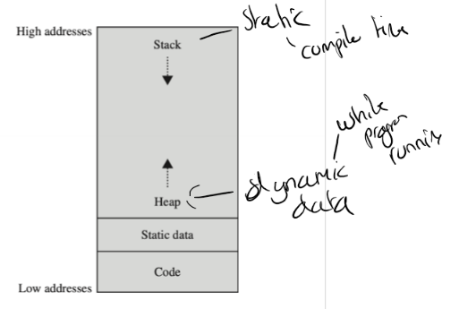

#### Buffer Overflow
- Occur when data is written beyond the space allocated for it
- EG: writing a 10th byte in a 9 byte array
- In attack: attacker inputs allowed to overwrite memory holding executable code.

#### Program Memory Stack
- Text segment - executable code of the program - usually only readonly
- Data segment - static variables, global variables, constants
- BSS (block starterd by symbol) segment
  - Unitialised static / global variables
- Heap
  - Dynamic memory allocation
- Stack
  - Local vairables defined inside functions
  - Data related to function calls (return address, parameters, local variables)
- Stack grows downwards, heap grows upwards
- 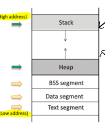

#### Frame pointer
- Register to indicate memory address.
- Reference to different functions
- 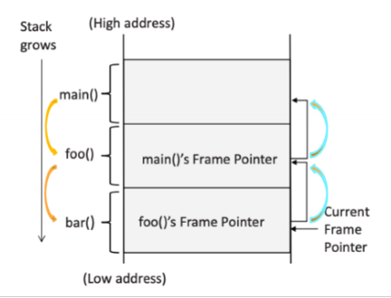
- 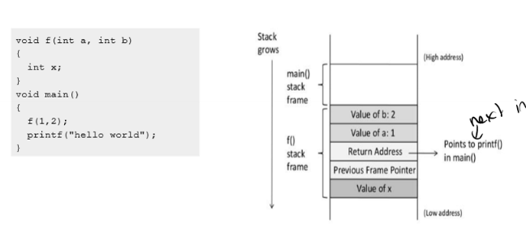

#### Strcpy
- Copies string from source to destination
- No bounds checking
- Stops when it seens a null terminator `\0`
- Used to copy buffer data

### Attacking

#### Buffer Overflow
- Basic, can be used to corrupt the stack - program failure / crash
- EG, writing 13th byte to buffer, would overwrite the previous frame pointer and break it.
- 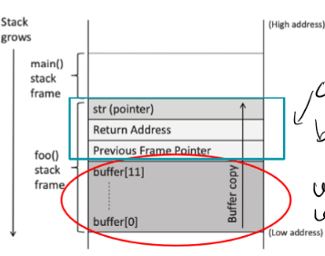

#### Overwriting Return Address
- Can overwrite the return address of the function
- Could be pointed to:
  - Invalid instruction
  - Non existing address
  - Access violation
  - **Attackers code**
- Therefore can write to malicious code.
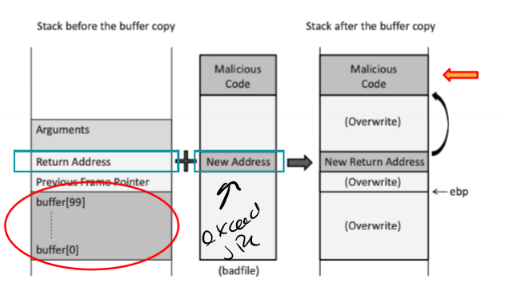

#### Creating Malicous Input
- First find **offset distance** between base of the bffer and return address (so we can replace the return address)
- Then find the address to place the malicious code to point to
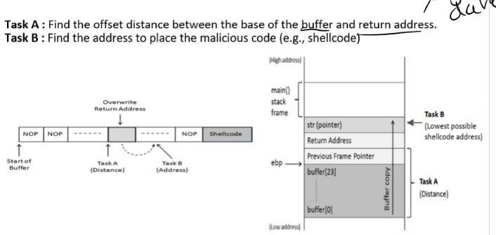
- Neither of these are easy to find
- Early systems use fixed memory address for the stack
- Tehcniques to improve chances of finding correct
  - Filling NOP (does noting, move to the next instruction)
    - 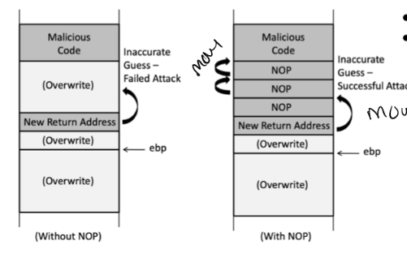
  - Spraying return address
    - Spray buffer size + a small value (compiler may add space) with the return address.
    - 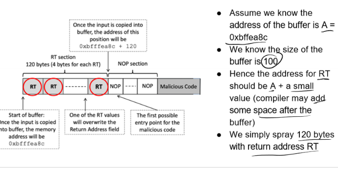 

#### Shellcode
- Code that is executed when the buffer overflow occurs
- Usually a shell command
- Can be used to execute any command
- Challenges with loading from c file (libraies, zeros in code etc)
- Instead use assembly (dont need to memorise)

### Countermeasures
- Developer approaches:
  - Safer functions like strncpy()
- OS approaches
  - ASLR (Address Space Layout Randomization)
- Compiler Approaches
  - Stack guard
- Hardware Approaches
  - Non executable stack

#### ASLR 
- Address Space Layout Randomization
- To randomise **start** location of the stack every time the code is loaded into memory, therefore **stack address changes**.
- Diffiucult to guess stack address in memory
- Therefore difficult to guess %edp address and address of malicious code

#### Stack Guard
- Use secret guard that is needed to complete the function
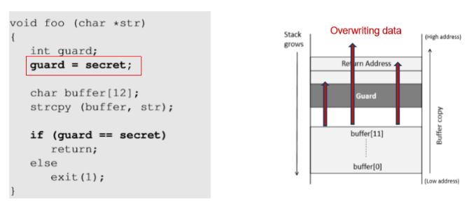

#### Non Executable Stack
- Mark the stack as non executable
- NX bit
- Can be countermeasured with **return-to-libc attack**
  - Where the attacker doesnt run any code in the stack, but simply makes the program return to a function in an exisiting libryary.

## Race Condition
- Happens when:
  - Multiple processes access and manipulate the same data concurrently
  - The outcome of execution depends on a particular order
- If a privileged program has a race condition, the attackers may be able to affect the output of the privileged program by infuluences on uncontrollable events.
  

### Time-of-check to time-of-use (TOCTTOU)
- Occurs when checking for a condition before using a resource
- Between the time, data may have changed
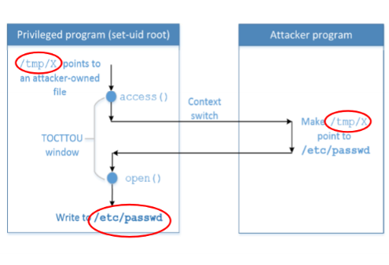

### Privileged Program
- Compirmisng user program, may allow an attacker to gain root access
- Special user-programs that are executed with a higher privlege behind the scene
- EG, Set-UID programs

#### UNIX File Permissions
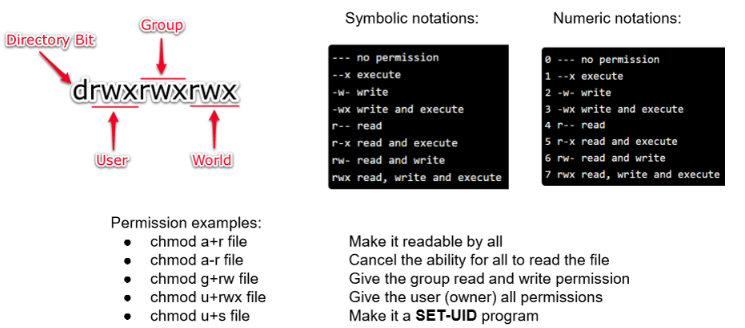

#### Set UID
Allows a user to run a program with the program owner’s privileges
- Widely implemented on UNIX
- Tempory elevated privleges
- EG: `passwd`
- Program needs access to `/etc/shadow`, but only root can access that file.

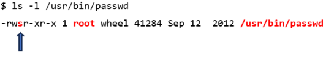

- Each process has:
  - **Real UID** (RUID) - identifies real ower of process
  - **Effective UID** (EUID) - identifies the privileges of the process - access control based on EUID

### Race Condition Vulerability
- Goal, to write to protected file (like /etc/passwd)
- Use symbolic link to point to the file
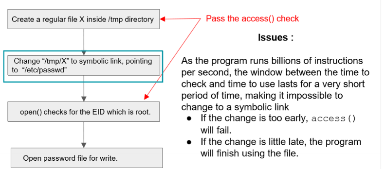
- need to run on a loop to get correct timing
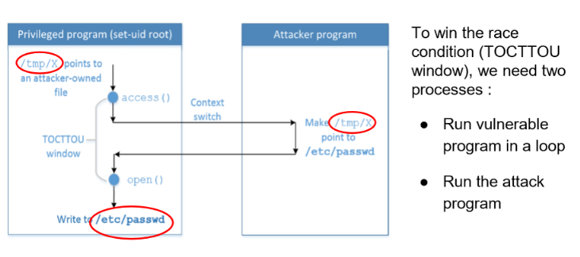
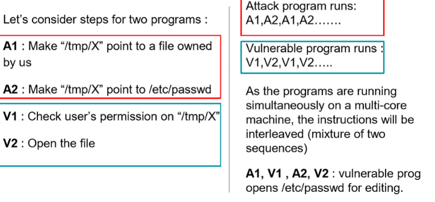

### Countermeasures

#### Atomic Operations
`f=open(file, O_CREAT | O_EXCL)`
- If the file already exists, the call fails
- Guarantees that the file is created atomically

#### Sticky Symlink Protection
- When enabled symbolic links inside a sitcky word-writable can only be followed when the owner of the symlink mathches either the follower or the directory owner.
- 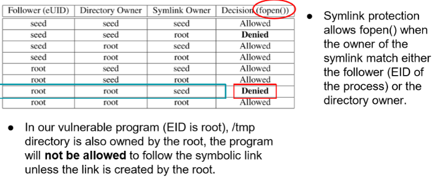

#### Principle of Least Privilege
A program should not use more privilege than what is needed by the task.
- Vulnaerable program has more privleges require while opening the file
- So use `setuid` to drop privileges before testing access.
- 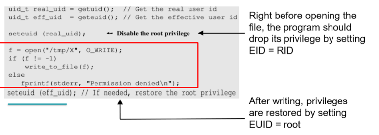