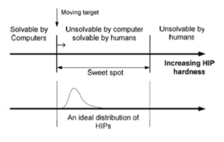

# Users and Security

## Why Humans?
- Human is often the weekest link.
- IE:
  - Lorenz cipher - 1941 - operator uses the same key to send the same message twice.
  - Cipher was broken.
  
### Phishing (Fishing)
- Social engineering where the attacker tries to trick the user into giving away their credentials.
- Often done via email.
- Sends lots of emails, hoping to get a few people to click on the link.

#### Properties of Spoofed sites
- Copied look and feel of the original site.
- URL is similar to the original site.
  - Typejacking - similar looking letters.
  - URL with IP
- Usually only online for few hours or days
- Rarely use SSL
- Some grammatical errors
  

#### Why it works
- Human psychology to trust brands, logos and trust indidcators.
- Users cannot reliably determine the sender identity in emails.

#### Defence
- Anti-spam
  - No perfect solution 
  - False psotives might mean missing messages and disabling
  - False negatives mean spam gets through
- Security toolbar
  - Browser plugins that check the URL against a list of known phishing sites.
- Browser plugins
  - Check the URL against a list of known phishing sites.
  - Requires user to install
- Trusted path
  - Use a background image that easily recognised but hard to know and spoof
- Two factor authentication
  - Doesnt solve problem, but pushes phishing attacks to real tiem
- Best defense is a good offsense
  - Banks etc, prusue phishing attacks relementlessly

#### Spear-Phising
- Targeted phishing attacks.
- Customised attack on specific employee and company

#### Smishing = SMS + Phising
- Links sent via SMS instead of emails
- People tend to act quicker on links on phones.
- Attacker can spoof an arbitary string
  

## CAPTCHA
Completely Automated Public Turing test to tell Computers and Humans Apart
- Used to prevent automated attacks.
- To tell humans and computers apart.
- CAPTCHA test = hard open problem in AI
  - Optical character recognition
  - Speech recognition
  - Nowdays, not really a problem, more complex perception

### Turing VS Captcha
- Turing test = if a computer can fool a human into thinking it is a human, it is intelligent.
- Both tests distingush
- Turing test = human judge
- CAPTCHA = computer judge
- CAPTCAH is automated turing test 

### Captcha Attacks
- Cirtical flaw, no matter how characters are distorted, the pixel counts remain the same.
- Predictable patterns greatly weaken security
- So use more creative CAPTCHAs, but also make it harder for human.
- There is a sweet spot.
  

Problems:
- Man in the middle attack:
  - Shift the load of solving captcha to dodgy site visitors
- Outsourcing attack:
  - Bot users outsource task to people in low paying countries.

### reCAPTCHA v2
- Google service, 2014
- Uses risk analysis based on google cookies.
- Many users just tick box, but suscpicious users (or without google cookies) are asked to solve a challenge 
- Attacking
  - Use AI to perform image recongnion
  - Redirect challenges to humans
  
### reCAPTCHA v3
- Developed to imporve user experience, now invisible to website visitors
- Burden on website admisistrators
- V3 returns score between 0 and 1, the admin needs to decicde:
  - Grant access
  - Ask user a challenge (v2)
  - Block access
- Limitation: tied to google, only free up to 1 million requests per month.