# Web Security

## Cross Site Request Forgery (CSRF)

### Cross Site Request
- Same Site Request: a page from a website sends an HTTP request to the same site
- Cross Site Request: a page from a website sends an HTTP request to another site
- Browser knows it's cross-site, sever doesnt
- 

#### Cookie
Packet of information sent from the server to client, and then sent back to the server each time it is accessed by the client

#### CSRF
- Browser attaches all cookies related to a website to a request, even if requested from different site
- Therefore servers cannot distingusih between same site and cross site requests
- Possible for third party websites to forge requests that are exactly the same as the same site requests
- *Main cause: Server cannot distinguish between same site and cross site requests*
- This is **Cross Site Request Forgery**

#### CSRF Attack
- Assume the victim is already logged into legitimate website
- The attacker crafts a webspage that can send cross site requiest to the targeted website
- The attacker tricks the victim to visit the malicious website

#### Get Request Attack
- Data attached to URL
- EG: user is logged into web aplication and a session cookie that identifies and authenticates the user
- THe attacker places a piece of code to trigger a request with different parameters (like send more money specifically to the attacker)
- The attacker can use the user's session cookie to send a request to the server
- Can be done by adding url to soruce of image tag in webpage with size 1x1 (so very small and not suspicious)
- Image loads source on page load and sends request.
- Just need victim to visit page with that image tag.

#### POST request attack
- Data attached to body of request
- EG: user is logged into web aplication and a session cookie that identifies and authenticates the user
- When form submit button is pressed.
- Attackers job to click on the button without help from the user.
- So attacker:
  - Creates a post from dynamically
  - Adds hidden fields to the form
  - Submits the form automatically
  - Function can be called on page load

### Counter Measures
Main cause is the server cannot distingqush whether a request is cross site or same site. The browser does know the difference.

#### Referer Header
- HTTP header field identifying the address of the webpage from where the request is generated.
- A server can then check if it originated from its own papges
- Reveals **privacy** issues, reveals browsing history
- So removed
- Thus unreliable solution

#### Same-Site Cookies
- Special type of cookie, provides special attribute to cookies called `SameSite`
- Attribute set by severs and tells the brwos wheter a cookie should eb attached to a cross-site request or not
- Cookies with this attirbute are always sent along with samesite requests
- But optionally sent on cross-site requests
- `Strict` = Not sent along with cross-site requests
- `Lax` = Sent with cross-site requests

#### Elgg Countermeasure
- Uses secret-token approach: `_elgg_ts` and `_elgg_token`
- Values are stored inside javascripts values and all the forms that use user action (hidden)
- Security token:
  - MD5 digest of:
  - Site secrete value
  - Timestamp
  - User session id
  - Randomly generated session string

## Cross Site Scripting Attack (XSS)
- XSS, an attacker injects malicious code into vicitims brows via target website
- When code ccomes from a website - considered trusted
  - wrt to website
  - So can access / change pages
  - REad cookies
  - Send requests etc
- Is actually "same site" attack

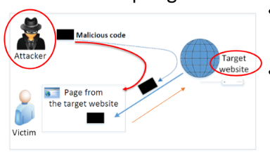

### Non Persistent (Reflected) XSS
- Website takes user inputs:
- Attacker can put javascript int the input,
- So when the input is reflected back, the JS code is injected
- **Not stored** on the server
- 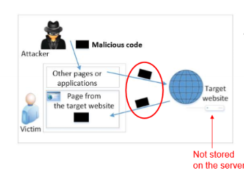
- EG: `http://example.com/search?q=`
- The attacker sends this link to the victim, so when they click it, the code is executed

### Persistent (Stored) XSS
- Channels are supposed to be data channels
- But data if not sanitsed can be sent to other users and executed as code
- As the browser sees the code coming from a trusted website, the code is given the same privledges as the actual code from the website.

#### Damage
- Web defacing 
  - JS can access the DOM inside the page, so can make arbiritary changes to teh webpage
- Spoofing request
  - Injected JS can send HTTP requests to the server on behlaf of the user
  - To bypass CSRF countermeasures need elgg_ts and elgg_token
  - But the attacker can get these values from the page (as just JS varaibles)
- Stealing information
  - JS can steal private data such as session cookie, personal data displayed on webpage etc

#### Self Propagating XSS Worm
- XSS code that can spread itself
- Malicious code added to attacker profile
- So when someone opens it, the code sends a request on their behalf to change their description to also include the worm (without them knowing)
- Then proagates from there.

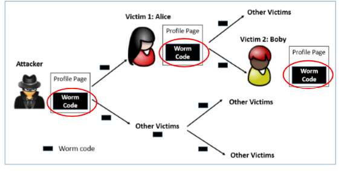

DOM approach
- `document.getElementById("worm).innerHTML` to get the worm and can use that to add to theprofile

Link Apporach
- Sote worm online somewhere
- Does not need to the include the worm code itself in the profile
  
### Countermeasures

#### Filter Apporach
- Removes code from user inputs
- But can be bypassed
- So use libraries designed to cover all bases, eg `jsoup`

#### Encoding Approach
- Replace all HMTL markups with alternative representation
- EG `<script>` becomes `&lt;script&gt;`

#### Content Security Policy (CSP)
- Fundemental problem: mixing data and code (code is inlined)
- So **force data and code to be seperate**. 
  - Dont allow inline apporach
  - Only allow link approach.
- EG:
  - 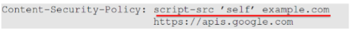
  - Disallowed all inline javascript
  - Only allow javascript code script from own site, example.com and google. 

#### Nonce
- Randomly generated value
- Added to the CSP header
- Only allow inline code with the nonce
- 
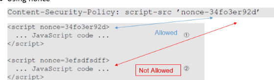

## SQL Injection
- SQL statements are used to access and manipulate data in a database
- Usually browser sends HTTPS request to web server which then sends SQL query to the database
- Therefore need to adjust web request for the web server to send the SQL query that we want.
- 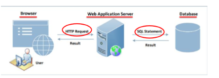
- The web application often constructs a SQL statement (as a string) and substitutes the user input into the SQL statement
  
### Example
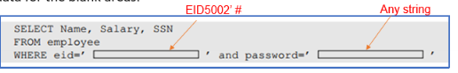
- Remove password predicate
- By making id end with `' #` which comments out the rest of the SQL statement so the password check is ignored
- Giving access to the attacker

### SQL Injection to get the entire database
- Instead can include `OR 1=1` as part of the `WHERE` predicate.
- Therefore all rows are returned

### Curl
- To use CURL, need to encode special characters, otherwise it wont work

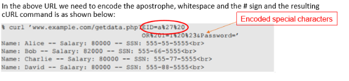

### Modifying Database
- If the statement is an `INSERT` or `UPDATE` statement, then the attacker can modify the database
- EG password change
- SQL inject at teh new password to include `', salary = 1000000 #`
-  
- 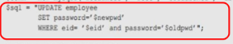
- 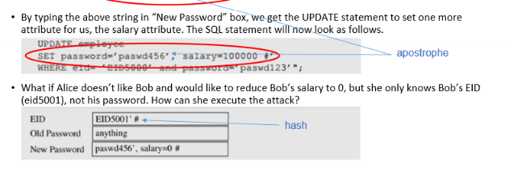

### Multiple SQL Statements
- Include something like `DROP DATABASE users` that will delete the entire database
- Cant run multple queeries in one with MySQL and PHP (need to use multi_query())
- So depends on implementation

### Countermeasures
Problem is mixing data and code
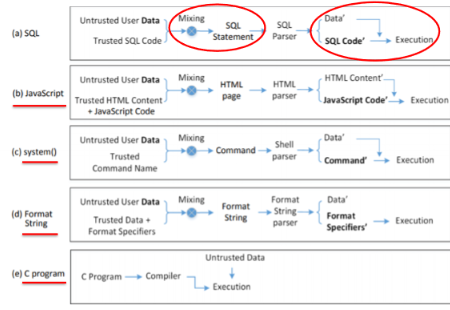

#### Filtering / Encoding (not recommended)
- Before mixing data with ode, filter out any chracter tha may be interpreted as code
- Encode special characters
- EG: php has `mysql_real_escape_string()` that encodes characters that have a special meain in SQL.
  
#### Prepared Statement
- Problem: mixing data and code
- Solution: separate data and code
- Idea, send code and data on seperate channels
- Prepared statement:
  - Send SQL statment template to database, with parameters left unspecified
  - The database parses and complies and performans query optimistaion on the template 
  - Stores the result without executing it
  - So we can then **bind data** to the prepared statement later.
  - Not doing "string manipulation"
- 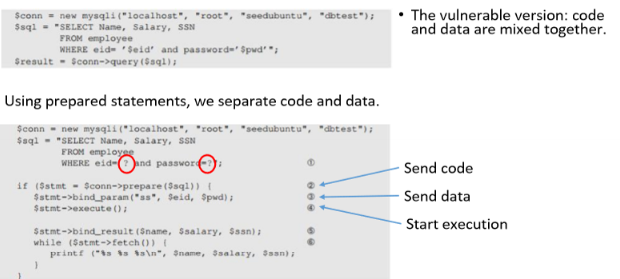
- Secure as trusted code is sent via code channel
- Untrusted user provided data is sent via data channel
- 