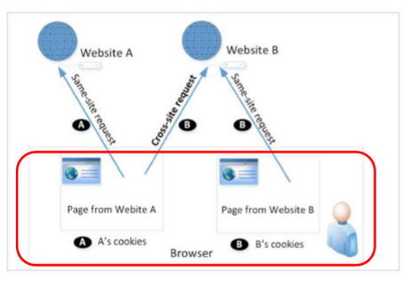
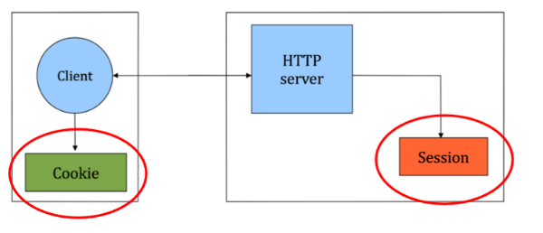
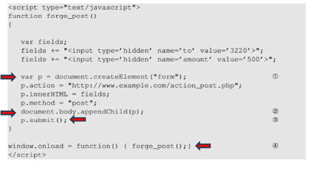

# Web Security

## Cross Site Request Forgery (CSRF)

### Cross Site Request
- Same Site Request: a page from a website sends an HTTP request to the same site
- Cross Site Request: a page from a website sends an HTTP request to another site
- Browser knows it's cross-site, sever doesnt
- 

#### Cookie
Packet of information sent from the server to client, and then sent back to the server each time it is accessed by the client

#### CSRF
- Browser attaches all cookies related to a website to a request, even if requested from different site
- Therefore servers cannot distingusih between same site and cross site requests
- Possible for third party websites to forge requests that are exactly the same as the same site requests
- *Main cause: Server cannot distinguish between same site and cross site requests*
- This is **Cross Site Request Forgery**

#### CSRF Attack
- Assume the victim is already logged into legitimate website
- The attacker crafts a webspage that can send cross site requiest to the targeted website
- The attacker tricks the victim to visit the malicious website

#### Get Request Attack
- Data attached to URL
- EG: user is logged into web aplication and a session cookie that identifies and authenticates the user
- THe attacker places a piece of code to trigger a request with different parameters (like send more money specifically to the attacker)
- The attacker can use the user's session cookie to send a request to the server
- Can be done by adding url to soruce of image tag in webpage with size 1x1 (so very small and not suspicious)
- Image loads source on page load and sends request.
- Just need victim to visit page with that image tag.

#### POST request attack
- Data attached to body of request
- EG: user is logged into web aplication and a session cookie that identifies and authenticates the user
- When form submit button is pressed.
- Attackers job to click on the button without help from the user.
- So attacker:
  - Creates a post from dynamically
  - Adds hidden fields to the form
  - Submits the form automatically
  - Function can be called on page load

### Counter Measures
Main cause is the server cannot distingqush whether a request is cross site or same site. The browser does know the difference.

#### Referer Header
- HTTP header field identifying the address of the webpage from where the request is generated.
- A server can then check if it originated from its own papges
- Reveals **privacy** issues, reveals browsing history
- So removed
- Thus unreliable solution

#### Same-Site Cookies
- Special type of cookie, provides special attribute to cookies called `SameSite`
- Attribute set by severs and tells the brwos wheter a cookie should eb attached to a cross-site request or not
- Cookies with this attirbute are always sent along with samesite requests
- But optionally sent on cross-site requests
- `Strict` = Not sent along with cross-site requests
- `Lax` = Sent with cross-site requests

#### Elgg Countermeasure
- Uses secret-token approach: `_elgg_ts` and `_elgg_token`
- Values are stored inside javascripts values and all the forms that use user action (hidden)
- Security token:
  - MD5 digest of:
  - Site secrete value
  - Timestamp
  - User session id
  - Randomly generated session string