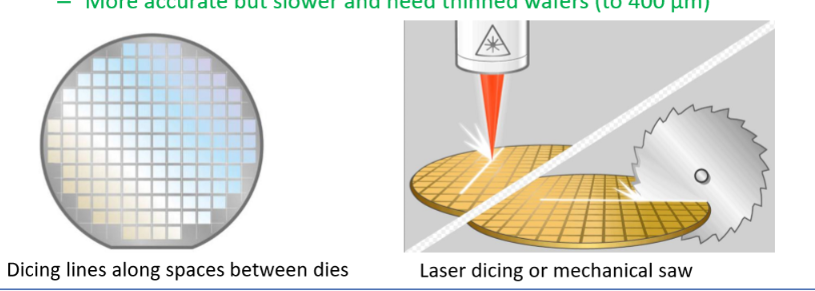

# 3D MEMS and Packaging

## LIGA
- Lithographie Galvanoformung (electroplating) und Abformung (Moulding) 
- Can make up to mm scale fabrication
- Uses thick layer of resist on a metallic substrate
  - Usually PMMA (Poly(methyl methacrylate))
- Pattenred by an X-ray source - short wavelength
- REsists forms a mould ofr electroplating
- This mould becomes an injection mould or embossing tool
- Can make good high aspect ratio structures
- Costs:    
  - Xray source: £1500 per shift
  - £5000 a mask plate
  - So much cheaper than silicon
  
  
- Fabrication:
- Uses Xray curable polymers
- To a thickness of over 1mm 

### Deep X Ray Lithography
- Synchroton Xray source as UV cannot penetrate thcik resist
- Uses 4" Au mask to define area on top of a Be plate
- Very expensive machine - usually one per country
- 

## Stereolithography (SL) or Rapid Prototyping (RP) or 3D Printing
- True method of creating 3D objects
- 1981
- Rapid prototyping from 3D objects from CAD
- Low cost compared to conventional methods
- High resolution (100sum)
- Extrusion base
  - Theraml setting plastics
  - SLA resin

### Micro-stereolithography (MSL)
- MSL based on SL (essentaily resin printer but small)
- Designed for high aspect ratio structures
- Can be micron scale
- "Poor person" LIGA
- Some compatibility with silicon process
- £30k machine, DRIE cost £2m
- Is CMOS compatible
- Materials such as ceramics and metals can be added to photocurable resisst to change properties
  - Piezoelectric properties
  - Different stiffness/eleastic/resistance properties
  -   
#### Methods
- There are many methods of MSL
  - Classical MSL
  - IH (integrated hardened) Process
  - Mass-IH (integrated hardened) Process
  - Mask-Projection MSL
  - 

#### Process
- Move translation stage for recoating
- Measurement and control of position
- Send image slice to MSL
- Shutter On for laser beam exposure
- SHutter off 
- Vision system to ovserve the condition of the cured $\mu$ component
- 
- 

#### Applications
- MSL Fluidic microstructures 

- 

## Nano Devices - NEMS
- Nanometer scale will be useful for data storage
- Current storage use magnetism
- But will reach superparamagnetic limit
- Solid state memory (SSM), qunatum technology etc
- But very costly

## Alignment Marks
- Wafers have a flat slide to know crystal orientation
- Ned to add alignment marks onto the wafers and onto each photographic mask for processing
- 

## Dicing Marks
- Need to add dicing marks to the wafer
- Show where cuts are to be made to make small silicion die
- Adds cost to silicion, as lose material
- Cut with Circular saw or thin wires
  - Cheap / fast but more collateral damage around cut
- Optically diced using powerful laser (stealth dicing)
  - More expensive but less collateral damage
  - Slower
  - Requires thinned wafers (400um)  
- 

## Packaging
- Packaging can cost more than the processing of the silicion devie
- Different bonding
- 
