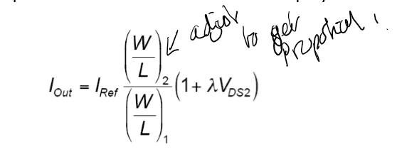
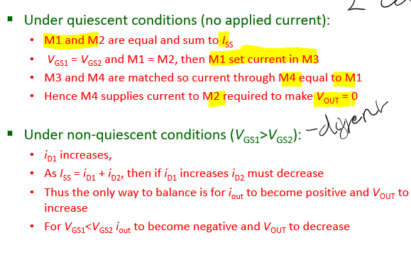
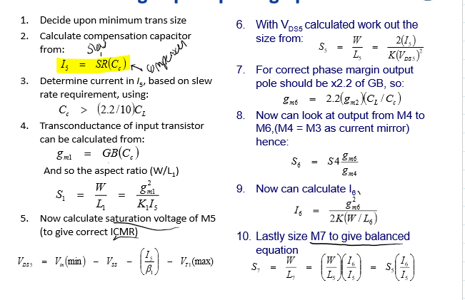

# CMOS Technology

## Analog Passive Componennts

### Resistors

#### Sheet Resistance
$$
R = \frac{\rho}{t} \frac{L}{W}
$$
Where $\rho$ is the resistivity, $t$ is the thickness, $L$ is the length and $W$ is the width specified by the process.

The more highly doped the material, the lower the resistance (as doped adds impurities that let current flow more easily)

#### VLSI Si Resistor

- Rcont is the contact resistance
- R square is the resistance of a unit square (independent of the length of width)

#### Resistor Layout
- Serpentine, best for compact high resistance
- Important as space is expensive.
- 

#### Factors that Affect Resistance
Absolute accuracy is poor due to large variation in parameters.

#### Design Rules for VLSI Resistors
- For matching:
  - Use equal sized structures that are not too narrow
  - Inter-digitate strips
  - Require temperature compensiation
- For good temperature coefficients
  - Use material with low temperature coefficient, diffusion is best.
- For accuracy use n-well or p-well
- Dont use metal as very low resistance, therefore very expensive as takes up space

### CMOS Capacitors
- Capacitors required for designing analgoue circuits (filters, amplifiers, etc)
- Created between:
  - Poly layer and p+n+ diffusion
  - Two poly layers
- Metal could be used but low capacitance, therefore expensive
- Insualtor layer usually silicon oxide (thermal or chemical vapour deposited)

Capacitor values and tolerances:

#### Factors affecting accuracy of CMOS capacitors

Absolute accuracy is better than resistors as it's value does not depend on diffusion or doping.

#### Layout of VLSI Capacitor (W=L)
- Exact layout depneds on layers used
- To get good matching:
  - Use unity capacitors connected in parallel
  - Use square (W=L) as it helps charge get out

Also can use centroid structure that gives a range of capacitor values

Or capacitor stack to **increase capacitance** per **unit area**.

#### Switched Capacitor
- VLSI accuracy and size of reisstors is issues
- So using switched capacitors to replace resistors
- Related to the charge and frequency

- It require s a two phase non overlallping clock

$$
I = qf = C(V_1-V_2)f \\
R = \frac{V}{I} = \frac{1}{Cf}
$$

Where equivalent resistance is given by:
$$
\frac{T}{C} = \frac{1}{Cf}
$$

#### VLSI Switch
- Require high quality analgo VLSI switches
- MOS transistors good switches to move charge
  - But not as good at switching current as it gives and offset between the input and output

 

- Highly non linear resistance and can only really change W/L ration.
- Value of on resistance depends on overdive voltage 
- Modern processes give ~5kohm for ntype and ~26k for p type 
- (See lecture 3 slide 24)

## Analogue CMSO Circuits

### Active Loads
- Good for high values (for resistive load) is ot use active load
- EG: the gate and drain of a MOSFET can be tied together
- Gives the IV charactersistcs similar to a *p-n junction diode* (Descrived as MOS diode)

#### Floating Gate
- Create an active load
- Rather non-linear - but only small changes in input violtage - it is considered acceptable

#### Current Mirror
- Gives a replica (attenuated or amplified as neccessary) of a bias / signal current

##### Simple Current Mirror
- Reference current Iref mirrors
- M1 is in saturation, so $V_{DS1} = V_{GS1}$
- 
- It has the following ratio of currents, but has the same parameters, we can simplify. 

- Therefore the W/L ratio can be adjusted order to change the proportion of the current.

**Design Parameters that effect current mirror**
- Channel Lenght Modlation (lambda)
- Offset between threshol voltages $V_{th}$
- Imperfect geometrical matching (W/L ratios of each)
- Technlocolical parameter mismatch ((mu, C_ox))
- Parasitic resistances

##### Wilson Current Mirror
- 3 MOSFETS, therefore more space nad cost
- Aim is to have a better small signal output resisance
- High performance current mirrors improve this.
- Wilson Current Mirror is well known,.

- Principle:
  - Output resistence increased through negative feedback
  - As Iout increases, M2 current icnrease
  - Mirroring action of M1 and M2 increase current in M1
  - Which cause voltage of M3 to decrease
  - Therefore its channel resistenc reduces
  - Current of I out falls
  - Hence stabilised

#### Current Source
- Current source is a circuit that provides a constant current to a load
- Very useful for CMOs
- Simple references use the supply voltage
- 
- Has poor accuracy
- 
- Heavily dependent on the supply voltage
- And load resistance errors

##### Independent of VDD
- Use **Bootstrapped** or self bias current reference
- Removes effect of power supply variations
- Therefore more accurate.
- But costs more as more transistors are required
- 

#### Voltage Source
- Voltage reference (has a low current so CMOS good) can be used for things like comparators
- A voltage source can supply large currents and usuauly bipolar stages
- Voltage references should be independ of load
  - As resistance have high innacuracies
- Can make a very crude voltage reference from a voltage divider
  - Simple, but not very accurate and cannot draw much current
- 

##### Breakdown Diode
- Diode in reverse bias
- Output almost idenempent of VDD, therefore fairly constant
- Instead depends on resistors and diode.

## CMOS Amplifiers
- Operation amplifiers are voltage amplifiers (controlled sources)
- We focus on differential amplifiers (amplifies the difference between two inputs)
- Designed to have good forward gain so when negative feedback is applied, the overall gain is independent of the op-amp gain.
- 
$$
V_{out} = A_{v} (V_{1}-V_{2}) \\
A_{v} = \frac{-R2}{R1} \\
$$

**Ideal Charactersistics**
- Infinite (differential) voltage gain
- Infinite input resistance (so requires no inpuit current)
- Neglibile output resistance (so outout is not dependent on the load)
- In reality, this is not possible

### Typical Op-Amp Charactersitcs

- Supply voltages
- Supply current
- Temperature range
- Gain
- Gain Bandwidth
- Output resistance
- CMRR
- Settling time
- Slew rate
- Output siwng
- Offset
- Noise
- Layout

### Designing a Generic 2 Stage Op Amp
- Differential / high gain stage (voltage to current)
- Output Stage (current to voltage)
- Compensation Circuitary (stability and operational range)
- 

#### Differential Amplifier Stage
- Based on matched pair of N-channel MOSFETs
- M1 and M2 biased by Iss
- **Source coupled**

##### Substrate Tap
- M1 and M2 are not connected to ground
- So can get floating outputs, but can be faster as doesnt have increased current.
- Connect the substrate to the sources
  - Keeps threshold voltage the same but the junction capacitance will vary
- Connect substrate to ground
  - Keeps junction capacitance the same but will alter threshold voltage
 

#### Differentail amplifier 2

Design Specifications:

### Stability
- Op amps generally used in **negative feedback** configuration
- High gain of op amp so external components set gain
- Dont want to oscillate or saturate to power rail
- For stability: **phase gain curve must pass 0db before it reaches 0 phase** (Phase margin)
- 
- Different phase margins give ringing
- 

#### Compensation
Can improve stability by adding a **compensation capacitor**
- Connected between the output of the differental amplifier and the output stage

### Custom Op Amp
- Need to design for specifications
- Gain at DC
- Gain Bandwidth
- Input common-mode range (IMCR)
- Load capacitance
- Slwe Rate
- Output voltage swing
- Power dissipation

#### Instrumentation Amplifier in CMOS
- Combination of 3 op amps
- Ratios of resistors is good
- Can be made into CMOS well

## Advanced Silicion Technology
- Previosuly discuessed bulk (eg twin tub) CMOS and Bipolar processes
- Big problem is **lateral isolation**
- Want to keep the devices isolated from each other
- Lateral isolation - possbile with trenches
- Vertical isolation possible with SOI (Silicon on Insulator) technology

### CMOS
Most used CMOS is Twin well (or tub)
- Features both nwell and pwell
- Can have epi & buried layers
  - Which enchance isolation and reduce parasitic componnents 

### Internal and Parastitc Capacitances
- When a transistor turns on, it must charge all internal/parasitic capacitances before it can conduct
- Therefore can slow down the switching speed
- So reducing - can switch faster - better performance
- Major source: from source drain (CMOS) to substrate junction
- 

### Main Technollogies
- Bulk CMOS:
  - Twin Well Process
  - No Epitaxy required
  - Technology is well established, cheap
  - Performance is poor to average
- Epi CMOS & BiCMOS
  - Growing thin epitaxial layer onto silicion substrate
  - Isolates the substrate
  - Allos formation of buried layers (which increase level of isolation)
  - Better immunity to cross-talk and latchup (both temperature dependent)
  - Low self-heating (advantage for electronics, disadvanteg for high temp devices / sensors)
  - Well suited for berical bipolar transistors
  - Good for most appplications
  - Disadvantages:
    - Relativly poor electrical isolation (better than standard bulk CMOS)
    - Lowish speed
    - High leakage currents
    - Large area, but process is cheap
- 
- SOI CMOS & BiCMOS:
  - Silicon on insulator
  - Buried insulator layer (vertical isolation)
  - Excellent isolation between devices
  - High temperature and high speed operation
  - High packing denisty
  - Better electrical properties for MOSFETs
  - Verty low interference
  - High self heating (so very good for high temp sensors)
  - More expensive (but lower area consumption)
  - Substrate also expensive
  - 
  - 

#### SOI Wafer
- Wafers created using different technlogies
  - Simox (Thin film) : seperation by ion implantation of oxygen
  - Wafer bonding (thick film): bonding two wafers together, one with top oxide
  - Unibond Wafer (SOITEC) - implantation of H+ ion and wafer bonding

#### Simox (Thin Film) Wafer
- High energy high dose of oxygen ions
- Causes silicion to oxidise (after annealing) and get solid layer
-  

#### Wafer Bonding (Thick Film) Wafer
- Direct bonding, inexpensive technique
- Two wafers bonded together using Van der Waal forces
- Annealed for increased mechancial strenght (chemical reaction)
- Thin down one side to 1 um thick from 100um;
- 

#### Smart Cut Process
- Two wafers, one oxidedsed (will form buried oxide layer)
- Ion implantation of H+ ions through oxide forms Smart Cut Layer
- Both wafers cleaned to remove particels - creates hydrophilic surface for bonding
- Bonded with Van der Waals forces
- Top wafer cut away using 500C thermal activation - from at the implanted cleavage plan
- SOI wafer annealed at 1100C
- Polish step

Therefore the limitations of conventional bonding solved:
- Uniformity for thin SOI layers obtained as io implandation is used
- Second wafer is saved - therefore cheaper

#### Device Isolation

##### Oxide Isolation
- Introduced in 70s
- Groves is silicon etched using KOH (potassium hydroxide)
- Oxide is either deposited or grown (LOCOS) to fill vertical grooves
- Since no side spread of depletion region, packing density can be very high

##### Trench Isolation
- Further reduce area
- Typically 2um wide and 5um deep
- Walls are oxidised and remaining volume filled with polysilicon

##### Locos Isolation

- Birds beak (type of Oxide isolation)

#### Cost Speed Power of Silcion Technlogies
- SOI for low voltage, low power circuits, has good junction capacitance so good speed power
- 
- Can improve with Forward Body Biasing (FBB) to enable running faster
  - Loweres threshold voltage so can turn on faster
  - 