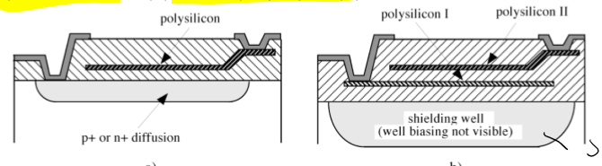
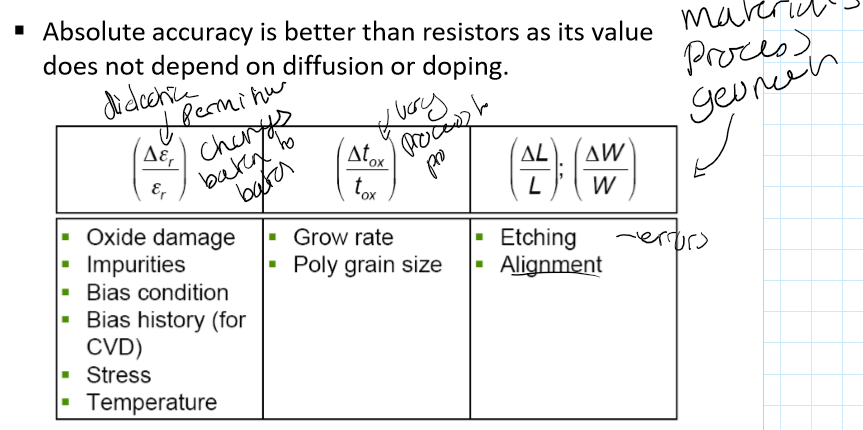
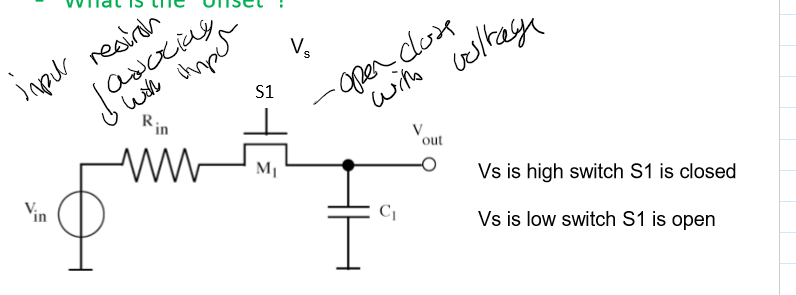
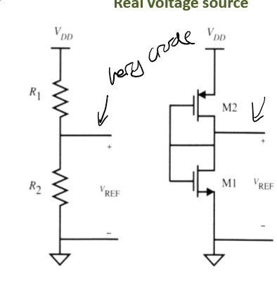
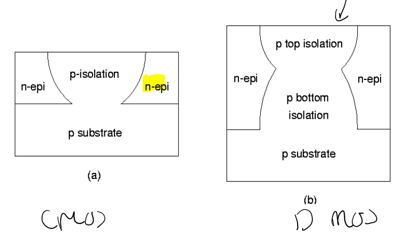
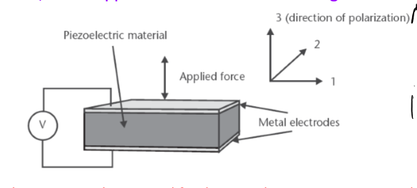
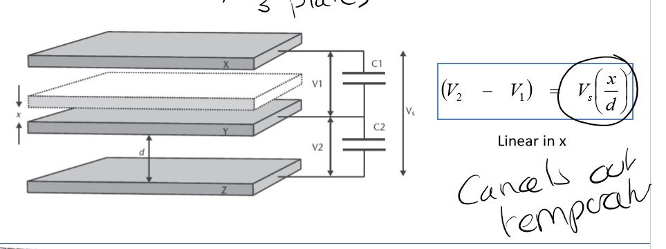
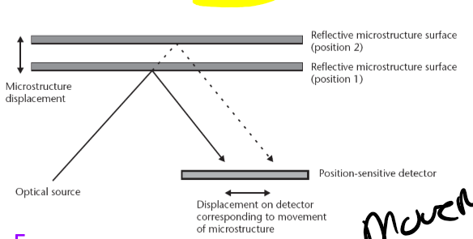
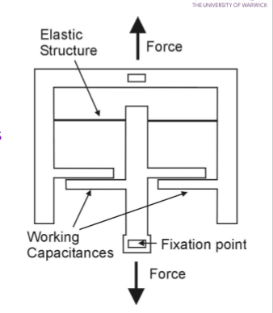

# ES434 Diagrams to Remember

## CMOS Technology

### Resistors

### Capacitors

#### Switched Capacitor

### VLSI Switch

### Active Load

### Floating Gate

### Current Mirror

### Current Source

### Voltage Source

### CMOS Op Amp

$A_v = \frac{-R2}{R1} $

### Twin Tub

### Epi CMOS

### SOI

#### SIMOX Thin film wafer

#### Wafer Bonding (thick film)

#### Smart Cut

#### Isolation

#### Trench isolation

#### LOCOS Isolation

## Silicon Micromachining

### Anisotropic Etching

### Wet Etch Process

### Surface Micromachining

## Sensors

### Thermocouple

### Thermotransistor

### Piezoelectric

### Capacitve

### Differential capacitve

### light Intensity Variation

### Spatial Position Variation

### Electrostastic comb drive

### Scratch drive

### Piezoelectric Cantielever

### Piezoelectric Pumps

### Thermal Drive

### Closed Loop Accelerometer

### Piezoresistive Accelerometer

### Capacitive Accelerometer

### Piezoresistive Pressure Sensor

### Piezoresistive boss pressure sensor

### Surface Micromachined Pressure Sensor

### Cantilever Pressure Sensor

### Capacitive Pressure Sensor

### Lateral Resonant Pressure sensor

### Pressure Sensor Fabricaition Steps

### Capacitive Force Sensor

### Load Cell

### Cantilever Froce Sensro

### Anenometer (Heat Loss)

### Calorimetric Flow Sensor

### Time of Flight Flow Sensor

### SOI Flow Sensor

### Pressure Difference Flow Sensor

### Fporce Transfer Flow Sensors

## 3D MEMS and Packaging

### LIGA

### MSL

## High perforamnce Emerging Tech

### Future Mosfet

### Partially Depleted SOI

### IBM Strained Silicon Device

### FinFET
