# High Performance & Emerging Technologies

## High Performance
- Silicion is reaching technological limit
- Therefore "desperat" measures to get below 10nm
- SOI Is established
- But Si/Ge and GaAs are alternative for speed.

### Critical Issues in Transistor Design
- Poor electrostatics increased Ioff
  - Double gate to retain gate control over channel
    - Minimise OFF State drain drain source leakage
- Poor Channel Transport decreasted Ion
  - High mobility channel
    - High mobility / injection velocity
    - High drive current and low intrinsic delay
- S/D parasitic resistance decrease Ion
  - Metal Schottky S/D
    - Reduced extrinsic resistance
- Gate leakage increased
  - High-k dielectrics
  - Reduced gate leakage
- Gate depletion
  - Metal Gate
    - High drive current

    

### Partially Depleted SOI
- Device design translates well between bulk Si and PD SOI
- eg: Short channel effect control by doping halos
- Reduced junction capacitance
- Dynamic floating body effect - parasitic bipolar

### SiGe (Strained Silicion, Silicon Germanium)
- As speed of transistor is dependent on the size of the channel and the spead carrieres move acrros it.
- Therefore, improved lithographic techiques have reduced channel dimension to 10's nm
- "Strained silicon" can be used to imrpove carrier mobility
- ~34% reduction in power or ~17% speed for same power
- But is more expensive process than SOI.

#### How is Silicion Crystal Strained
- Strained layer created from CVD (Chemical Vapour Deposition) deposition of silicion over a graded Si/Ge layer.
- Si and Ge depositied starting at a low Ge conecntration until lattice constant is 1% greater
- Done to maintain crystal lattice without defects.
- 
- How it works:
  - Electrons "bullets" and atomic lattice as "target"
  - Strained silicion has more "space" before it hits a "target" 
  - In reality, strained silcion makes it harder for electrons to move states, sometimes called "scatter"
  - This "scatter" radomises their motion
  - IE resistance that keeps electrons from maintaing a momentum in one direction
  - Reducing scatter increases the average distance an electron can travel before being "knocked offf course" - increasing it's average velocity in the condufction direction
  - Hence an increase carrier mobility and speed

#### IBM Strained silicion devicces
- Strained silicion layer can either be used with bulk silicion or SOI for better isolation.
- 
- 
- Substrate Ge, fraction x $\lt 30%$
- NMOS Idsat enhanced ~1.5x
- PMOS Idsat enhanced ~1.15x
- 

### New Gate Structure
- Nano technology transistors (sub 100nm)
- Only few atomic layers thick
- Leakage power - which generates heat and lowers power efficiency becomes a major challenge
- Intel Tri-gate design = MuGFET
- 

#### FinFETs (TriGate with Fins)
- Sub 45nm node
- Lowest node is now 5nm
- Compared to 65nm tranistors
  - Intergrated tri-gate transistors offers 45% increase in drive current (and switching speed)
  - 50 times reduction in off current
  - 35% perfect reduction in transistor switching power
  - 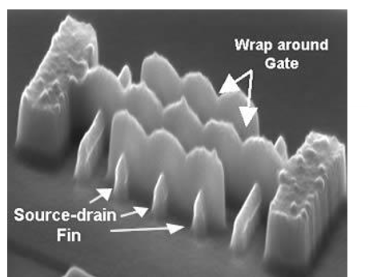 

### probelms with VLSI Capacitors
- Silicion dioxide has been main gate oxide material but has kow K value
- As transistor size shrinks, so must the gate oxidie thickness 
- Below 2nm leakage current increase drastically tue to qunatumn mechanical tunneling
- Leads to unnacpatable power consumption and reduced deivce reliabilty
- Replacing the siicion dioxide gate dieletric with a high k cermaic material would increase the gate capacitance without concomitant leakege effects

#### GaAs Ultra High Speed
- GaAs (Gallium Arsenide) both advantages and disadvantages to Silicion
- Main advantage is higher electron mobility
- Mainly used for fast opto-electronic communication
- **Advantages**:
  - Higher electron mobility (4000 vs 800 cm2/Vs - same doming much lower resistance)
  - Lower noise at high frequencies
  - Semi-insulating substrate
  - Higher radiation hardness
  - Opto-electronic integration
- **Disadvantages**
  - Lower hole mobility 
  - Higher noise at low frequencies
  - Higher cost
  - Great fragility
  - Lower thermal conductivity
- Trade off between power and speed
- Eg: two devices with same channel reistance, then GaAs will have to be long and thin.
  

##### GaAs NMOS - MESFET
- As hole mobilitty is lower for p-typ GaAs, nearly all devices are n-type
- Can make the same range of devices as with Si (bipolar, MOSFET)
- GaAs logic nearly al Metal-Semiconductor FETs (MESFET)
- MESFETS do not rely upon the formation of an inversion layer but instead the thcikenness of the channle is modulated by varying the thickness of the depletion zone
- 
- 
- Metal Semidconductor forms a Schottky diode
- By changing the gate voltage, the size of the depletion region can be changed
- Devices come in two forms:
    - Enhanced: Doped so not normally "on"
    - Depleted: Doped so "on" all the time
    - 

##### Inverter
- GaAs logic only uses n-type as p is significantly slower  
- Can use a "switch" to control the current to the output
- Can be made by combining D and E MESFETS using E-MESFET as a switch
- MESFETS also used instead of a reistor as it has a higher resistivity
- And better matching of the load resistnce and the on resistance can be achieved.
- 

##### NOR gate
- Logic described as Direct-Coupled FET logic (DCFL)
- Others exist, but this is the most common
- 

### Relative Perforamnces

##### Opto Electronic & Microwave (THz) devices
- GaAlAs photodiodes
- High speed optical couplers
- Hetrojunction HBTS - different material for base and emitter.

## Smart Devices
- Smart sensor has both sensor and preprocessing, some with processor as well.
- 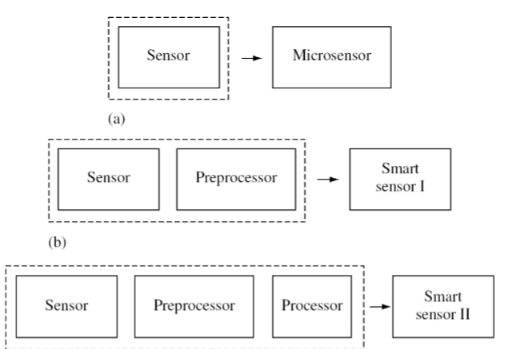
- Elements:
  - Primary sensing element
  - Excitation control
  - Amplification (variable gain)
  - Analgoue filtering
  - Data conversion
  - Internal compensation
    - Self-test
    - Auto-calibration
  - Digital information processing
  - Digital commncation processing
- 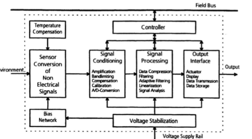 

### When to use Smart Sensors
- Issues to consider
  - Cost effective production needed in volume
  - Reliability needed
  - Compensation of interference from (eg: ) temperature etc
- Low noise amplification is key
  - Sensor signals much smaller with minaturation
  - Have to cope with tiny capacitacnes and currents
- Digital interface required
  - Digital communciation commonly used
  - I2C, SPI, CAN etc

### Smart vs Intelligent
- Intelligent sensors have some additioanl processing capability - ie to use deep learning, AI, Machine learning etc
- 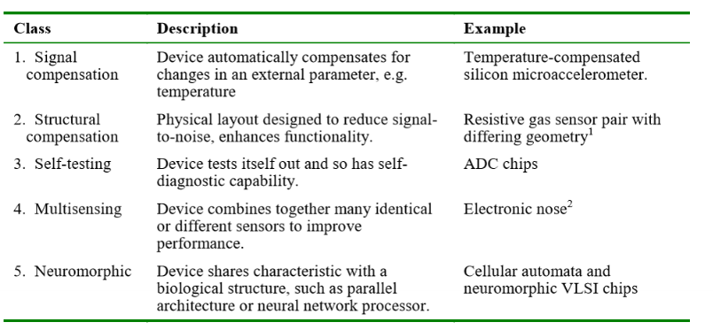  

### Smart Smell Sensing
- A simple odour usually small, polar, light, molecule
- Compelx odour set of 10s to 1000s of molecules
- Smell stimulates the olfactory receptor cells
- Sends signals to the brain
- Brain registers smell intensity and type
- So **E-Nose** has array of chemcial sensors with partial specificity and appropatiate recognition system - so can identify simple to complex odours.
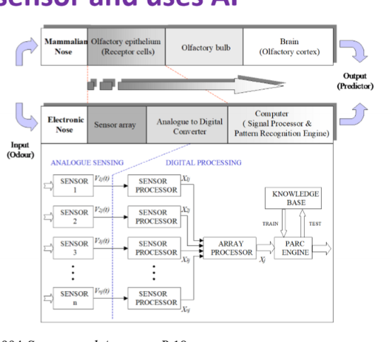

#### Urine Detection
- Physcological Impact
  - Affected person cannot percieve smell (or too late)
  - Depression, loss of self-esteem
  - Loss of independence, second  most common cause of institutionalisation
  - Looss of individual potentials, social isolation and loneliness
- Health Concerns
  - Skin breakdown
  - Urinary infections etc
- Commerical availability:
  - Incontinence care and products
- Therefore need odour sensors as a warning device! Electronic nose of urine

#### Small Low Cost Wearable Smart Nose
- Metal Oxide CMOS base Odour Sensors
- Based on CMOS micro heaters
- Customised materials (Pd/Pt doped Sn02, WO3 CuO)
- High sensitivity: $\lt 10ppm$
- Low poer consumption
- Fast response time compared to comerial sensors
-  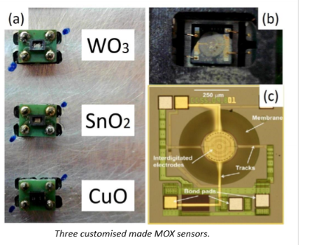
-  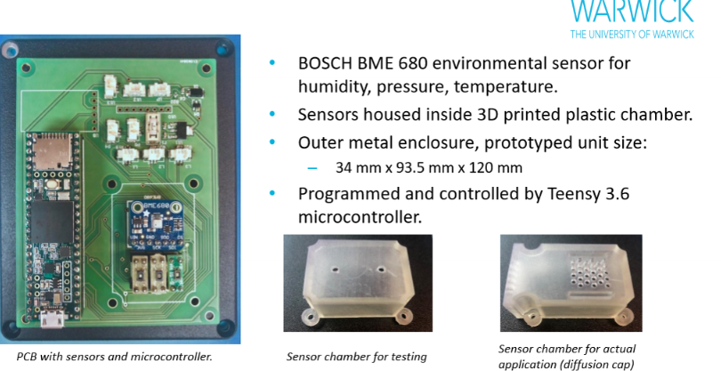
-  

### Learning Systems

#### Measurement Systems
- Automated gas testing bench with controled gas concentrations an flow rates
- Urnine and possible interfering gases
- 5 concentrations of each gases and 5 repeates, so 100 learning vectors
- 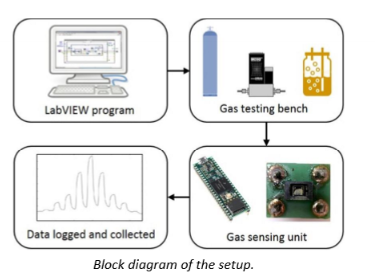

#### PreProcessing
- Convert raw sensorresponse in voltage to resistance
- $S = R_{gas} / R_{zero}$
- Preprocess multivariate data in matrix with concentration, sensors response and gas type

#### Artificial Neural Network Model
- Convolutional Neural Network and Shallow MLPNN
- Shallow mLP NN:
  - 1 hidden layer
  - Four inputs - gas response and humidity
  - Four output neurons - one per class  
- CNN
  - Two convolution layer
  - One max pooling layer
  - One fully connected layer with four possible outputs
- Result of both good accuracy
- 100% accuracy for synthetic urine - no false positives

#### Improving Selectivity
- Use Silicion neurons and deep learning
- 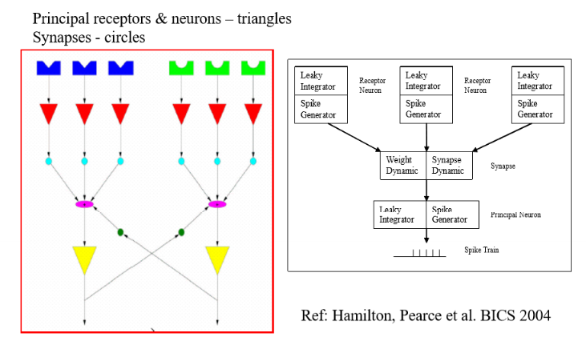 
- And use pre-concentrators
- 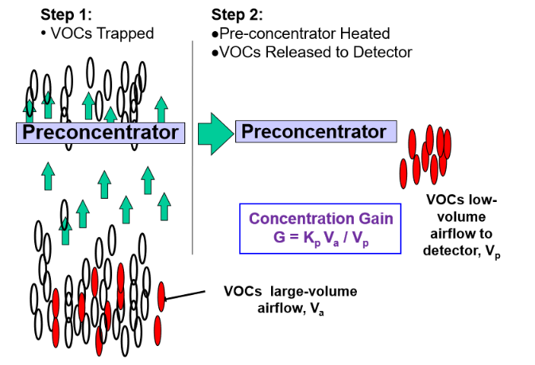

### Breath testers
- Common
- Exciting emerging market (advanced chemical sensing)
- To test for different VOCs
- Lots of different types
- Owlstone Lonstar E-nose from Cambridge company very good
- 
- 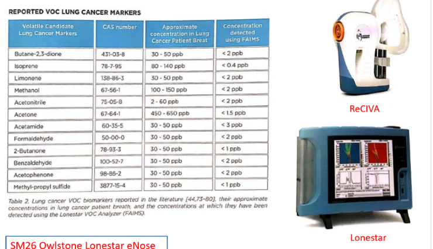

