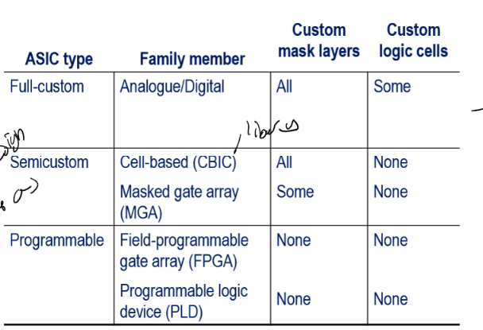
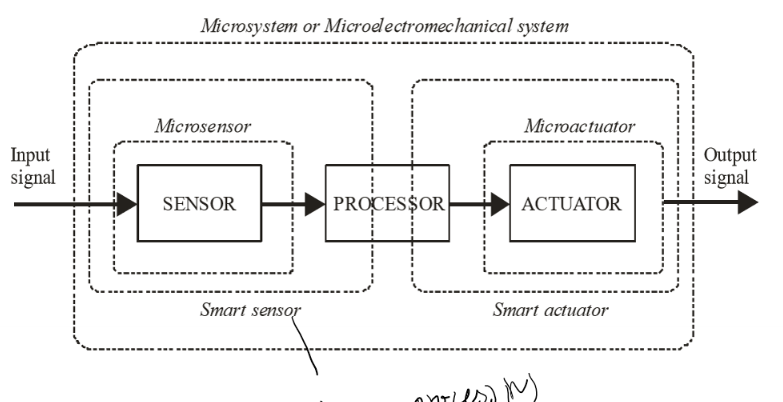
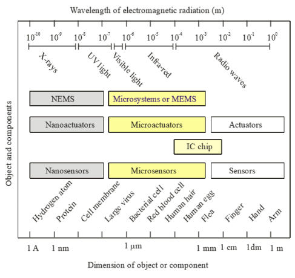
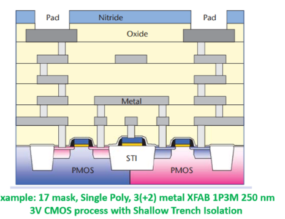
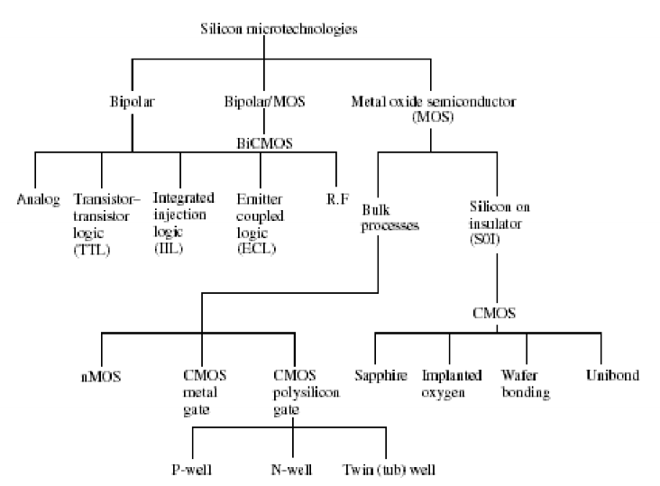
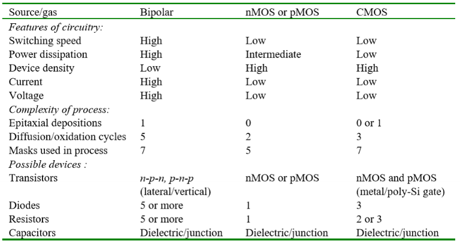
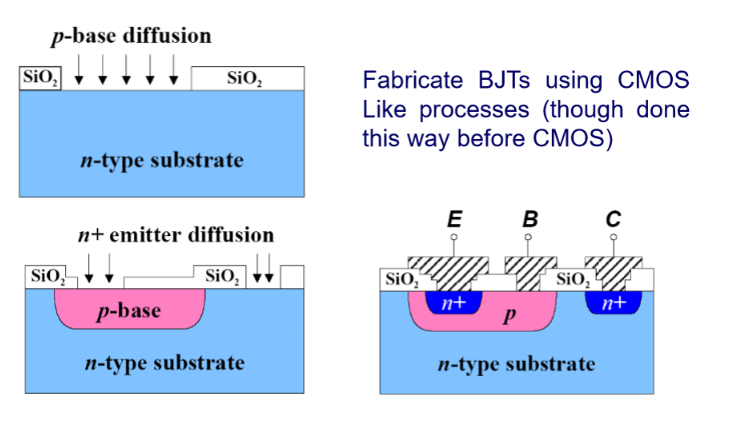

# Introduction to ASICs & Silicon Processing

<equation-table>

| [Introduction](#introduction)                                     |                                                                                     |
| ----------------------------------------------------------------- | ----------------------------------------------------------------------------------- |
| [Sensor definition](#sensor-definition)                           | A sensor is a device that converts a non-electrical physical or checmial quantit... |
| [MEMS Defintion](#mems-defintion)                                 |                                                                                     |
| [Microsensors and MST/MEMS](#microsensors-and-mstmems)            | Advantages:                                                                         |
| [BJT vs MOSFET](#bjt-vs-mosfet)                                   |                                                                                     |
| [Basic Silicion Bipolar Process](#basic-silicion-bipolar-process) | See image                                                                           |
| [BiCMOS Process](#bicmos-process)                                 |                                                                                     |

</equation-table>

## Introduction

### ASICS
- Application Specific Integrated Circuits
- Difference between ASICs and ICs
    - ICs that are not ASIC
      - Memory chips - ROMS, DRAMS SRAM
      - Microcontorller/processors
      - TTL ICs at MSI, LSI and VLSI level
    - ICs that are ASIC
      - Chip for a toy
      - Chip for a satellite
      - Chip containing micropressor as a cell together with other logic
      -    

### Sensor

#### Sensor definition
A sensor is a device that converts a non-electrical physical or checmial quantity into an electrical signal.

#### MEMS Defintion
- A microsensor is a sensing device with at lease **one dimension** on the **micron** scale
- A microsystem is an intelligent miniturised system comprising of sensing, processing and actuating fucntions.
- Microsystem technlogy is used to fabricate microsensors, microactuators and micromachines
- Euro we call it MST, but in the US they call it MEMS. 
- MEMS: microelectromechanical systems
- 

#### Microsensors and MST/MEMS
Advantages:
- Silicion microtechnology
- Small size
- Low weight
- Batch production / low volume 
- Integration of processor / actuator
Disadvantages:
- Small numbers and expensive silicion technology
- Process incompatiability with circuits and sensors
- Major packaging problems - often more expensive
- No standard signal output - need to move to digital
- Sensor industry is very conservative
- Deviced deficiencies (offset, drivt, non-linearity, cross sensisity, temperature) - dofficult
- Rapid prototyping
- Microassembly

## Silicion Processing

### Standard Silicon Technlogies
- Silicion CMOS process, widely used for low cost silicion chips
- Numebr of poly and metal layers differ
- Full wafer, MPW (multiproject wafer) and multi mask and split runs possible to
  - Smaller runs, spread cost with other companies using

### Transistor Technology Recap
- Bipolar junction transistor first invented 1948, commercial 1952.
- Field effect transistor - are unipolar, since operation depends on carrier type. (n type, pythpe)
- 60s-70s BJTS dominated, 80s plus, MOSFETs dominated as simplicity in circuit and fabrication
- BJTS offer higher current drive and better analogue (so used in power) or preffered for high speed RF.

#### BJT vs MOSFET
- Input Current
  - Mosfet - No gate current (capactive input)
  - BJT - Base current (resistive input input)
- Output current
  - BJT capable of larger output currents
- Bias Voltage:
  - Similar: $V_{GS} \approx V_{BE} \approx 0.7V$
- Performance
  - Size: BJT larger
  - Gain: BJT has higher transconductance (gm)
  - Speed: BJT faster
  - Power: BJT has higher power consumption 

#### Basic Silicion Bipolar Process
See image

#### BiCMOS Process
- Combination of CMOS and biploar into one process
- Good interest for wireless / communiaiton makrets
- Cost more to fabricate but at systems level, not much more
- Thus combines digital logic with high speed drive.
- Thus has advantages of Bipolar and CMOS
  - Combines **speed** of current driven BJTS with **low power and high density** of voltage driven MOSFETS
- Process compleixty is increased
  - Twin tub process
  - Buried layer
  - BJT isolation layer
  - Collector plug
  - P-base

In general is in two stages when performacne is needed
- CMOS for low cost, low power analogue and logic
- BJT (TTL) output buffer for current drives
  - Very fast when driving capacitive loads
  - High fan out
  - large bus lines (eg. pre charging)
- More complex (and expensive) processing and area than cmos, therefore only used when speed is required for driving large loads.

