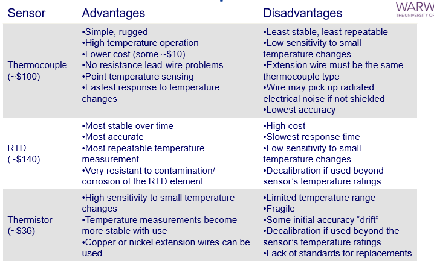
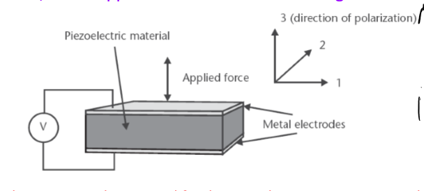
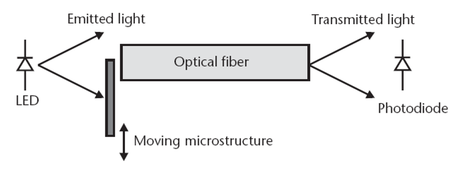
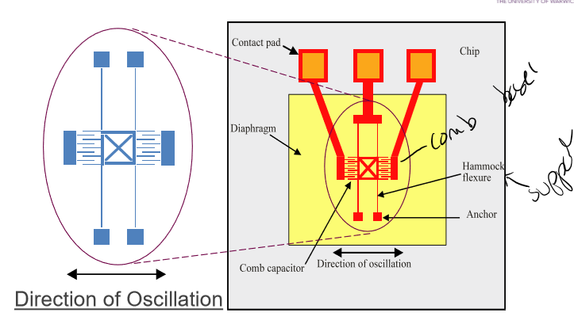

# Sensors

## Temperature Microsensors
- Silicion widely used
- Most temperaure sensosr based on dependence of base-emitter voltage of bipolar transistors
  - (Bipolar tends to have higher sensitivity than MOSFET)
- Thermal sensosrs are also used to indirectly measure non-thermal proepries (velocity of air flow)
- Temperature dependence of silcion is undesirable
  - Therefore temperature dependence intensivly studied, well udnerstood and compensated for
  - Most MEMS device have temp compensation as control
  - ise expensive, need heating /cooling system such as fan or Peliter
- Therefore 2 catagories:
  - Self-generating: Needs no external power source, since it uses the signal as power source (eg thermocouples)
  - Modulating: Needs external power srouce (eg resistors, diodes and transistors)

### Classification

### Thermocouple
- Basic principle: Seebeck effect
- 2 conductors joined together at one point
- Temperature difference obtained between joined and non joined parts
- Open circuit voltage measured
  - Very high input impedance 
- 

**Advantages:**
- Low cost
- Mecahnical stability
- Wide temperature range (-200 to 2000C)
- Reasonable accurace (+- 2.2C)

**Disadvantages**
- Low sensitivity (uV/C)
- Requires known temperature reference
- Requires periodic calibration

### Thermopile

- Population of thermal coples togheter
- Used to measure the seebeck effect in silicion
- Narrow p-type stripes made by ion implantation or diffiusion in an n-type epitaxial layer
- Strips connected by evaporated aluminum strips
- 

**Advantages**:
- Easy to fabricate
- Hgih sensitivity 1mV/K
- Excellent resolution, 1-10uK

**Disadvantages**
- large thermal conductitvy ofsilicon causes probles as it is more difficul to create temperature difference on chip
- Problem can be solved with resistor on chip
- Noisy so set to 50kOhms for lower Johnson noise.

### Thermistor
- Low cost temperature sensitive resistors
- Constructed of solid semiconductor materials that have postive or negative temperature coefficient
- Solid Sate semiconductor device
- Positive Temperature Coefficient (PTC) thermistors
  - increases resistance with increasing temperature
- Negative Temperature Coefficient (NTC) thermistors 
  - decreases resistance with increasing temperature 
  - Tends  to have  large resistance range so easy to measure
- R to T relationship is non-linear
  - Very steep slope
  - Increase sensitivity of the device
  - Resistance change +- 3% /C
  - Limits range of operation

**Advantages**
- Low cost
- Very sensitive (10x more than RTDs (PT100 etc) )
- High accuracy (+-0.02C)
- Stable / reliable / repeatable

**Disadvantages**
- Limited operating range (-100 to 150c)
- Very non linear

### RTD (Resistance Temperature Detector)
- Typically platinum wire wrapped around ceramic bobbin. 
- More accurate and more linear over wider range than thermocouple and thermistor

### Silicon n-p Diode as temperature Sensor
- Usually diodes are forward biassed when used as temperatre sensosr
- Between -40 to 125 almost linear behaviour
- Keep bias current low to avoid heating but enough to overcome noise.

### Thermotranistor Circuit
- Transistor make more accurate temperature sensors than diodes
- Use of transistor based on Ic-Vbe characteristics
- npn less noisy than FET
- 
- 

## Mechanical Microsensors

Measurands:
- Angular velocity
- Acceleration
- Force (torque)
- Pressure
- Flow Rate
- + others that we don't cover

### Mechanical Transduction Principles
- Piezo resistive
  - Common, resistence changes with appried pressure or straing
  - Cheap
- Piezoelectric
  - Generate charge from surface when external force
- Capacitive
  - Charge based on capacitance / change of capacitance
  - Low power consumption
  - Simple and easy to fabricate
- Optical
  - Modulating properties of optical wave
  - Multiple properties to alter and measure
- Resonantors / Moving mass
  - Vibrate at fixed freuqency

#### Piezoreisistivty
- Measures change in resistance to applied pressure or strain
- Metal foil
- Sensitivity defined by gauge factor (GF)
- Ristance changed / applied strain, $\epsilon$
  - $GF = \frac{\Delta R / R}{\Delta L / L} = \frac{\Delta R / R}{\epsilon}$ 

-     
- Fairly cheap

#### Piezoelectric
- Materials generate electric charge when mechanical stress is applied
- Occur due to charge assymetry in the crystal lattice
- Hence have anisotropic properties
- can be used for oscillators / resonators
- At *Curie Temperature* (usually very high), loses its properties
- Voltage produced from rectangular block of Area A, thicknes t, Charge Q, capactiance C and relative permittivity $\epsilon_r$
- $V = \frac{Q}{C} = \frac{dFt}{\epsilon_o \epsilon_r A}$
- High input impedance required (as large currents cannot be drawn)
- 
- 
- Could use to cause movement, but nto very common as need high voltages and only give micron displacements

#### Capacitive
- Physical structure very simple and easy to fabricate in MEMS
- Gives presice means of measuring movement
- Charge based device, therefore low power consumption
- 
- Variable cap - Vertical motion
- Variable area - Horizontal motion
- Variable dieletric constant - dieletric material moves

$$
C = \frac{\epsilon_o \epsilon_r A}{d}F
$$
- Can be non linear
- As A, d, $\epsilon$ are temperature dependent, need to be careful
- Therefore use differential capacitance senosr (temperature affects both capacitors, therefore cancels out)
- 

#### Optical
- rely on modulating the properties of an optical wave
- Typical microsensors interact with the measurand and usually do not have integrated optical components
- Can alter:
  -  Intensity
  -  Phase
  -  Wavelenght
  -  Spatial Position
  -  Frequency
-  
##### Variation in Light Intensity
- Simply measure change in light signal by optical sensor (eg photodiode)
- Optical soruce usually LEd
- Temperautre and humidity can affect the output
- 
  
##### Variation in Spatial Position
- used for triangulation
- 

##### Variation in Frequency
- Measures changes in frequency of a wave contacting a moving body
- Doppler frequency shift to measure velocity of target

#### Resonance
- Vibrate at fixed frequency ($f = \frac{1}{2\pi} \sqrt{\frac{k}{m}}$)
- Extremely stable
- Measurand typically modifies:
  - Stiffness, Mass and Shape of resonator (hene frequency)
- Resonance peaks at sepcific frequency - magnetigute will be limited by damping effects
- Quality factor Q - defines sensitivity
  - $ Q = 2\pi \frac{E_m}{E_C} $ where Em is energy stored, EC is energy lost per cylce
- possible microsensor resonantor structures based on multiple beasms
  - Double ended tuning fork (DETF)
  - Triple beam tuning fork (TBTF) 
- 

#### Q-Factor
- high Q factor - shows structure isolated from surroudnings
- Q factor controlled by many parameters
- EG:
  - Energy lost to surrounding fluiod = $1/Q_a$
  - Energy coupled through resonator supports = $1/Q_s$
  - Energy lost to internal damping = $1/Q_i$
  - $1/Q = 1/Q_a + 1/Q_s + 1/Q_i$
- $Q_a$ usually largest
- Below 100 Pa, moelcules behave independently exchanging momentum with the resonator
- Above 100 Pa behaves as a fluid, hence viscous drag dominates

## Mechanical Microactuators

Classification:
- Linear displacement
- Angular displacement
- Linear acceleration
- Angular acceleration
- Apply force or torque
- Apply Stress/ Load

### Actuating Principles
- Principles:
  - Electromagnetic
    - Not MEMS - difficult to make efficient and small
  - Electrostatic
    - Two plates opposite charge attact each other
    - Simple
    - Comb drive, Scratch drive
  - Thermal
    - More power, but more force
    - Expansion of bmaterials
    -  
  - Piezoelectric
    - Sensor and actuator
    - Mecahnical amplifciation from small movement
    - Piezopumps
  - Vibration and Noise

- Actuator translates an electrical signal to mechancial movement (output transducer)
- Noramlly only 5% to 35% efficient
- Factors:
  - Fabrication, robustness, resistance to external forces (temperature humidity), range of motion

### Electorstatic Drive
- Very common in MEMS
- Fundemental principle of electrostatic attraction of oppositely charged plates
- Relatively straight forward to fabricate (parallel plate cpacitor)
- Non linear
- Energy stored depends on gap
-      

#### Electrostatic Comb Drive
- Common to use comb drive
- Better surface area, therefore more force and more motion
- Multuiple fingers with small thickness compared to width
- Lateral movement with fixed electrode and moving electrode
- Gap doesnt change, it's the surface area that changes

#### Elecrostatic Scratch Drive
- Alternative format
- Flexible electrode plate and small bushing
- When voltage applied, plate buckles
- Causes electrode to scratch along insulator cuaisng motion
- Voltage cyclee to produce regular movement

### Piezo Eletirc Cantilever
- Used as sensor and actuator
- Small movement requires mechanical amplification
  - Effect is small, requires large voltage
- Can deposit pizeolectric onto cantilevers to create unimorph
- Hecne deflection of the free end is greater than produced film
-  

#### Piezoelectric Pumps
- common in micro pumps
- 2 silcion wafers one with etches with inlet and outlet, other etched to form membrane coated with piezoelectric material
- Hence combination forms a pump

### Thermal Drive
- Differential thermal expansion
- Consumes more power but produces more force
- Creates stress at interface, hence moevment
- 

### Mechanical Structures and Key Design parameters

### Micromechanical Scaling
- Micron size structures
- Laws of mechancics dont necessarily apply
- Depends on physical principle
- Ideally microstructures should designed so that linear theories of mechanics apply

#### Silicon
- Silicon has excellent properites
- Processed conveiently
- Can combine to make microsensors / actuators
- Precise reliable
  - Youngs modulus similar to steel
  - Brittel
  - CAnnot deform plastically

### Microhmehcanil Structures
- Cantilever beam
- Bridge
- Diaphragm
-  
-  

## Inertial MEMS Sensors
- Group of MEMS senosrs include accelerometers (linear) and gyroscopes (angular)
- Used in lots of applications
- Some need different bandwidths, resolutions, ranges
- 

### Principles of Operation
- Proof mass attached to mechanical suspension system
- Any interial force due to acceleration will deflect proof mass
- Effectibly mass-spring-damper system - second order damped harmonic oscillator
- Can be used to measure acceleration or angular velocity
- 

### Sensing Principles:
- Capactive

- Dispalcement sended by electrosatic (capacitive) sensor
- With fixed bias voltage, a change in charge of the capaciro can be measured
- 
- 

### Inertial Sensor Interface
- Circuitary to digitse sennsor voltage output
- Amplifier to increase signal - and to get best signal to noise ration (SNR)
- Signal processing tofilter and extract desired information
- Stabilising sensor perforamnce over temerature

### Accelerometer
- Measure acceleration
- Multi axis can measure orientatio of gravity directly
- But also can respond to linear acceleration due to motion in x y z
- Acceleration can be generated by motion of sensor or by gravity
- Gravity sensing application used a lot (eg tilt sensing)
- 

#### Open Loop Vs Closed Loop Accelerometers
- Open loop 
  - Simplest and ease of fabrication
  - Less accurate 
  - Issues with large manufacturing tolerances
  - Larger masses have second order effects, non linear (twisting)
  - Silicion suspension systems are additioanly non linear
  - BUT CHEAP
- Closed Loop
  - More accurate
  - Use output signal + circuitryu to stee actuation mechanism back to point of rest
  - **Force balance devices**
  - Electrical signal proprotional to feedback force
  - Advantages:
    - Deflection of mass reduced - hence less non linearity
    - Sensitivity determined by control system
    - Dyanmcis of control system tailored to application
  - Disadvantages:
    - More complex
    - More expensive
     

#### Piezoresistive Accelerometers
- First type - open loop control
- Produced on back of pressure sensors
- Poor temeperature coefficient (dependent on temperature)
- 1-3mV/G 5G to 50G dynamic range, 0.25%/deg C temp coefficient
- Can use integrated circuitary to improve perforamnce
- Uses more power than capacitanve
- Microcmachined out of single crystal silciion
- $\Delta R / R = k_a a_y$ 
- 

#### Capacitive Accelerometers
- Larger signals
- Good steady state
- Low noise
- But senstive to Electromagnetic fields
- 

##### Vertical Capactive Accelerometer
- Eeasy to fabricate, just miromachining
- 

##### Lateral Capacitive Accelerometer
- Cheaper to go with lateral version
- Use surface micromachining
- Comb structure - reduces electrostatic forces, more linear
- Many combs improve signal
- - Sensitivity inline with wafer plane
- Proof of mass much smaller (thinner)
- Onchip electronics for compensation
- Sensing element is poly silicion on top of sacrificial silicion oxide layer.
- 

#### Piezoelectic MEMS Accelerometers
- Common in macro accelerometers, same principle for micro
- Movement indcues surface charge that can be measured
- High bandwidths
- Poor at low frequencies as charge dissipates
- Usually ZnO or AlN as can be easily deposited
- 1.5mV/G 3Hz - 3kHz
- 
- Need high impedance to measure

### Gyroscopes
- Measure angular rate
- Gyro has one axis, but can be mounted in 3D 
- 
- Use the **Coriolis Effect**

#### Coriolis Effect
- Depending on reference, see curved path
- IE: Standing on rotating platform, near center
- If you move to the point near the edge your speed relative to ground is increased
- The rate of increase of your tangential speed caused by your radial velocity is coriolis acceleration
- 

#### Sensing

- Measure the Coriolis acceleration
- Using bivrating mass. Resonant strucutre
- Then clever maths

#### Lateral PolySilicon Gyroscope
- Earyl 1996
- Comb drive actuation to resonate mass
- Then capactive pickup
- 

#### ring MEMS Gyroscope
- Capacitve pick up place at points at antinode points of flexila mode and nodes of the secondary flexial mode
- Made with DRIE (Deep Reactive Ion Etching)
- Generally more expensive, used in aerospace
- 

### Commerical MEMS Sensors
- ADXL202 - 2 axis
- Surface mircomachined
- Static and dyancic accelerations
- Capacitive sensing
- 

## Pressure Sensors
- MEMS tech ideal for making low cost microsized pressure sensors
- Pressure measurement from displacement or strain
- 
- Applications:
  - Automatoive air pressure sensor
  - Typre pressure sensor
  - Blood pressure
- Mostly fabricated from forming mebranes in silicion
- Common method;
  - Wet etching (KOH)
  - Also can use surface micromachining (can have a higher precision)
- Define membrane dimensions by using etch stops (electrochemcial, timed, boron)
- 3 Types:
  - Absolute (relatuive to vacuum)
  - Gauge (relative to atmospheric pressure)
  - Differential (relative to two inputs) (easiest)
- When bulk micromachining:
  - Accruate dimensional toelrence are essential for good manufacturing process
  - use of dopants may lead to considerable residual stresses that can cause buckling of a structure
  - Fatigue endruance will depend on the surface roughness and hence the quaility of the ethcing process.
- When Surface micromachining:
  - Mechanical properties of polysilion are predominatly detemrined by grainsize
  - Smallest physial dimension of the structure should be larger than the grainsize (so linear elasticity applies)
  

  ### Piezoresistive Pressure Sensors
  
  #### Simplest
  - Simplest
  - Thin silicion membrane
  - Resistors placed on points of maximum strain
  - Used to measure deflection
  - Piezo-resistors diffused in top
  - Single Cyrstal Silicon
    - Excellent material
    - No creep (no plasticicity)
    - No hysteresis 
  - Been in use for years
  - 

#### Boss Design
- Employs rigid center, ehnce resitors can be laid out in pairs with no inrinsic stress issue (thicker)
- Arrangement improves linearily characteristics of diaphram in both directions - so suitable for differential pressure
- 

#### Surface Micromachined
- Cheaper and smaller
- Diaphram formed from SiNx or polysilicon
- But requires sacrificial layer
- Used for Blood pressure measurement
- can use a dummy pressure senosr for temperature compensation

#### Cantilever Beams
- Atteched to underside of the diaphragm
- Piezoresistive strain guage on cantilever
- Mechancial "amplifier"
- Second beam used for temperature compensation
- 

### Capacitive Pressure Sensors
- Use parallel plates
- Can be more compact
- Highly non linear
- Early: Pyrex (cryasl glass) as lid
- Newer: Sacirfical layers
- 

**Comparison:**

### Resonant MEMS Pressure Sensor
- Use a resonant mechanical structure to sense deflection in pressure sensitive diaphram
- Has many challenges:
  -  Fabrication of resonator on top of presure sening structure (complex)
  -  Silicion resonantors - incoroorating vibration excitiement circuitary and detection mechanism
  -  Vaccum encapsulation of resoantor to remove gas damping effects
-  
#### Lateral Resonant Pressure Sensor
- Mounted centrally on silicion diaphragm
- Electostatic excitiation
- Capacitive detection
- 

### Warwick Design Presure Sensor

### Pressure Sensor Fabrication Steps

