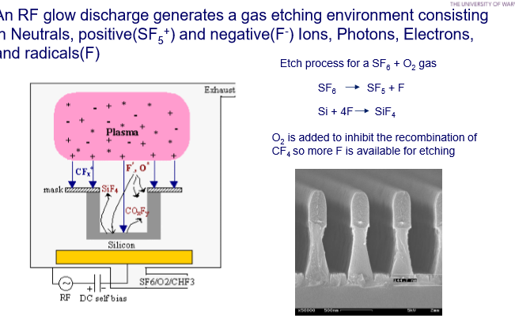

# Silicon Micromachining

#### Why is Silicon Micromachining Important?
- Need to manufacture micro components
- Complex in shape and have micron resolution
- At low cost and high volume
- EG:
  - Microsensors 
  - Microactuators
  - MEMS
  - Micro parts eg packages

#### MEMS
Combines:
- Micromachining
- Microfabrication
- Micromechanics
- Microelctronics

## Micromachining / Microfabrication Technologies
Common for microsensors:
- Bulk Micromachining
  - Removing material from the silicon wafer itself 
  - Wet etching
- Surface Micromachining
  - Leaves wafer untouched but adds/removes additional layers above wafer surface
  - Plasma (dry) etching
  - Relatvely expensive 
- UV lithograph
- Deep Reactive Ion Etching (DRIE)
  - Removes silicon but looks like surface micro machine
  - Very efficient can do deep

Deeper / larger structures and 3D MEMS: (explored later)
- 3D Printing (low res)
- Micro-stereolithography (MSL)
- Nano-stereolithography (NSL)
- LIGA - Xray based

### Bulk MicorMachining
- Removing material from the silicion wafer itself
- typically wet ethced
- Traditional technologies
- Inexpensive / basic but issues with IC compatibility
  

#### Isotropic vs Anisotropic Etching
- Isotropic: etches equally in all directions
  - **Dry Etch** Process (SF6)
  - Masks: SiO2, Photoresist
- Anisotropic: etch rate dependent upon crystal orientation
  - **Wet  Etch** (approx 100 times slower than dry etch)
  - Etchents selectivly etch <100> and <110> crystal orientations while leaving <111> orientation unchainged
  - Use KOH (or TMAH EDP)
  - Etches photoresist and Al instantly so IC compatibility is an issue
  - Masks: SiO2, Si_xN_y

##### Sinlge Crystal Silicon Structure
- Crystal orientation specified in terms of crystal planes.
- Silicon aranges itself in diamon lattice structure
- 

##### Anisotropic Etching

- Typical etch rate for KOH: 0.1-3um/min (depedning on concentration and temp)
- Specifically 57.7 degrees
- CMOS usually uses <100> orientation wafer.

#### Etch Stops Types
- Oxide/nitride etch stop (to form nitride membrane or to leave a thin silicon/oxide membrane using SOI followed by backside etching)
- Boron Etch Stop
- Electro chemcial etch stop
- Timed etchstop
  - Simplist and cheapest but introduces more error.

#### Tpycial Wet Etch Process

- Deposit low stress nitride on oth surfaces of 100 wafer
- Spin on resist
- Copy mask onto resist
- Etch nitride through mask
- Etch wafer

### Surface MicoMachining
- Leaves wafer untouched but adds/ remove additioanl layers above wafer surface
- Typically plasma (dry) etched
- IC like philiosophy though relativly expensive
- "Sacrificial" thin films
- Heavily used for pressure, mass sensors and accelerometers
- Can be used with bulk micromachining to produce complex micromechancial structures
- 

#### Typical Fabrication Steps to Surface Microhamcine a Structure
- Oxidiation
- LPCVD (Low Pressure Chemical Vapour Deposition) deposit silicon nitride (rather than plasma)
- Deposit spacer layer
- Deposit Photoresist patten and etch base windo
- Remove resist and deposit polysilicion
- Etch microstructure
- Etch out Spacer layer
- metaliisation
- Done
- 

Combines to make micromachine silicon resonant pressure sensor

#### Problems with Surface Micromachining - Resisdual Stersses
- Corrected by high temperature 1000c Annealing
  - Have to be careful it's compatible with the CMOS
  - Might have to do before hand
- 

#### Multi polysilicon CMOS process
- Silicon wafer
- Thin layer of photoresist
- Step & Scan system, exposes pattern from mask into photoresist
- Unexposed photoresist is removed
- Repeat to build layers for 3D structure
- 

#### Examples of Polysilicion Strcutures

- Meshing gears on movable platform
- Laminated comb actuator results in nearly five times electrostatic force of single level actuator
- Micromirrors
  - One of the most valuable 
  - Projectors use them 
  - 

### Deep Reactive Ion Etching (DRIE)

#### Reative ion Etching
- RF glow discharge generates a gas etching environment consisting in Neutral, positive and negative irons, photons, electros and radicals 
- Ionic gas is what does the etching
- 

#### Deep Reactive Ion Etching (DRIE)
- Commonly used method also for full wafer depth TSVs (through silicon vias, usually fill with plasma)
- Based on dry etching method
- High density plasma to alternatively etch silicon and deposit an etch resistant polymer on side walls
- Unconstrained geometry 90 degree side walls
- High aspect ratio (1:30)
- Etch rates of almost 20um/min though 2-3 more common
- Easily masked with photoresist and SiO2

#### Bosch process to Improve Accuracy
- Basically masking and etching
- Phase 1: Deposition Phase:
  - Typically Bosch process
  - Short polymer deposition cycle immediatly after an etch cycle
  - Deposits layer of passivation on sidewall and base of feature by ionisation and dissociation of octaflurocuclopentane (C4F8)
- Phase 2: Etch Phase:
  - Sulfur hexafluoride (SF6) sponatneously etches silciion isotropically by initially dissociating the relatively inert molecule into atomic fluorine radicals
  - Trench propagates by sequentially alternating between etch nd passivation steps
  - Enables silicon to be etched vertically by restricting the lateral etch characteristics/.

#### Example of DRIE

Thermal actuator.

IR Detector with oxide mask

##### Microfludiics

##### Deep Comb Structures

- Comb drive to move a micromirror to alter wavelenght of laser
- Most commonly fabricated combdrive
- 