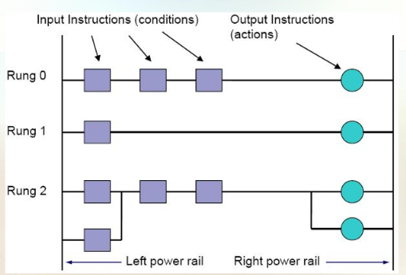

# PLCs Introduction

## Archiecture

#### What is a PLC?
- Programmable Logic Controller
- Industry computer to control / automate systems in real time
- Inventred by automotovie indsutry to replace dedicated relays

#### Designing PLC program steps
1) Undserstand the process
2) Define the variables to use (Addresses and Tags)
3) Design / build the ladder diagram
4) Run and verify the LD

### Memory Addressing (Tags)
- Global memory:
    - Inputs (I)
    - Outputs (Q)
    - Memory (M)
- Bits
  - Reference byte then bit
  - Example:
    - I1.6 = Input memomry, byte 1, bit 6

Different formats of displaying depending on manufacture

### Programming languages
- Ladder logic / diagram (LD) - Most commonly used
- Structured Text (ST) - More like C
- Function Block Diagram (FBD) - Graphical
- Sequential Function Chart (SFC) - flowchart like
- Instruction List (IL) - Assembly like

### Ladder Logic

### Scan Cycle
- PLCs run in a loop
- Read inputs
- Execute program
- Housekeeping diagnostics
- Write outputs
- Repeat

### Logic Functions

#### AND
- Both inputs must be true

#### OR
- Either input must be true

#### NAND
- Not AND
- Either output must be false

#### NOR
- Not OR
- Both outputs must be false

#### XOR
- Either input must be true, but not both
- Exclusive OR

#### Ladder Logic Advice
- Input instructions on the left
- Output instructions on the right
- Logic execute from left to right, top to bottom
- Outpiuts are written to memory first (and copied to actual outputs at teh end of the logic scan)
- Avoid duplicating outputs.
  - Output address should be referenced only once, otherwise the last output overwrites earlier settings
  - Avoid using negative coils as outputs
