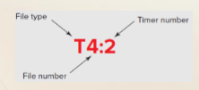
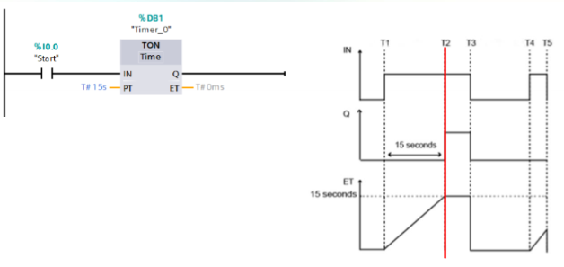
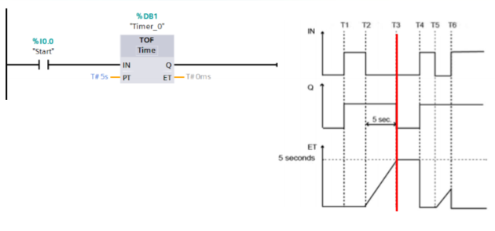
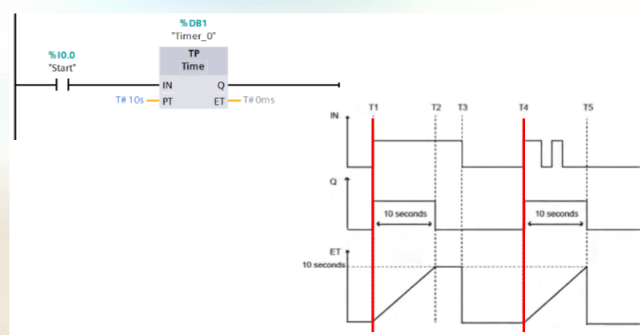
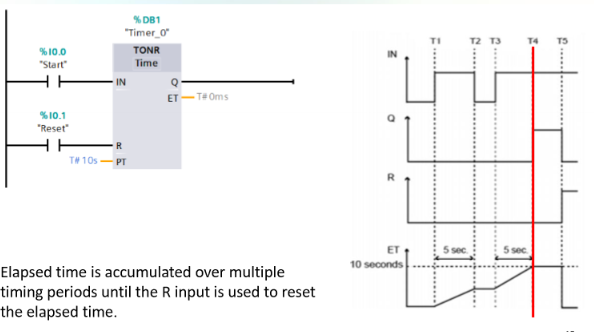
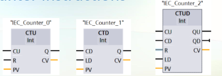
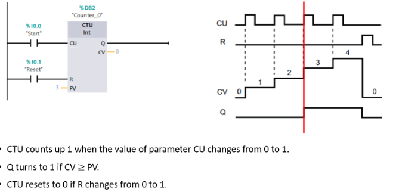
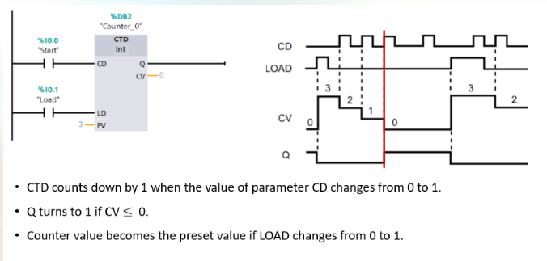

# PLC Timers and Control

### PLCS Timers
- Old school timing relays, operate at a preset time interval, then coils is engergise / denergised.
- PLC Timer instructions do the same thing.
- Time accuracy and repeatability are extrememly high.

Types:
- TON - On delay timer
- TOFF - Off delay timer
- TP - Pulse Timer
- TONR - On delay retentive timer

Inputs and output:
- Reset (R)
  - 0 = No reset
  - 1 = Reset elapsed time and Q bit to 0
- PT = Preset time input
- ET = Elapsed time output
- Q = Output

#### TON
- On delay timer
- Output turns on after input is held for certain time.
  

#### TOFF
- Off delay timer
- Output turns off after input has been off for given time

#### TP
- Pulse timer
- From rising edge of input, output turns on for a given time.

#### TONR
- On delay retentive timer
- Same as TON, but if input goes low, timer stops counting, but does not reset.
- Unless reset input is high.
  

### PLC Counters
- Count up or down

Types:
- CTU Count up
- CTD Count down
- CTUD Count up and down

Arguments:
- CU, CD: Count up or count down by one count
- R: Reset count value to zero
- LOAD: Load control for reset value
- PV: Preset value
- Q, QU: True if count value is greater than or equal to preset value
- QD: True if count value is less than or equal to 0.
- CV: Current count value

#### CTU
- Count up
- CTU counts up 1 when the value of CU changes from 0 to 1 (raising edge)
- Q turns to 1 if the $CV \geq PV$
- Current Value CV resets to 0 if the reset raising edge.

 

#### CTD
- Count down
- CTD counts down 1 when the value of CD changes from 0 to 1 (raising edge)
- Q turns to 1 if the $CV \leq 0$
- Current counter value become the preset value if the LOAD is changed from 0 to 1.

