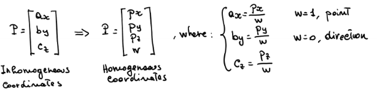
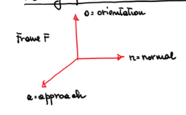
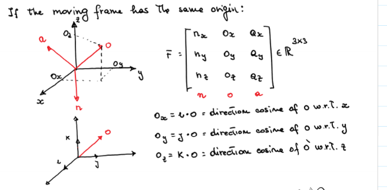
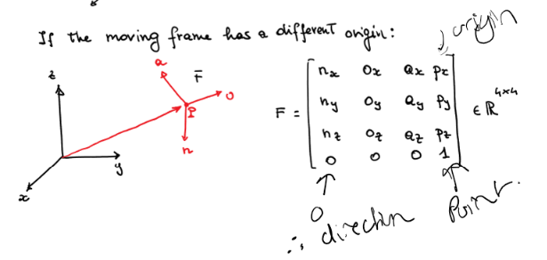
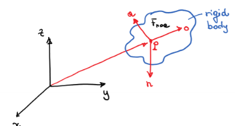
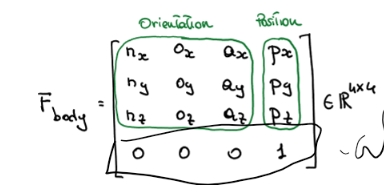
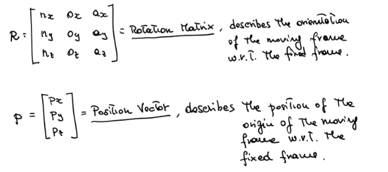
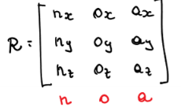

# Robot Kinematics 1 - Vectors and Frames

## Vectors and Frames

### Homegenous Cooridniates (HC)
- A point in 3D space can be represented by a 4D vector using homogeneous coordinates.
- Equally valid for points and directions
- Use w as 1  to represent points, 0 for direction.

### Moving Frames
- A frame is a set of 3 orthogonal unit vectors and a point in space.
  

If a moving frame has the same origin, thne just a 3x3 matrix

If a moving frame has a different origin point, then you need to use a 4x4 matrix, with the first 3 columns as direction coordinates and the last as a point vector for the origin.

### POSE
- Position and orietnation = pose
- A frame is attached to a rigid body to desribe it's pose (given it's rigity)
  

- Rotation Matrix - 3x3 - descries orientation of moving frame, wrt to fixed frame
- Position Vector - 3x1 - position of the origin o f the frame wrt to the fixed frame

#### Rotation Matrix Requirements

- 3 perpendicular constraint equations (axis are perpendicular)
  - $n \cdot o = 0$
  - $n \cdot a = 0$
  - $o \cdot a = 0$
- 3 unit length constraint equations (axis are unit vectors)
  - $|n| = 1$
  - $|o| = 1$
  - $|a| = 1$
- Right hand frame equation
  - $\det{R} = 1$
  