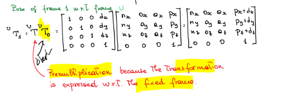

# Robot Kinematics 2 - Transformation Matrices

## Transformation Matrices

- $^UR_N$ = rotation matrix of N wrt U (Rotation)
- $^Ud_N$ = Displacement vector of N wrt T (Translation)

Can take 3 interprestations of *transformation matrix* $^UT_N$:
- Pose of N wrt U
- Change of corrodinates from N to U
- Rototranslation opeerator on a vector expressed wrt U.

### Pure Translation wrt fixed frame

- With resepct to U fixed frame. 
- Only dipslacement, no rotation (idendity matrix)

- When applying this translation to another fram
- **Premultiply** as transformation is expressed wrt fixed frame U.
Eg:

### Pure Rotation wrt to fixed frame
- With reprect to fixed frame U
- Only rotation, no displacement (0 vector)

#### Rot(x, theta)
- Rotation about x axis by theta
- X axis stays the same, y and z axes rotate

$$

Rot(x,\theta) = 
\begin{bmatrix}

1 & 0 & 0 & 0 \\
0 & \cos{\theta} & -\sin{\theta} & 0 \\
0 & \sin{\theta} & \cos{\theta} & 0 \\
0 & 0 & 0 & 1 \\
\end{bmatrix}
$$

#### Rot(y, theta)
- Rotation about y axis by theta
- Y axis stays the same, x and z axes rotate

$$
Rot(y,\theta) =
\begin{bmatrix}
cos{\theta} & 0 & \sin{\theta} & 0 \\
0 & 1 & 0 & 0 \\
-\sin{\theta} & 0 & \cos{\theta} & 0 \\
0 & 0 & 0 & 1 \\
\end{bmatrix}
$$

#### Rot(z, theta)
- Rotation about z axis by theta
- Z axis stays the same, x and y axes rotate
  
$$
Rot(z,\theta) =
\begin{bmatrix}
\cos{\theta} & -\sin{\theta} & 0 & 0 \\
\sin{\theta} & \cos{\theta} & 0 & 0 \\
0 & 0 & 1 & 0 \\
0 & 0 & 0 & 1 \\
\end{bmatrix}

$$

### Pure Translation wrt moving frame
- With respect to moving frame T
- Only displacement, no rotation (identity matrix)

- **Postmultiply** as transformation is expressed wrt moving frame T.
- Pose of frame 1 wrt to frame U:

### Pure Rotation wrt moving frame
- With respect to moving frame T
- Similar

- **Postmultiply** as transformation is expressed wrt moving frame T.

### Inverse Transformation
- Inverse, get the Transformation from the moving frame to the fixed frame.
- Computationally intensive so use specific features to help.

#### Rotation Component
- Transpose of the rotation matrix gives inverse
- Scaler product of negative point by unit vectors

