# Robot Kinematics 3 - Forward & Inverse Kinematics

## Forward Kinematics (FK)
> Given joint variables, and link parameters, find the pose of the end effector EE

### 2R Planar Arm
Simple geometric inspections to calculate.

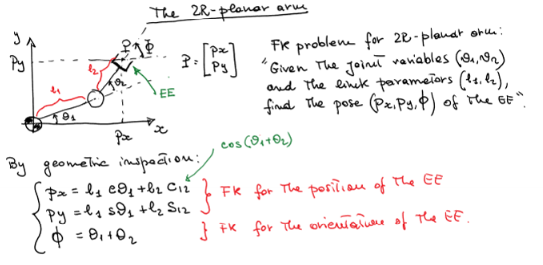

### FK Cartesian Arm
- 3 transformations in following order (order of translations doesnt matter with cartesian, rotation does.)
  - Translation px along x
  - Translation py along y
  - Translation pz along z

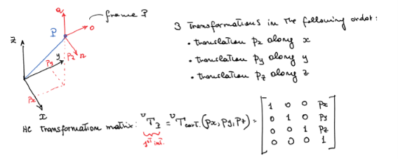  

### FK of Cylindrical Arm Position
- 3 transformations in following order (order of translations matters with cylindrical)
  - Translation r along x
  - Rotation about z
  - Translation l along z
- All transofmrations relate to fixed frame so premultiply

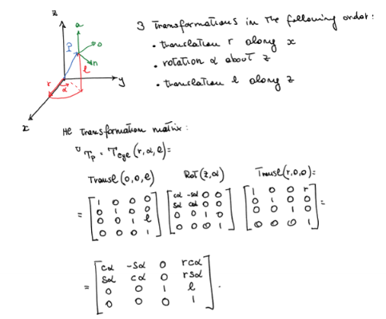

### FK of Spherical Arm Position
- 3 transofmrations:
  - Translation r along z
  - Rotation beta about y
  - rotation gamma about z
- All transofmrations relate to fixed frame so premultiply

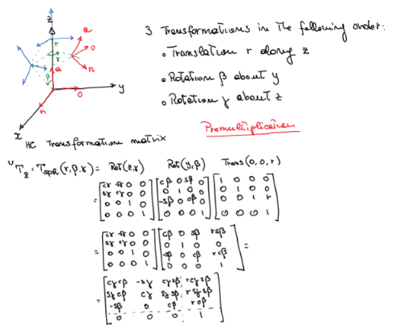

## Inverse Kinematics (IK)
> Given the link parameters and desired pose of the EE, find the values of the joint variables that takes the EE to the desired pose.

### 2R Planar Arm
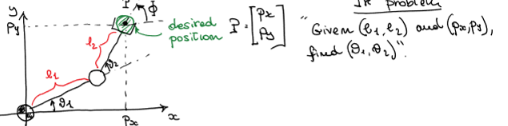

- Many possible soluitions

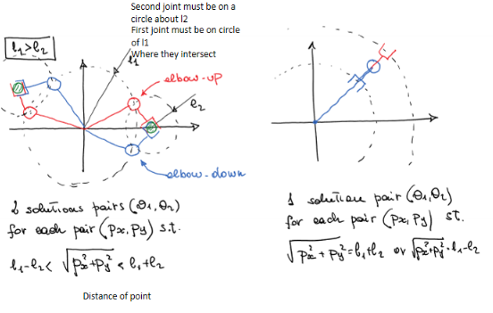

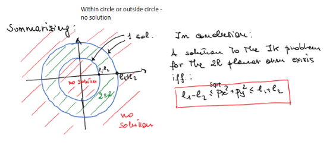

A soltuion to the IK for teh 2R planar arm if:

$$
l_1 - l_2 \leq \sqrt{p_x^2 + p_y^2} \leq l_1 + l_2
$$

That means it falles within the range.

#### Solutions
2 solutions, elbow up and elbow down.
- From FK, square and sum, do some maths, re arrange
- Get sine and cosines, but cant just inverse sine, need to take consideration of both sides, so use arc atan.
  
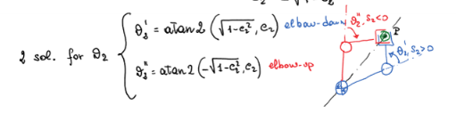

- To find the angle, use the equations but need to seperate cos1cos2 as difficult
- Create linear equiations
- Solve
- Find determinant 
  - If l1 = l2, cos2 = -1, det A = 0
  - Then infinite solutions for theta 1.
  - If $detA <0$
  - Then 
- 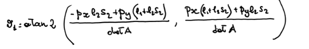

Observatins:
    - 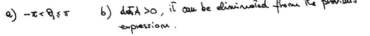

### Cartesian Arm
Easy, just the point is the inverse!
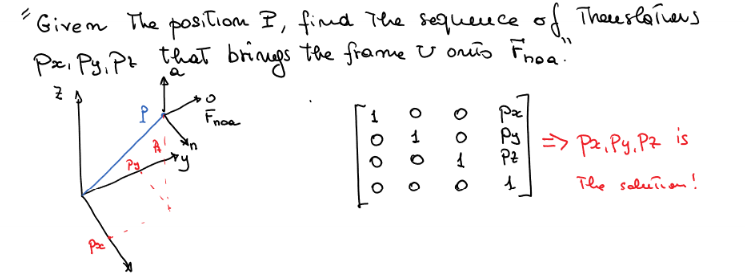

### Cylindrical Arm
Relatvily straightforward
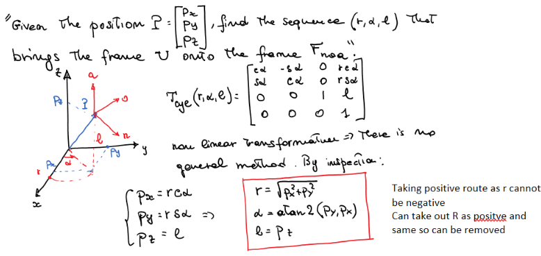

#### aTan2:
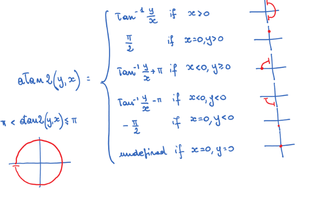

### Spherical Arm
Linear equations

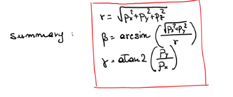

