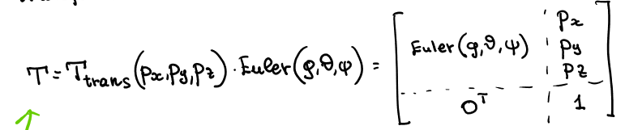

# Robot Kinematics 4 - Orientation Representation

## Orientation Representation

### Why other representations needed?
- Intermeidate pose (interpolation doesnt work)
  - 
- Error
- Numerical stability (floating point / integer problems)
- Topological difficulties
- Rotation matrix 
  - 9 elements - 3 orthogonatical constraints - 3 unitary constraints = 3 indepenedt variables.
  - Orientation can be described by a sequence of 3 rotations around an indepenedent axis
  - (Lots of possible orders + solutions)
  - So not "unique"

### Euler Angles
- Sequence of rotations
- In specific order

#### Euler Rotation Transform

- If combined with dispalcement, can make full transformation matrix

#### Inverse Euler Transform
- From final orientation find sequence of euler rotations that lead to it.

- Set of nonlinear equations
- No general procedure
- As square rooting, possible to have multiple solutions
- Can have singularity! 
  - Gimbal lock
  - Axis align
  - 1 DOF lost in kinematic inversion
  

### Roll Pitch Yaw (RPY)

- Sequnce of 3 rotations wrt to the fixed axis from universial frame.
- 
- Transformation matrix is combination of each individual rotation transofrmation, with pre multiplication (as from fixed axis)

#### Inverse RPY
- From final orientation find sequence of roll pitch yaw rotations that lead to it.
- Set of nonlinear equations
- No general procedure
- Again multiple solutions
- Gimbal lock

### Quaternions
- General rotation of a frame can be represented by a unit vector and angle.
- Therefore represented with quaternion

#### Inverse Quaternion
- From final orientation find sequence of quaternion rotations that lead to it.
- Set of nonlinear equations
- Doesnt suffer from same singularity problems
- However does have problems (out of scope of the course)

