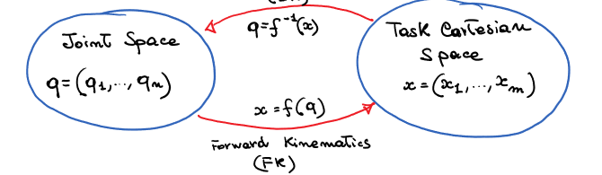
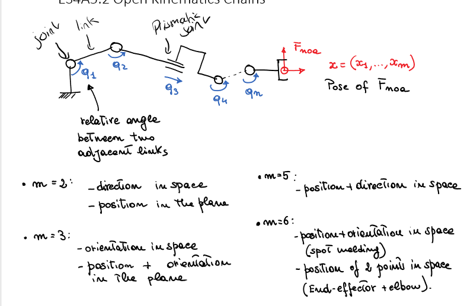
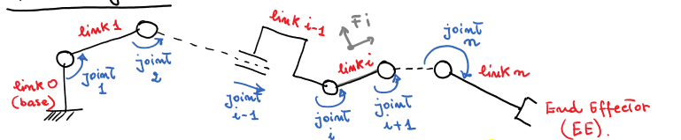
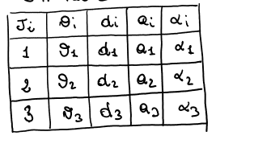
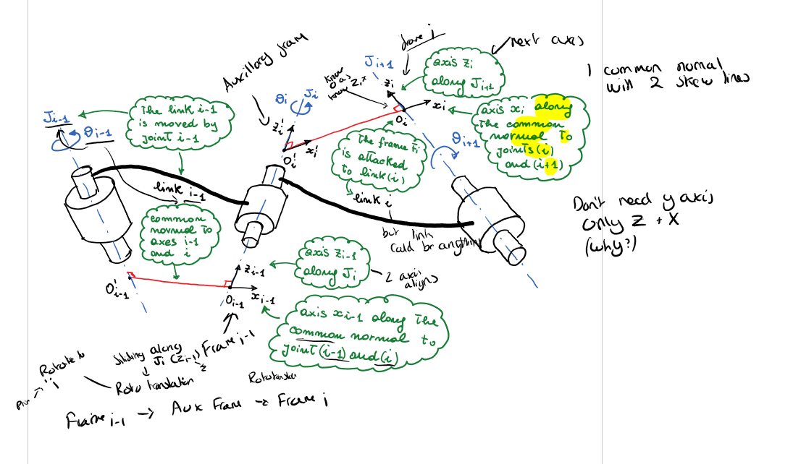
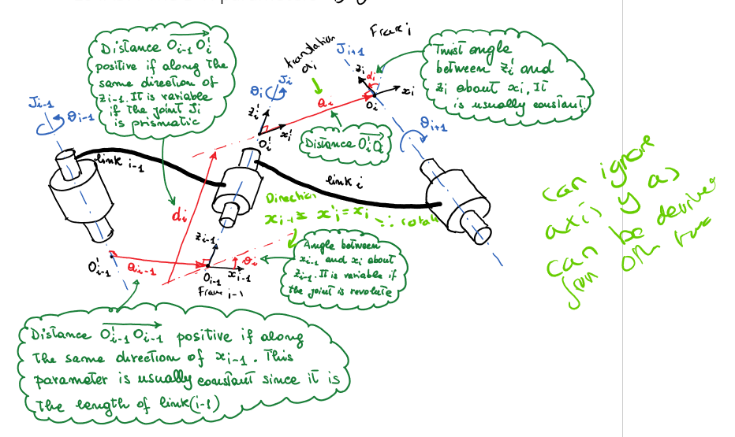
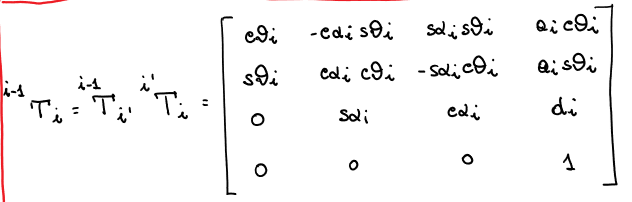

# Robot Kinematics 5 - General Joint to Task - DH

## General Joint to Task
- Need exact kinmatics of robot:
  - Functional aspects
    - Definition of the robot workspace
    - Calibration
  - Operational aspects
    - Task exectuion actuation by motors <-> task definition and performance

### Conversion between Joint space and Task Carteisan
- Joint space ->  Task space
  - Forward kinematics
- Task space -> Joint space
  - Inverse kinematics

- To descrivbe joint space:
  - unambiguous and minimal description of configuration
  - where n = number of DOF
- To describe cartesian space:
  - compact description of the pose variables for the task
  - usually $m \leq n, m \leq 6$

### Links and Joints

- Joints may be in any position and orientation in space (eg: any shape arm etc)
- Links may be of any length, including zero (eg shperical wrist)
- links may be twisted or bent
- Frame can be attached to each link to describe it's pose wrt the base frame.
- Use Denavit-Hartenberg (DH) convention to describe the pose of each link.

### Denavit-Hartenberg (DH) Convention
- 4 parameters
  - $\theta_i$ - joint angle - angle between the $x_{i-1}$ and $x_i$ axes about the $z_i$ axis - Rototranslation along $z_{i-1}$
  - $d_i$ - joint offset - distance from $F_{i-1}$ to $F_i'$ along the $z_i$ axis - Rototranslation along $z_{i-1}$
  - $a_i$ - link length - distance from $F_i'$ to $F_i$ along the $x_i$ axis - Rototranslation along $x_i$
  - $\alpha_i$ - link twist - angle between the $z_{i-1}$ and $z_i$ axes about the $x_i$ axis - Rototranslation along $x_i$
- Forms a DH taable 
  
- The pose of $F_i$ wrt to $F_{i-1}$ can be obtained by *postmultiplication* of the two rototranslations
  

#### DH Transformation Matrix

