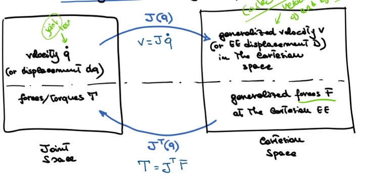

# Robot Kinematics 6 - Differential Kinematics

## Differential Kinematics
- Velocities of joints and end effector. 
- Whereas direct kinematics is direct transformation from one point to another.

Direct Kinematics:

Differential Kinematics:

### Forward Differential Kinematics
From velocities of joints to end effector velocities.

### Inverse Differential Kinematics
From end effector velocities to joint velocities.

### Derivative
- Can't just calculate the exact velocities for a given config (would require infinite solutions!) 
- So of course take time derivative!

$$
v = J(\theta_1, \theta_2), = J \dot \theta
$$

Where J is the jacbobian of the angles. So when multiplied by the joint velocities, gives the end effector velocity.

### Forward Differential Kinematics of Cartesian
- Same thing, using jacobian of all the angles, but the pose of the moving frame contains x, y, z, and the angles.
- Therefore 6x1 vector (with position and orientation)
- 

$$ 
v = J \dot q
$$

### Differential Motions - Wrt to Fixed Frame
- Differential motion wrt to fixed frame, use jacboian of the fixed frame.
- 

### Torques and Forces

$$
^HF\text{generalised force} = \text{force} / \text{torque}
$$

Combination of all forces and displacements of each joint. 

### Virtual Works
- Sum of the **virtual works** done by all the forces / torques  (assume know kinetic energy, friction etc) acting on the system in static equilibrium is zero.
$$
T = J^T F
$$

Where T is the generalised force at joint level, jacobian is the bridge between joing and EE (and any frame), and F is the force at teh end effector

### Duality between velocity and force
Very simiular conversion
