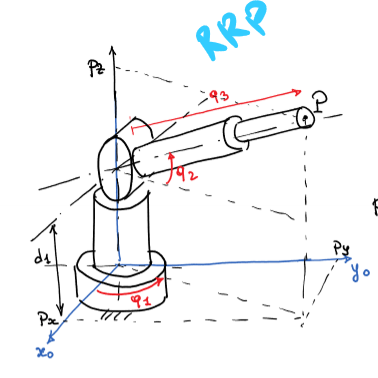
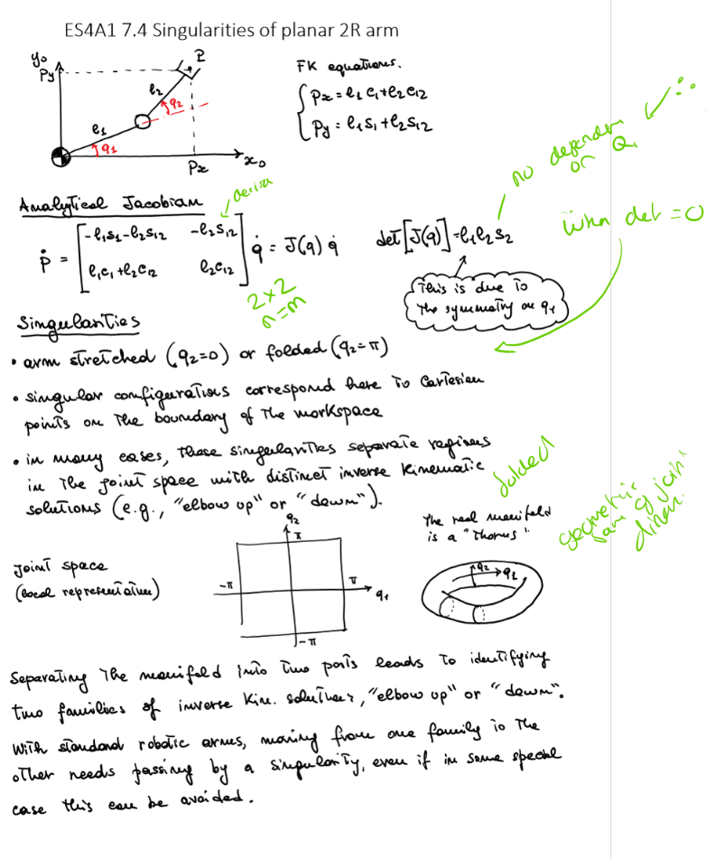

# Robot Kinematics 7

## Forward Differental Kinematics of Polar Robot (RRP)

- Forward kinematics at point derived from angles and sizes
- 
- Then need to take time derivative and convert to vector form (with jacobian)
- 

## Maths
### Minors
A minor of a matrix is the determinatn of some smaller square matrix generated from A by removing one of more of it's row's and columns.

### Rank
Rank of a matrix is the **maximum order** of a minor that doesnt equal 0.

A full rank is when the rank of a matrix is equal to the minimum of the number of rows and columns.

## Kinematic Singularities
- Defined in a mathmatical way
- Configurations where the Jacobian **looses rank**
- Implies that the robot looses a degree of freedom
  - Where determinant = 0
  - Implies a loss of instantaneous mobility of the robot's EE
- When square matrix (m x n), they correspond to carteisan poses
  - Where number of solutions of inverse kinematics differ from the generic case
- In a singular configuration
  - Cannot find a **joint velocity** that realises a desired **end effector velocity**
- When close to singularity
  - Large joint velocities are required to achieve even small velocity of EE
  - Therefore can exceed joint limits
- Thus finding singularites in advance for the robot to avoid is important
  - So trajectory planning can avoid it.

#### Finding singularity when Jacobian is square
When $m = n$ (square matrix), find all configurations such that:
$$
\det(J(q)) = 0
$$

#### Finding singularity when Jacobian is not square
When $m \lt n$ (non-square matrix, m = task space, n is number of joints), find all configurations such that **all m x m** minors of J are singular such that:
$$
\det(J(q) J^T(q)) = 0
$$

### Example
Singularity of a planar 2R arm

### 2019 Exam
Singularity of RRP Planar Arm

