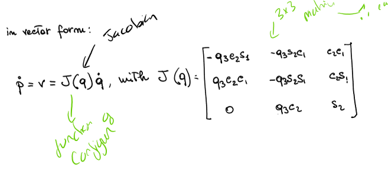

# Robot Kinematics 7

## Forward Differental Kinematics of Polar Robot (RRP)

- Forward kinematics at point derived from angles and sizes
- 
- Then need to take time derivative and convert to vector form (with jacobian)
- 

## Maths
### Minors
A minor of a matrix is the determinatn of some smaller square matrix generated from A by removing one of more of it's row's and columns.

### Rank
Rank of a matrix is the **maximum order** of a minor that doesnt equal 0.

A full rank is when the rank of a matrix is equal to the minimum of the number of rows and columns.

## Kinematic Singularities
- Defined in a mathmatical way
- Configurations where the Jacobian **looses rank**
- Implies that the robot looses a degree of freedom
  - Where determinant = 0
  - Implies a loss of instantaneous mobility of the robot's EE