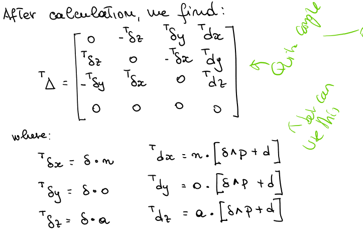

# Robot Kinematics 8

## Manipulability
- In a given configuration, we want to evalulate how *effective* the the mecahnical transform between joint velocities and EE velocities:
  - How easily the EE can be moved in the various directions of the task space
  - How far the robot is from a singular condition

### Derivation

- Assume J to be square and invertible
- The more circle-like the ellipsoid, the better the manipulability

### Equation
$$
w = \sqrt{\det(JJ^T)}  = |\det(J)|
$$

Proportional to the volume of the ellipsoid

#### Singualiry
In singularity, the ellipsoid loses a dimension (for 2D, it becomes a segment)

#### Direction of Principal Axes
(Orthogonal) eigenvectors assocoaiated to 

#### Length of the principal (semi-) axes of the ellipsoid
$$
\sigma_i\{J\} = \sqrt{\lambda_i\{JJ^T\}} \geq 0
$$
Where $\lambda_i\{JJ^T\}$ are the eigenvalues of $JJ^T$.

## Differentianal Transformation

### Translation
Small translation. pretty standard

### Rotation
Small rotation, therefore sin is approximated as linear and cos as 1. Therefore this is not a transformation matrix but an approxmation.

### Rotation about random axis
Combination of 3 rotations.

### Frame Transformation
Original frame with small change, is approximate, therefore not transfomration frame but **operator**

$$
dT = \Delta \cdot T
$$
where
$$
\Delta = \text{Trans} (dx, dy,dz) \cdot \text{Rot} (k,d\theta) - I = \begin{bmatrix}
0 & -\delta z & \delta y & dx \\
\delta z & 0 & -\delta x & dy \\
-\delta y & \delta x & 0 & dz \\
0 & 0 & 0 & 0
\end{bmatrix}
$$

### Differential Changed between frames
Differential operator $\Delta$ is relative to fixed reference frame U, but can dfine $\Delta$ wrt to the curretn frame T.

