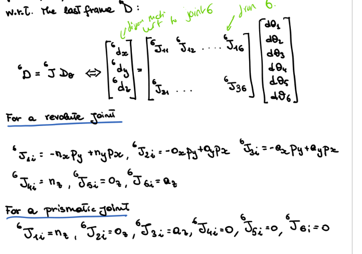
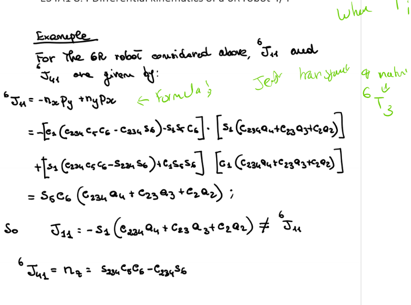
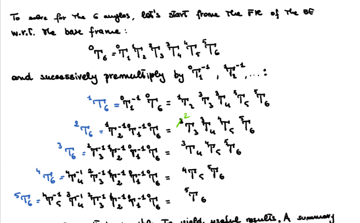
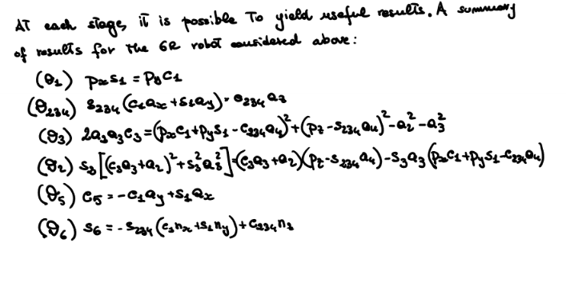
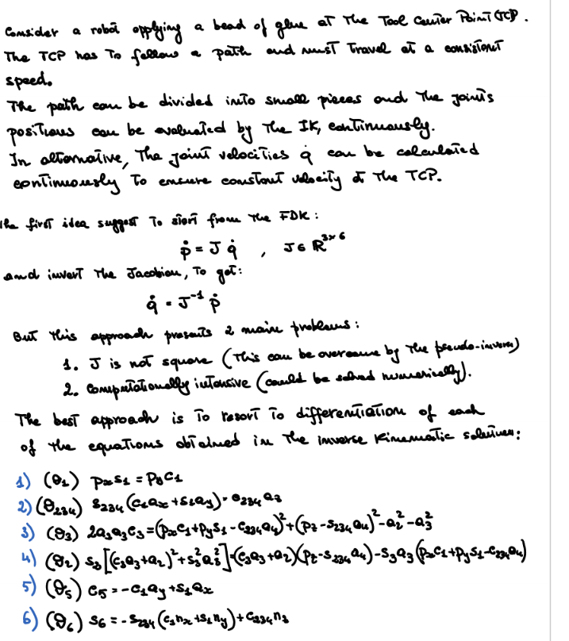
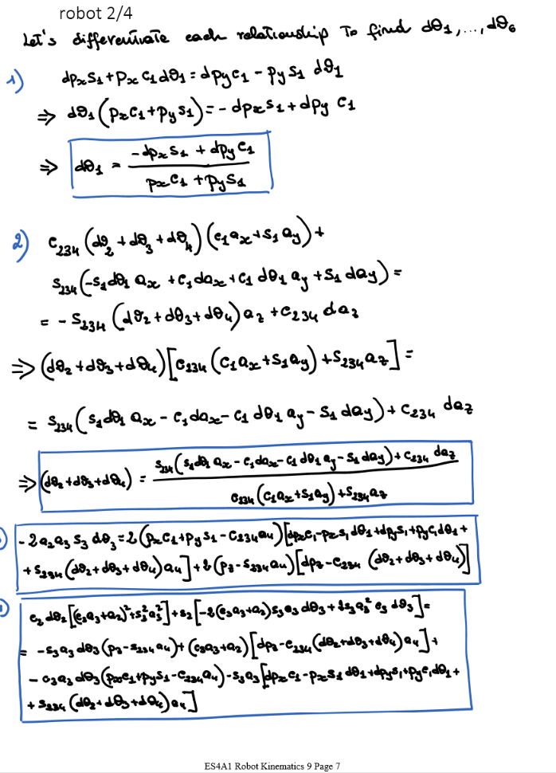
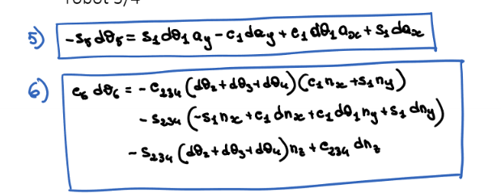
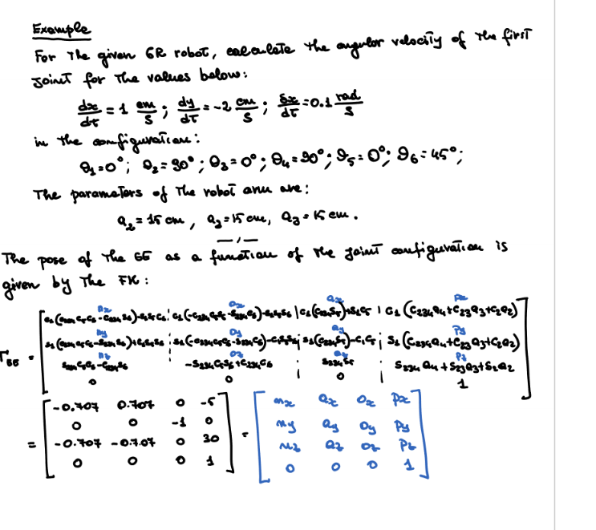
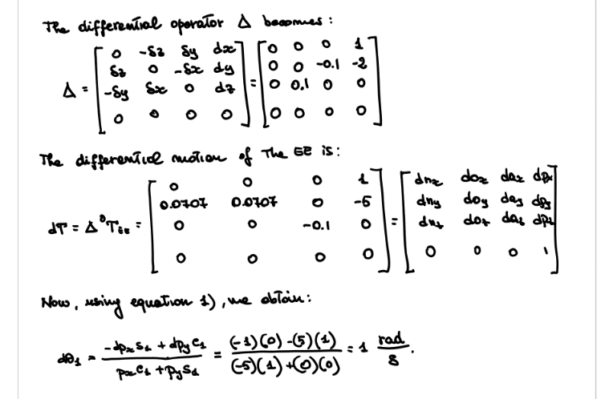

# Robot Kinematics 9

I am pretty sure this is not "examinable" as it is very complex and long for the exam. But good to know I guess :P

## Differential Kinematics of 6R Robot
- 6R robot, has 6 revoloute joints
- We want to find differential kinematics of the robot
- Therefore need jacboian
- Normal way is to determine forward kinematics and caluclate jacobian.
- This gets very long and complex, therfore we will use a different method.

### Altenate Method
Calculate the jacobina relative to the last frame $^6J$ and then calcualte differential motion of EE with respect to the last frame, $^6D$

## Inverse Kinematics of 6R Robot
To solve for 6 angles, start from FK of EE to base frame and premultuply with inverse 

Therefore an ueild results

Then can differentiate to get differential joint angles

### Example

