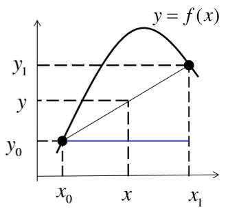
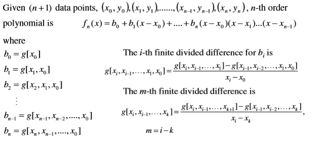
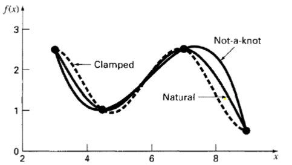
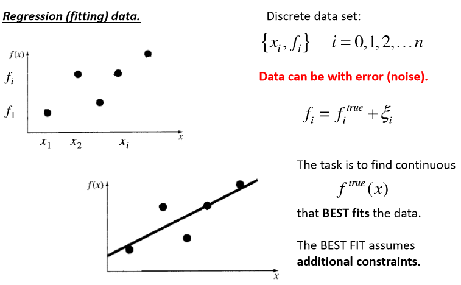
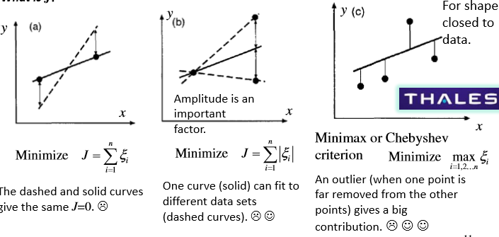
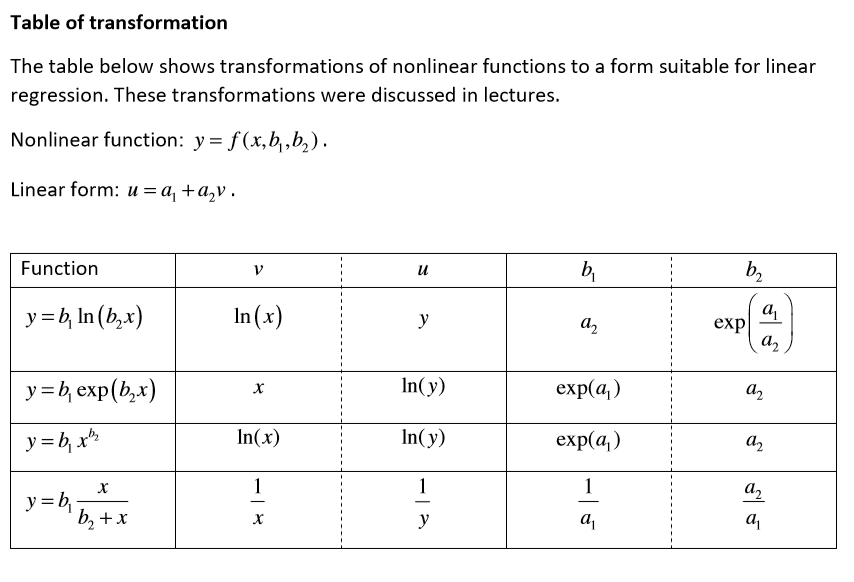

# Data Analysis, Regression & Interpolation

## Equations

<equation-table>

| [Interpolation](#interpolation)                                                                              |                                                                                                                         |
| ------------------------------------------------------------------------------------------------------------ | ----------------------------------------------------------------------------------------------------------------------- |
| [Linear Interpolation Formula](#linear-interpolation-formula)                                                | $y = y_0 + \frac{y_1 - y_0}{x_1 - x_0} (x - x_0)$                                                                       |
| [Taylor's Expansion Formula](#taylors-expansion-formula)                                                     | $f(x) = f(x_0) + (x-x_0)f'(x_0) + \frac{(x-x_0)}{2!}f''(x_0) + \ldots + \frac{(x-x_0)^n}{n!}f^{(n)} (x_0) + R_n =$      |
| [Newton's Divided-Difference Interpolating Polynomial](#newtons-divided-difference-interpolating-polynomial) | $f_n(x) = g[x_0] + g[x_1, x_0](x - x_0) + \ldots + g[x_n, x_{n-1}, \ldots, x_0](x - x_0)(x - x_1) \ldots (x - x_{n-1})$ |
| [Lagrange's Interpolation Polynomial](#lagranges-interpolation-polynomial)                                   | $f_n(x) = \sum_{i=0}^{n} L_i(x)f(x_i) = \sum_{i=0}^{n} L_i(x)y_i$                                                       |
| [Cubic Spline](#cubic-spline)                                                                                | Cubic polynomial approximates the data between two conseceutive data points                                             |

| [Regressions](#regressions)                                                                               |                                                            |
| --------------------------------------------------------------------------------------------------------- | ---------------------------------------------------------- |
| [Residual, epsilon](#residual-epsilon)                                                                    | $\epsilon = y - (a_0 + a_1x)$                              |
| [Least-Squares Criterion](#least-squares-criterion)                                                       | $Minimize \sum \epsilon^2 = \sum (y - (a_0 + a_1x))^2$     |
| [Non Linear relationships - Table of transfomations](#non-linear-relationships---table-of-transfomations) | Can be transformed to linear and perform linear regression |

</equation-table>

## Interpolation

- Determining new data points within range of known data points
- Assumption: data is exact or error is small
- Task: find continuous function that fits data

### Linear Interpolation

- Straight line between two points
- Error can be large depending on given know values
- Use similar triangles to compute

#### Linear Interpolation Formula

$$
y = y_0 + \frac{y_1 - y_0}{x_1 - x_0} (x - x_0)

$$

### Taylor's Expansion

Expanded around point $x_0$

#### Taylor's Expansion Formula

$$
f(x) = f(x_0) + (x-x_0)f'(x_0) + \frac{(x-x_0)}{2!}f''(x_0) + \ldots + \frac{(x-x_0)^n}{n!}f^{(n)} (x_0) + R_n =

$$

$$
f(x) = \sum_{k=0}^{n} \frac{(x-x_0)^k}{k!}f^{(k)} (x_0) + R_n

$$

Where $R_n$, Lagrange remainder

$$
R_n = \frac{(x-x_0)^{n+1}}{(n+1)!}f^{(n+1)}(x^*)  \quad x^* \in (x_0, x)

$$

Leads to polynomial:

$$
f(x) = p_0 + p_1x + p_2x^2 + \ldots + p_nx^n + R_n = \sum_{k=0}^{n} p_k x^k + R_n

$$

- $n+1$ data points **uniquely** n-th order polynomail
- Polynmoal describes data **exaclty** if in given data range, the function $f(x)$ can be represeted by nth order polynomial with $R_n = 0$
- $R_n$ is the error of the polynomial approximation

### Polynomial Interpolation

- $n+1$ data points
- Polynomial of degree $n$
- **unique** nth order polynomial can be calculated using *Newtons divided-difference interpolating polynomial*
- Can become highly inaccurate if using high-order polynomials. Overfitting
- Both:

  - Data points dont have to be equally spaced
  - Abscissa values dont need to be in ascending order
- Newtons Advantages

  - Expression of corefficients is recursive
  - Higher order differences are computed by taking differences of lower order differences
- Disadvantages

  - Small errors in data / low accuracy lead to error accumulation + propagation

#### Newton's Divided-Difference Interpolating Polynomial

$$
f_n(x) = g[x_0] + g[x_1, x_0](x - x_0) + \ldots + g[x_n, x_{n-1}, \ldots, x_0](x - x_0)(x - x_1) \ldots (x - x_{n-1})

$$

Where function gs are *finite divided differences*

#### Lagrange's Interpolation Polynomial

$$
f_n(x) = \sum_{i=0}^{n} L_i(x)f(x_i) = \sum_{i=0}^{n} L_i(x)y_i

$$

where

$$
L_i(x) = \prod_{j=0, j \neq i}^{n} \frac{x - x_j}{x_i - x_j}

$$

Consdiered as **weighted average** of n values we are connectign by nth order polynomial

Example: See L2, slide 24

### Spline (piece-wise) interpolation

- Remedy for highly inacrruate high-order polynomials
- Use **low order piecewise** polynomials to connect data points
- Not unique (different end conditions)

#### Cubic Spline

Cubic polynomial approximates the data between two conseceutive data points

$$
f_i(x) = a_ix^3+b_ix^2+c_ix+d_i \quad x_{i-1} \leq x \leq x_i

$$

There are 4n unknowns, 4n equations so setup conditions

1. Each spline goes through 2 consecutive data points, first and last pass through end points
2. First derivative at the interior knots must be equal
3. Second derivative at the interior knots must be equal
4. Two (arbritary) end conditions

Alternative technique only requires n-1 linear alegebraic equations

- **Natural End Conditions** - Natural spline requires zero second derivative at the end points
- **Clamped End Conditions** - Clamped spline requires first derivative at the end points to be equal to a given value
- **Not-a-knot End Conditions** - To force continuity of the third derivates at the second and next ot last knots

**Resampling:**
- Often data sampled on irregular grid
- Therefore need redifining of regular grid
- Can use spline interpolation
- Matlab ODE solving, returns on non-uniform grid, so need to resample
- Use matlab `interp1` function

## Regressions

Regression (fitting) data.

Data can have error (noise), so task is to find continuous function that **BEST fits** data

### Linear Regression

Mathamtical expression for straight line, with $\epsilon$ as residual (error)

$$
y = a_0 + a_1x + \epsilon
$$

#### Residual, epsilon
Difference between actual value and predicted value
$$
\epsilon = y - (a_0 + a_1x)
$$

Different methods of minimising

- Sum of errors - minimise $\sum \epsilon$
- Sum of absolute errors - minimise $\sum |\epsilon|$
- Minimax or Chebyshev criterion - minimise maximal error $\max |\epsilon|$

#### Least-Squares Criterion
$$
Minimize \sum \epsilon^2 = \sum (y - (a_0 + a_1x))^2
$$

- Yields **unique line**
- Maximum likelihood estimator
  
- Assumes:
  - Each $x_i$ has fixed value, not random and is known without error
  - $y_i$ independent random variables, same varience but different mean
  - $y_i$ are normally distributed for given $x_i$
  
Leads to two linear algebraic equations, so get derivatives etc

$$
a_1 = \frac{n\sum_{i=1}^n y_i x_i - \sum_{i=1}^n y_i \sum_{i=1}^n x_i }{n\sum_{i=1}^n x^2_i - (\sum_{i=1}^n x_i)^2}
$$

$$
a_0 = \frac{1}{n} \sum_{i=1}^n y_i - a_1 \frac{1}{n} \sum_{i=1}^n x_i

$$

#### Non Linear relationships - Table of transfomations
Can be transformed to linear and perform linear regression

Assume a mathmatical form of the function. And find the transfomration of coordinaties for rewriting the function in linear form.

1) Use expert knowledge to assume data how data is defined (exponential, power, saturation-grow)
2) Rewrite equation with transformation
3) Introduce new variables
4) Obtain linear form
5) Apply transformations to data
6) Perform linear regression
7) Transform back to original variables

### Generalised Least Squares Regression

Has following linear form, where $z_j$ are basic known functions of $x_i$ and $a_j$ are unknown coefficients

$$
y = \sum_{j=0}^{m} a_j z_j + \epsilon
$$

And cn be expressed in matrix notation

$$
\boldsymbol{Y} = \boldsymbol{Z}A +\Epsilon
$$

$$
A  = Z^+ Y
$$
Where $Z^+$ is the pseudo-inverse of non square matrix Z. Z must be a full rank, therefore functions of $z_j(x)$ must all be linearlly independent

#### N-order polynomial least-square regression
$$
y = \sum_{j=0}^{n} a_j x^j + \epsilon
$$
Polynomial is the best and most common choice.

In general, select the polynomial that:
- gives **smaller errors** (residuals) $\epsilon$
- has a **smaller order** (fewer terms)

#### Fourier Basis Least Square
$$ 
z_j(x) = \sin(j\Omega x), \quad z_j(x) = \cos(j\Omega x), \quad \Omega = const
$$

Therefore $(2N+1)$ terms:

$$
y = \sum_{j=0}^{N} a_j \cos(j\Omega x) + \sum_{j=1}^{N} b_j \sin(j\Omega x) + \epsilon

$$

## Extrapolation

Process of estimating a value of $y$ for a value of $x$ outside the range of the data set. Prediction of values outside given range

This is an estimate. If the true curve $f(x)$ is known, the extrapolation can be done by using the function $f(x)$ and can be exact (up to measurement errors)

Expert knowledge is very useful!

See lecture 4 for examples of where errors can be introduced
- Polynomial extrapolation can be very inaccurate (as it oscillates) after a while etc.