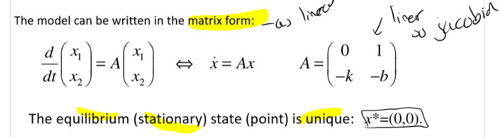
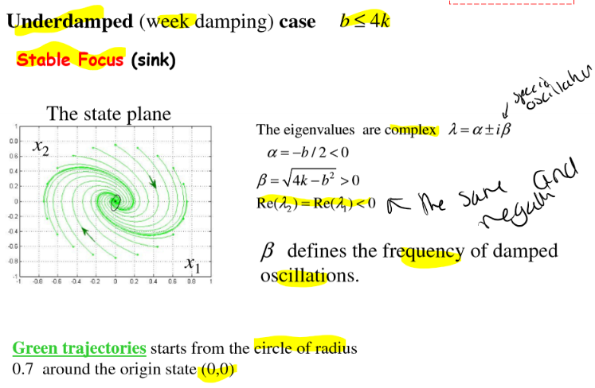

# Linear vs Nonlinear Modelling

## Introduction
- Traditionally, design is based on a combination of analytically (mainly linear) tractable models and experimental design
- To complicated (but more realistic) models mainly analsed numericaly.
- Non linear models have started to be embeeded
- There are significant differences between linear and non linear
  - EG: linear quarter model for car's suspension
    - Options:
        - Simple model, ignore damping, estimate natural frequencies
        - Consider frequency response and identify resonance (can be found analytically or numerically)
        - Model based engineering
          - Measure coefficients (experimental measurements lead to non linear)
          - Idendity expressions
          - Modify linear model to use non linear coefficients
          - Calculate frequency response, idendify reasonance. 
          - Complex. Requires more anaylsis for stability etc.
  

## State Space Approach

### 1 Dimensional System
- 1D order ODE, one variable, typical form, no inputs
- EG:
- $\dot x = \frac{dx}{dt} = f(x)$ 
- Equilibrium state $\dot x = 0$
- 1 dependent (state) variable x,
- 1 independent variable t
- No forcing terms
- State space is a line, x.
- Task: find equilibirum states and characterise stability

#### Differential Equation as Vector Field
- Used to see stability points. 
- x as x axit, xdot as y axis.

#### Multistability
- Linear system only has one stable or unstable state
- Nonlinear system can have multiple stable and unstable states
- EG: Overdamped pendulum, in oil, so inertia not imapct, rearrange to get first order non linear ODE
- $ \dot \theta + \frac{1}{\alpha} \sin(\theta) = 0$
- General soloution can be solved analytically, but impractical
- Infinite number of stalbe and unstable equilibirium states (where velocoity is 0)
- Unstable state corresponds to a boundary between stable state.

- Can use linearisation to characterise each state
- 

#### Bifurcations
- Eg: 1 dimensional, non linear first order ODE
- $\dot u = (f-f_0)u-u^3$
- Where f and f0 are paramters describing the load (not properties of dynamics)
- State space variable is u.
- 
- By fixing f0 and varying f, we can see the bifurcation points
- 
- Diffeent number of equilibrium points and stability depending on relationship.
- The change occurs at the **point of bifurcation** $f=f_0$
  

#### Rigourous Approach
- Rigourous approach to bifurcation analysis
- Steps:
    1) Find all equilibruim (stationary) states (where $\dot x = 0$)
    2) For each equilibrum state calculate the jacobian
    3) calculate the eigenvalues of the jacobian
    4) Make a conclusion about stability (from eigenvalues)
   
- Step - 1: Find all equilibriums
  - Set $\dot x = 0$, then solve for u to find all possible solutions (only real) 
  - The number of states depends on the parameter f.
- Step - 2: Linearise equation, calculate jacobian. 
  - Jacobian is the derivative of the function with respect to the state variable.
  - $J = A = \frac{df}{dx}$
  - Jacobian is a matrix of partial derivatives
  - For 1D system, the jacobian is a scalar
- Step - 3: Calculate Eigen values
  - For 1D system, $A = \lambda$
  - Do for each state from earlier, with the corresponding f
  -  
- Step - 4: Conclusion
  - Can see different states and stability
  - Pitchfork biforcation happens at f0 = f.
  - 

### More Realistic Model
- More realistic model with damping and interia.
- 
- Therefore now:
  - Second-order ODE, non linear
  - 2 dependent variables (u and $\dot u$)
  - 1 independent variable (t)
  - **6 independent parameters**: m, b, k d, L, k_0
- Therefore how do we do a bifurcational diagram as a function of parameters?
- Have to do direct (brute force) numerical modelling to explore the **6D** space.

#### Reduction of Parameters (Analytical - expert approach)
- OR can introudce new variables to reduce parameters
- Large damping (from problem), therfore can eplison is small in comparison to 1, 
- Arrive at one parameter equation
- (see lecture 13 page 4 for more details)
- 
- CAn apply, and get something similar.

### Asymmetry
- General case, different equlibirium states

EG:
- Simple model with 2 parameters r and h
- $\dot x = h + rx - x^3$
- Where h is the **asymmetry (imperfection) parameter**
- Equlibilrium states are solutions of = 0.
- Therefore 2 solutions
- $y = rx -x^3$ and $y = h$
- Therefore equlibirium states correspond to **intersections of the two curves**
- Graphic approach, applied for modified "x-axis" (y=-h) to find equilibirum states and define stability

- There is **saddle node birfurcation** at $h_c(r) = \pm \frac{2r}{3} \sqrt{\frac{r}{3}}$ where $r \geq 0$

#### Saddle-node bifurcation
- Leads to the appearence of two equlibirium states with different stability
- Bifurcation can be analysed using graphical approach and linearisation
- Eigenvalue of states is zero at bifurcation point

#### Pitchfork bifurcation
- Pitchfork shape
- Super critcal: change of **stable state**
- Subcritical: change of **unstable state**

#### Hysteresis
- Experimentally unstable states are inaccessible
- In real systems, there must be stable states for any value of a parameter.
- 
- Therefore do not give a clear view of birfocation

### 2D Linear Oscillator
$$
\ddot y + b \dot y + k y = 0
$$
- Generalised form: $\ddot x + 2 \zeta w_n \dot x + w_n^2 x = 0$
- Write in state space form, as 2 first order equations
- Into matrix form
- Eigen values of matrix define stability of station state and trajectories
- See lecture 13 pg 26.

#### Undamped Linear Oscillator - Elliptic Points
- Centre (**ellipitic point**) is the equilibirium state
- Neutral stability
- No damping, b = 0, conservative oscillations
- Green trajectories start from line x1 =0
- 
- Solutions oscillations with freequency $w_0 = \sqrt{k}$
- 

#### Over Damped Linear Oscillator - Spiral Points
- $b^2 \gt 4k$ => $\lambda_2 \gt \lambda_1 0$
- **Steady node (sink)** = steady state
- Egieng values are real
- After a short relaxation period, trajectories follow a line (eigenvector v1) motion is one-dimensional

#### Underdamped (Weak Damping) - Spiral Points
- **Stable Focus (sink)** - equlilbirum state
- Eigenvalues are complex
- Beta of complex eigenvalue defines the frequency of damped oscialltions
- 

#### Negative Damping - Over Damped
- Unsable solution
- Steady state is **unstalbe node** (repeller)
- Eigen values are real
- 
- 
- Exponentially go to infinity

#### Negative Damping - Underdamped
- Weak damping
- **Unstable Focus** (repeller)
- Complex eigen values
- Spiral out trajectories rotating with frequnecy of B (eigen value complex)
  
  

  

#### Negative Damping Negative Stiffness
- Saddle (huperbolic point)
- Egienvalues are real
- Trajectories can come to station state along v2 and go away along v1.
- v1 and v2 correspond to manifolds of the sadle
- v2 is a **separatrix**

#### Postivie Damping, negative stiffness
- Saddle (hyperbolic point)
- Eigenvalues are real
- Trajectories tend to the stationay state along v2 and go away along v1
- v1 and v2 corespond to manifolds of the saddle
- v2 is a separatrix

#### States on Parametric Plane Summary
Relationship between types of solution and eigne values

