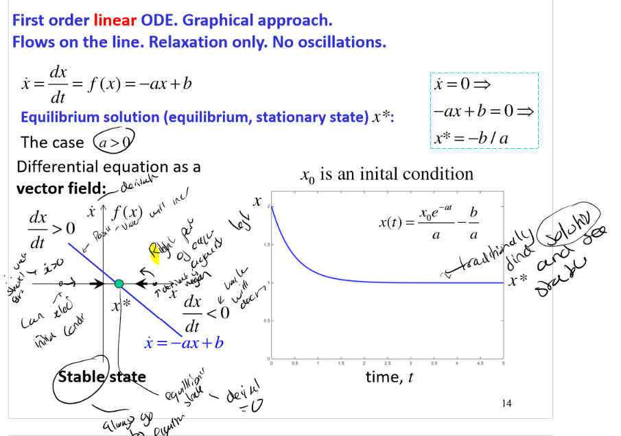

# Linear vs Nonlinear Modelling

## Introduction
- Traditionally, design is based on a combination of analytically (mainly linear) tractable models and experimental design
- To complicated (but more realistic) models mainly analsed numericaly.
- Non linear models have started to be embeeded
- There are significant differences between linear and non linear
  - EG: linear quarter model for car's suspension
    - Options:
        - Simple model, ignore damping, estimate natural frequencies
        - Consider frequency response and identify resonance (can be found analytically or numerically)
        - Model based engineering
          - Measure coefficients (experimental measurements lead to non linear)
          - Idendity expressions
          - Modify linear model to use non linear coefficients
          - Calculate frequency response, idendify reasonance. 
          - Complex. Requires more anaylsis for stability etc.
  

## State Space Approach

### 1 Dimensional System
- 1D order ODE, one variable, typical form, no inputs
- EG:
- $\dot x = \frac{dx}{dt} = f(x)$ 
- Equilibrium state $\dot x = 0$
- 1 dependent (state) variable x,
- 1 independent variable t
- No forcing terms
- State space is a line, x.
- Task: find equilibirum states and characterise stability

#### Differential Equation as Vector Field
- Used to see stability points. 
- x as x axit, xdot as y axis.

#### Multistability
- Linear system only has one stable or unstable state
- Nonlinear system can have multiple stable and unstable states
- EG: Overdamped pendulum, in oil, so inertia not imapct, rearrange to get first order non linear ODE
- $ \dot \theta + \frac{1}{\alpha} \sin(\theta) = 0$
- General soloution can be solved analytically, but impractical
- Infinite number of stalbe and unstable equilibirium states (where velocoity is 0)
- Unstable state corresponds to a boundary between stable state.

- Can use linearisation to characterise each state
- 

#### Bifurcations
- Eg: 1 dimensional, non linear first order ODE
- $\dot u = (f-f_0)u-u^3$
- Where f and f0 are paramters describing the load (not properties of dynamics)
- State space variable is u.
- 
- By fixing f0 and varying f, we can see the bifurcation points
- 
- Diffeent number of equilibrium points and stability depending on relationship.
- The change occurs at the **point of bifurcation** $f=f_0$
  

#### Rigourous Approach
- Rigourous approach to bifurcation analysis
- Steps:
    1) Find all equilibruim (stationary) states (where $\dot x = 0$)
    2) For each equilibrum state calculate the jacobian
    3) calculate the eigenvalues of the jacobian
    4) Make a conclusion about stability (from eigenvalues)
   
- Step - 1: Find all equilibriums
  - Set $\dot x = 0$, then solve for u to find all possible solutions (only real) 
  - The number of states depends on the parameter f.
- Step - 2: Linearise equation, calculate jacobian. 
  - Jacobian is the derivative of the function with respect to the state variable.
  - $J = A = \frac{df}{dx}$
  - Jacobian is a matrix of partial derivatives
  - For 1D system, the jacobian is a scalar
- Step - 3: Calculate Eigen values
  - For 1D system, $A = \lambda$
  - Do for each state from earlier, with the corresponding f
  -  
- Step - 4: Conclusion
  - Can see different states and stability
  - Pitchfork biforcation happens at f0 = f.
  - 

