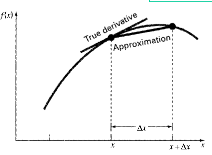
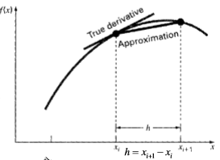
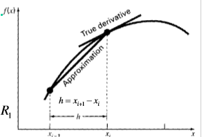
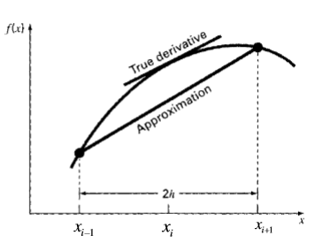
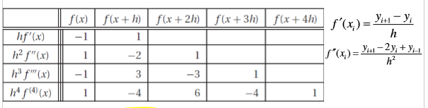
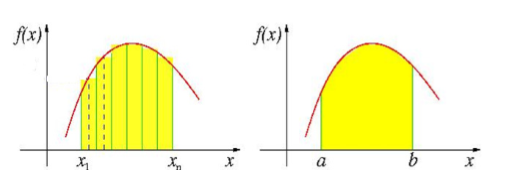
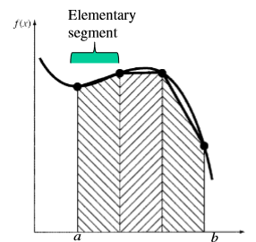
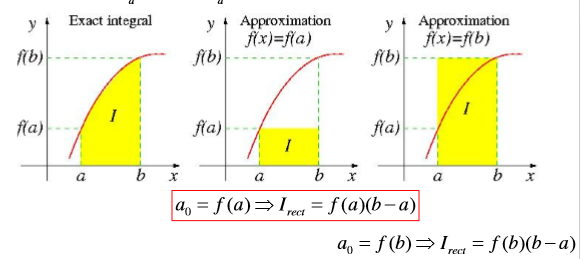
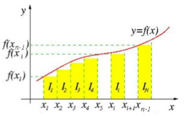
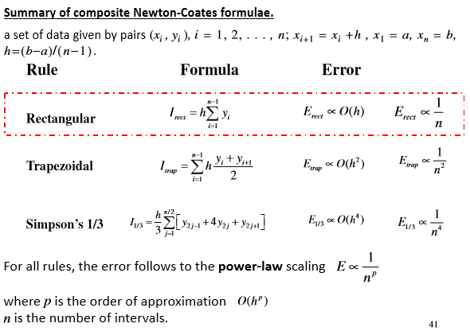

# Numerical Differentiation & Integration

<equation-table>

| [Numerical Differentiation](#numerical-differentiation)                                 |                                                       |
| --------------------------------------------------------------------------------------- | ----------------------------------------------------- |
| [First Forward finite Divided Difference](#first-forward-finite-divided-difference)     | $f'(x_i) \approx \frac{y_{i+1}-y_i}{h}$               |
| [First Backward finite Divided Difference](#first-backward-finite-divided-difference)   | $f'(x_i) \approx \frac{y_i-y_{i-1}}{h}$               |
| [First Central finite Divided Difference](#first-central-finite-divided-difference)     | $f'(x_i) \approx \frac{y_{i+1}-y_{i-1}}{2h}$          |
| [Second Forward finite Divided Difference](#second-forward-finite-divided-difference)   | $f''(x_i) \approx \frac{y_{i+2}-2y_{i+1}+y_i}{h^2}$   |
| [Second Backward finite Divided Difference](#second-backward-finite-divided-difference) | $f''(x_i) \approx \frac{y_{i-2}-2y_{i-1}+y_{i}}{h^2}$ |
| [Second Central finite Divided Difference](#second-central-finite-divided-difference)   | $f''(x_i) \approx \frac{y_{i+1}-2y_{i}+y_{i-1}}{h^2}$ |
| [Richardson Extrapolation Formula](#richardson-extrapolation-formula)                   | $G = \frac{2^p g(\frac{h_1}{2})-g(h_1)}{2^p-1}$       |

| [Numerical Integration](#numerical-integration)                                           |                                                                                                                                 |
| ----------------------------------------------------------------------------------------- | ------------------------------------------------------------------------------------------------------------------------------- |
| [Quadrature (Numerical integration)](#quadrature-numerical-integration)                   | $I = \int_a^b f(x) dx \approxeq \sum_{i=1}^n A_i f_n(x_i)$                                                                      |
| [Newton Coates Closed Form](#newton-coates-closed-form)                                   | $I = \int_a^b f(x) dx \approxeq \int_a^b f_n(x) dx \quad f_n(x) = a_0 + a_1 x + a_2 x^2 + \ldots + a_n x^n$                     |
| [Newton Coates Error](#newton-coates-error)                                               | $E = \int_a^b f(x) dx - \int_a^b f_n(x) dx$                                                                                     |
| [Composite Approach](#composite-approach)                                                 | Selection of elementary segment, formula is applied to the elementary  segment                                                  |
| [Rectangular Rule Error](#rectangular-rule-error)                                         | $E_{rect} = \frac{(b-a)^2}{2} f'(x^*) \propto O(h^2)$                                                                           |
| [Compositie Rectangular Rule](#compositie-rectangular-rule)                               | Rectancular approximation for segments.                                                                                         |
| [Composite Rectangular Rule Error](#composite-rectangular-rule-error)                     | $E_{rect} \propto O(h) \quad \text{where} \quad h = \frac{b-a}{n} \quad \text{therefore} \quad E_{rect} \propto O(\frac{1}{n})$ |
| [Nth Order Newton-Cotes](#nth-order-newton-cotes-1)                                       | $I_{NC} = \int_a^b f(x) dx = \sum_{i=1}^n A_i y_i$                                                                              |
| [Summary of Newton Coates compositite rules](#summary-of-newton-coates-compositite-rules) | See image                                                                                                                       |

</equation-table>

## Numerical Differentiation

Task is to calculate the derivative of the function at a point. The function is represetned by deiscrete data points in a regular grid. With a theoritical basis of taylor expnasion.

(Assuming $h \lt 1$ for error statements)

Higher accuracy schemes can be developed by using more data points. 

### First Order

Definition of derivative:

$$
    f'(x) = \frac{df}{dx} = \lim_{\Delta x \to 0} \frac{f(x + \Delta x) - f(x)}{\Delta x}
$$

If $\Delta x$ is finite, the formaula is approximate.

#### First Forward finite Divided Difference
$$
    f'(x_i) \approx \frac{y_{i+1}-y_i}{h}
$$

Truncation error is $O(h)$

Need to know future point

#### First Backward finite Divided Difference

$$
    f'(x_i) \approx \frac{y_i-y_{i-1}}{h}
$$
Truncation error is $O(h)$

Need to know past point

#### First Central finite Divided Difference
$$
    f'(x_i) \approx \frac{y_{i+1}-y_{i-1}}{2h}
$$

Truncation error is $O(h^2)$ so has less error than forward and backward

Need to know future and past point

### Second Order Derivative

#### Second Forward finite Divided Difference
$$
    f''(x_i) \approx \frac{y_{i+2}-2y_{i+1}+y_i}{h^2}
$$
Truncation error is $O(h)$

#### Second Backward finite Divided Difference
$$
    f''(x_i) \approx \frac{y_{i-2}-2y_{i-1}+y_{i}}{h^2}
$$

Truncation error is $O(h)$

#### Second Central finite Divided Difference
$$
    f''(x_i) \approx \frac{y_{i+1}-2y_{i}+y_{i-1}}{h^2}
$$
Truncation error is $O(h^2)$

### Pitfalls of Numerical Differentiation

Coefficients of forward finite difference approximations of order of the step size h:

- The sum of coefficients is **zero** so effect on the round off error can be big.
- So use double precision arithmetic (not always possible)
- Use a finite difference scheme that are accurate to atleast $O(h^2)$
- Be careful with experimental data, small step size (higher sampling rate) can lead to unreliable calculation

### Richardson Extrapolation
- A method to **improve the accuracy** of numerical differentiation
- Uses the fact that the error in the finite difference approximation is proportional to the step size h
- Finite difference approximation is truncated taylor expansion.
- See Lecture 6 pg 20 for derivation

#### Richardson Extrapolation Formula

$$
G = \frac{2^p g(\frac{h_1}{2})-g(h_1)}{2^p-1}
$$

- p is the truncation error or order of approximation, $O(h^p)$
- Where $g(h)$ is the finite difference approximation of the derivative with step size h
- $G$ is the extrapolated value of the derivative
- Reduces thge error **by an order of magnitude**

### Derivatives by interpolation and curve fitting
- Apply interpolation or curve fitting to get polynomial function representing data set, which can then be derivated easilly. 
- Get derivative at any point
- The error is defined by the error of interpolation or curve fitting. 
- Matlab: `polyfit` and `polyder` functions

## Numerical Integration

Evaluation of $I = \int_a^b f(x) dx$ is know as **intergral integration** or **quadrature**

### Defintion of Definite Intergral
- Based on the **Reimann sum**
- Introduce a mesh grid or interval size $\Delta x$ and partition the interval $[a,b]$ into n subintervals of equal width

$$
    I = \int_a^b f(x) dx = \lim_{n \to \infty} \sum_{i=1}^n f(x_i) \Delta x
$$

### Numerical Evaluation 
Replace the exact Reimann Sum with approximated polynomial $f_n(x)$

#### Quadrature (Numerical integration)
$$ 
I = \int_a^b f(x) dx \approxeq \sum_{i=1}^n A_i f_n(x_i) 
$$

Where $A_i$ are the weights of the quadrature rule and $f_n(x)$ is the polynomial approximation of the function f(x)

Then 

### Newton-Cotes 
- Chacterised by equally spaced points
- (Gaussian quadrature location of absicssas are chossen to yeidl best possible accuracy)
- Most common

#### Newton Coates Closed Form
$$
I = \int_a^b f(x) dx \approxeq \int_a^b f_n(x) dx \quad f_n(x) = a_0 + a_1 x + a_2 x^2 + \ldots + a_n x^n 
$$

#### Newton Coates Error
$$
  E = \int_a^b f(x) dx - \int_a^b f_n(x) dx
$$
The error is based on how well the polynomial approximates the function f(x) over the interval [a,b]

#### Composite Approach
Selection of elementary segment, formula is applied to the elementary  segment

$$
I = \int_a^b f(x) dx = \sum_{j=1}^m \int_{x_{j-1}}^{x_j} f(x) dx \approxeq \sum_{j=1}^m \int_{x_{j(n-1)}}^{x_{jn}} f_n(x) dx
$$

With the error

$$
E = \int_a^b f(x) dx - \sum_{j=1}^m \int_{x_{j(n-1)}}^{x_{jn}} f_n(x) dx
$$

### Rectangular Rule
Approximates the integrand by the **zero-order interpolant** (uses zero order polynomial) to approximate the function

$$
f_0(x) = a_0 \quad I = \int_a^b f(x) dx \approxeq \int_a^b f_0(x) dx = a_0 (b-a)
$$

The error of the elementrayr segment is accumulated in the composite approach (any errors in data or calculation will be accumulated (amplified)).

The rectangular approxmation
- Elementary segment error $O(h^2)$
- reduced to Composite error $O(h)$

#### Rectangular Rule Error
$$
E_{rect} = \frac{(b-a)^2}{2} f'(x^*) \propto O(h^2)
$$

#### Compositie Rectangular Rule
Rectancular approximation for segments.

$$
I_{rect} = h \sum_{i=1}^n y_i
$$

Where $h = \frac{b-a}{n-1}$ 

#### Composite Rectangular Rule Error
Error is the sum of errors for each interval
$$
E_{rect} \propto O(h) \quad \text{where} \quad h = \frac{b-a}{n} \quad \text{therefore} \quad E_{rect} \propto O(\frac{1}{n})
$$

### Nth Order Newton-Cotes
For polynomial greater than 0, use lagranges form of polynomial

$$ 
I = \int_a^b f(x) dx \approxeq \sum_{i=1}^n A_i f_n(x_i) 
$$

$$
f_n(x) = \sum_{i=1}^n L_i(x) y_x \quad L_i(x) = \prod_{j=1, j \neq i}^n \frac{x-x_j}{x_i-x_j}
$$

#### Nth Order Newton-Cotes
$$
I_{NC} = \int_a^b f(x) dx = \sum_{i=1}^n A_i y_i
$$

#### Summary of Newton Coates compositite rules
See image

With power scaling law

$$
E \propto \frac{1}{n^{p}}
$$

