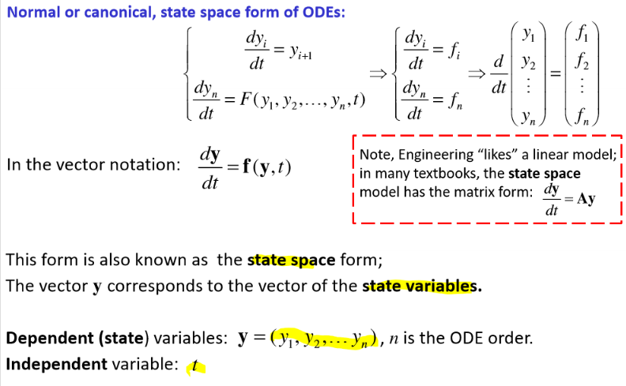

# Numerical Solution of ODEs

<equation-table>

| [ODEs and Euler](#odes-and-euler)                                                                    |                                                                                     |
|------------------------------------------------------------------------------------------------------|-------------------------------------------------------------------------------------|
| [Order of ODE](#order-of-ode)                                                                        | Defined by the order of the highest derivative present in the equation (or numbe... |
| [Linear vs Nonlinear ODE](#linear-vs-nonlinear-ode)                                                  | ODE is linear if it is a                                                            |
| [General form of ODE](#general-form-of-ode)                                                          | $a_n(t)x^{(n)} + a_{n-1}(t)x^{(n-1)} + \cdots + a_1(t)x' + a_0(t)x = f(t)$          |
| [Homogenous vs Non-homogeneous](#homogenous-vs-non-homogeneous)                                      | If the input function is 0 (f(t) = 0) and the coefficients a_i(t) are consta...     |
| [Autonomous vs Non-autonomous](#autonomous-vs-non-autonomous)                                        | Autonomous if the indepenednt variable does not appear explicity in the equation... |
| [Initial value problem vs Boundary value problem](#initial-value-problem-vs-boundary-value-problem)  |                                                                                     |
| [Normal, Canonical or State Space Form](#normal-canonical-or-state-space-form)                       | System of equations represented in a form of set                                    |
| [Initial Value Problem](#initial-value-problem)                                                      | Numerical solution of ODE with initial conditions. Introduce a grid for indepene... |
| [Explicit Euler Method](#explicit-euler-method-1)                                                    | $x_{i+1} = x_i + h f(t_i, x_i)$                                                     |
| [Explicit Euler Method Advantages + Disadvantages](#explicit-euler-method-advantages--disadvantages) | Advantages:                                                                         |
| [Explicit Euler Global Error per step](#explicit-euler-global-error-per-step)                        | $E\propto O(h)$                                                                     |
| [Explicit Euler Stability](#explicit-euler-stability)                                                | $\text {Stable if} h \lt \frac{1}{\alpha}$                                          |
| [Implicit Euler Method](#implicit-euler-method)                                                      | $x(t_{i+1}) = x(t_i) + h f(x_{i+1}, t(t_{i+1}))$                                    |
| [Implicit Euler Stability](#implicit-euler-stability) | $\text{Stable if} \left| \frac{1}{1+\alpha h} \right| \lt 1$ | 

| [Higher Order Schemes](#higher-order-schemes)                                                  |                                                                            |
|------------------------------------------------------------------------------------------------|----------------------------------------------------------------------------|
| [Computation Effort](#computation-effort)                                                      | $\text{Computation Effort} \propto n_f \propto \frac{1}{h}$                |
| [Adaptive Step](#adaptive-step)                                                                | Runge-Kutta-Fehlberg method combines formula of orders four and five.      |
| [Multiple Step Methods](#multiple-step-methods)                                                | Speeds up calcualtions. Use the available solutions in the previous nodes. |
| [Stiff ODE](#stiff-ode)                                                                        | An initial value problem is                                                |
| [Matlab ODEs](#matlab-odes)                                                                    | All methods use                                                            |
| [Initial Value Problem, Boundary Value Problem](#initial-value-problem-boundary-value-problem) | Initial: Unique solution                                                   |

</equation-table>

## ODEs and Euler

### Classifications of ODE

#### Order of ODE
Defined by the order of the highest derivative present in the equation (or number of equations if ODE is written in the normal form  (state space form))

- eg: $x' = 1/x$ is 1st order ODE
- $x'' = 1/x$ is 2nd order ODE
- $x'' = 2x' + x = 0$ is 2nd order ODE

#### Linear vs Nonlinear ODE
ODE is linear if it is a **linear function** of the depenedent variables. IE the variable only appears with a power of one. 

Function like cosine, sine, exponential, etc. are all non linear functions.

EG:
- $x'' + x = 0$   is linear
- $x'' + 2x' + x = 0$   is linear
- $x' + 1/x = 0$   is non-linear because 1/x is not a first power
- $x' + x2 = 0$  is non-linear because x2 is not a first power
- $x'' + sin(x) = 0$   is non-linear because sin(x) is not a first power
- $x x' = 1$   is non-linear because x' is not multiplied by a constant
- x y' = 1   is non-linear because y' is not multiplied by a constant

But exception can be made for time variable t. But as t is not the **dependent variable** the above holds true.
$x'' + 2 x' + x = sin(t)$   is linear in x

#### General form of ODE
$$
a_n(t)x^{(n)} + a_{n-1}(t)x^{(n-1)} + \cdots + a_1(t)x' + a_0(t)x = f(t)
$$

#### Homogenous vs Non-homogeneous
If the input function is 0 ($f(t) = 0$) and the coefficients $a_i(t)$ are constant (don't depend on t) then the ODE is homogenous. Otherwise it is non-homogeneous. 
- $x'' + 2x' + x = 0$   is homogenous
- $x'' + 2x' + x = sin(t)$   is non-homogenous
- $x'' + 2x' + x = 1$   is non-homogenous

#### Autonomous vs Non-autonomous
Autonomous if the indepenednt variable does not appear explicity in the equation.

#### Initial value problem vs Boundary value problem
- Initial value problem: the values of all depnednt variables are know at a particular (initial) value of the independent variable (time)
- Boundary value problem: The conditions do not form an initial value problem. Initial conditions specified at different points.

#### Normal, Canonical or State Space Form
System of equations represented in a form of set *simultaneous first order differential equations*.

This is often converted to vector notation because it is easier to work with.

### Explicit Euler Method

#### Initial Value Problem
Numerical solution of ODE with initial conditions. Introduce a grid for indepenent variable $t$ ($t_i$, $t_{i+1} = t_i + h$) and solve the ODE at each grid point.

Time continuos soltuion $x(t)$ is approximated by discrete time solutions at nodes $x(t_i)$.

#### Explicit Euler Method
$$
x_{i+1} = x_i + h f(t_i, x_i)
$$

From considering a 1D case, and selecting two terms of taylor series, selecting xi,ti as reference point (known).

Then for the next grid point at ti+1, can recursivily use the scheme. 

Drop off the Lagrange remainder. $R_1 \propto O(h^2)$. 

Therefore, **accuracy per step** is $O(h^2)$.

Alterntaive derivations include forward finite difference method and rectangular rule of integration

#### Explicit Euler Method Advantages + Disadvantages
Advantages:
- Simple and direct
- Easy to implement in many software
Disadvantes:
- Can be numerically unstable (depends on step size h)
- Approximation error is proportaional to the step size h
    - Therefore, need very small h, which can be computationally expensive
    - Therefore use better (and complex) methods, like Runge-Kutta methods

#### Explicit Euler Global Error per step
$$
E\propto O(h)
$$
Global error order (by analogy with compositie integratiion approach) from initial time to given.

Right hand part of ODE includes approximationn of x, so leads to **propagation of local error**. 

Error can grow or stay limited. If it grows, the method is **unstable**

#### Explicit Euler Stability
$$
\text {Stable if} h \lt \frac{1}{\alpha} 
$$

Where $\alpha$ is the derivate of the right hand side of the ODE.

- Method is **stable** if the effects of local errors do not accumulate catatrophically (the global error remains bounded). 
- Method is **unstable** if the global error increases exponentially, causing numerical overflow.
- **Stability is not related to accuracy** 

#### Implicit Euler Method
$$
x(t_{i+1}) = x(t_i) + h f(x_{i+1}, t(t_{i+1}))
$$

Introduce a grid for the independent variable. Taylor Series selecting $(x_{t+1}, t_{i+1})$ as reference point. (prediciting unknown node for expansion. )

Drop off Lagrange remainder. $R_1 \propto O(h^2)$.
Therefore, **accuracy per step** is $O(h^2)$.

#### Implicit Euler Stability
$$
\text{Stable if} \left| \frac{1}{1+\alpha h} \right| \lt 1
$$
For $\alpha \gt 0$, the method is unconditionally stable (for any $h \gt 0$).

## Higher Order Schemes

### Modified (midpoint) second order Explicit Eulers Method
Moer accurate than explicit euler method.

- Local error $O(h^3)$
- Global error $O(h^2)$
- This is **second order** Runge-kutta method
- Stability, similar to explicit euler method
- 

See L8 page 6 for derivation etc. Not neccessary to remember.

### Runge-Kutta Methods
- Aim to use high order derivatives without differentation of ODE. 
- 3 equations, 4 unknown parameters, so assign any value to one of the parameters and derive others. There are popular choices:

- Idea is to break up now more complex function into simpler functions. Which are essentially first order odes to be solved simply with euler.

- Higher order does not guarantee a high tolerance, therefore additional modificaitons for tolerace control are needed.

#### Computation Effort
$$
\text{Computation Effort} \propto n_f \propto \frac{1}{h}
$$
Where $n_f$ is the number of evaluations of the right hand side of ODE for an interation i.

Error dramatically decreaess with the order of methods. Gain in accuracy (tolerance) tends to dimish after an effort point (power law scaling).

### Tolerance (accuracy) Control

#### Adaptive Step
Runge-Kutta-Fehlberg method combines formula of orders four and five. 

For computational efficieny,, the same right parts of ODEs Ki are calculated for 4th and 5th order schemes, but different set of coefficients are used.

$$
\boldsymbol{E}(h) = \boldsymbol{y}_5(x+h) - \boldsymbol{y}_4(x+h) = \sum_{i=1}^6 (C_i -D_i)\boldsymbol{K}_i
$$

Root mean square error (RMS) is used as E is a vector
$$
e(h) = \sqrt{\frac{1}{n} \sum_{i=1}^n E_i^2}
$$

4th order error y_4: the error for the current step size $h_{current}$:

$$
e(h_{current}) = c \cdot h_{current}^5, \quad c \text{ is a constant}
$$

Specifiy desired tolerance $\epsilon$ for the error.
$$
\epsilon = e(h_{new}) = c \cdot h_{new}^5, \quad c \text{ is a constant}
$$

Then the **new** step isze is:

$$
h_{new} = h_{current} \left| \frac{\epsilon}{e} \right|^{1/5}
$$

For computational efficienty this new step size is used. Hopefully controls the stability (no guarantee)

Step size is large if the solution is slow varying. Higher accuracy (smalller tolerence) requires a smaller step size

#### Multiple Step Methods
Speeds up calcualtions. Use the available solutions in the previous nodes. 

### Stiff Problems

#### Stiff ODE
An initial value problem is **stiff** if some terms in the solution vector y(x) vary much more rapildiy with x than other terms.  Recommend to use implicit method.

ODE with constant coefficient matrix $A$ $\boldsymbol{y}' = -\boldsymbol{A} \boldsymbol{y}$

Solution is: 
$$
y(t) = \sum_i C_i \boldsymbol{v}_i e^{-\lambda _i t}
$$

Step size h is needed for stability of *explicit* method is detemined by the largest eignenvalue.

$$
y'  = \alpha y, \quad \alpha = \lambda_{max}
$$

For explict method: means integration step must be very small:

$$
h \lt \frac{1}{|\alpha|} \quad h \lt \frac{1}{|\lambda_{max}|}
$$

Therefore, for larger h, we have to use *implicit methods* (solves our problems, but is more complex)

#### Matlab ODEs
All methods use **adaptive step size** to control tolerance, therefore defined on **non-unifrom grid**.

- `ode45` `ode23` - explict Runge-Kutta methods
- `ode113` adams-bashforth-moulton method
- `ode15s`, `ode23s`, `ode23t`, `ode23tb` - stiff problems

#### Initial Value Problem, Boundary Value Problem
Initial: Unique solution
Boundary: Can be none, uninique, finite or infinite solutions.

