# PDEs

<equation-table>

| [Partial Differential Equations (PDEs)](#partial-differential-equations-pdes)   |                                                                                                                                    |
|---------------------------------------------------------------------------------|------------------------------------------------------------------------------------------------------------------------------------|
| [Genereal form](#genereal-form)                                                 | $A \frac{\partial^2 u}{\partial x^2} + B \frac{\partial^2 u}{\partial x \partial y} + C \frac{\partial^2 u}{\partial y^2} + D = 0$ |
| [Categories](#categories)                                                       | Defined by the                                                                                                                     |
| [Elliptic Equation](#elliptic-equation)                                         |                                                                                                                                    |
| [Parabolic Equation](#parabolic-equation)                                       |                                                                                                                                    |
| [Hyperbolic Equation](#hyperbolic-equation)                                     |                                                                                                                                    |
| [Dirichlet Conditions](#dirichlet-conditions)                                   |                                                                                                                                    |
| [Neumann Conditions](#neumann-conditions)                                       |                                                                                                                                    |
| [Robin / Mixed (Generalised Neumann)](#robin--mixed-generalised-neumann)        |                                                                                                                                    |
| [Problem](#problem)                                                             |                                                                                                                                    |
| [Introduce Grid](#introduce-grid)                                               |                                                                                                                                    |
| [Finite Difference Scheme](#finite-difference-scheme)                           |                                                                                                                                    |
| [Implementation of boundary conditions](#implementation-of-boundary-conditions) |                                                                                                                                    |
| [Algebraic Equations](#algebraic-equations)                                     | Leads to equations for interior nodes: All linear.                                                                                 |

</equation-table>

## Partial Differential Equations (PDEs)

### Classification
- Differential equations, inlolving **more than one independent** variable are called **partial differential equations** (PDEs).
- May include two and more independent variables.
- Unlike ODE, there is no unified theory
  - Some equations have theories, others do not.
- **Order**:
  - Order of the highest derivative present in the equation.
- **Linear vs Nonlinear**:
  - PDE is linear if it is a **linear function** of the **depenednt** variable.
  - This module we consider linear PDEs only.
- Homogeneous vs Non-Homogeneous:
  - If there is a term that us a function of the independent variables, the equation is **non-homogeneous**.

#### Genereal form
$$
A \frac{\partial^2 u}{\partial x^2} + B \frac{\partial^2 u}{\partial x \partial y} + C \frac{\partial^2 u}{\partial y^2} + D = 0
$$
Used for engineering problems. Where A, B, C are functions of the independent variables (x and y), and D is a function of x, y, u, du/dx and du/dy.

This is **linear** **second order** **partial differentiiation equation**, with **two independent variables** (x, y)m and **one** dependent variable (u(x,y)). If D = 0, it is a **homogeneous** PDE.

#### Categories
Defined by the **type** of solutions of PDEs. Assuming general form, A, B, C are constants and D = 0.

- **Elliptic**:
  $B^2 - 4AC \lt 0$ - stationary solution
- **Parabolic**:
  $B^2 - 4AC = 0$ - relaxation solution
- **Hyperbolic**:
  $B^2 - 4AC \gt 0$ - oscillating solution

Note:
**Tricomi** is where the catagory differs depending on a independent variable.

#### Elliptic Equation
- $B^2-4AC \lt 0$
- Equilibirum (static) states
IE:

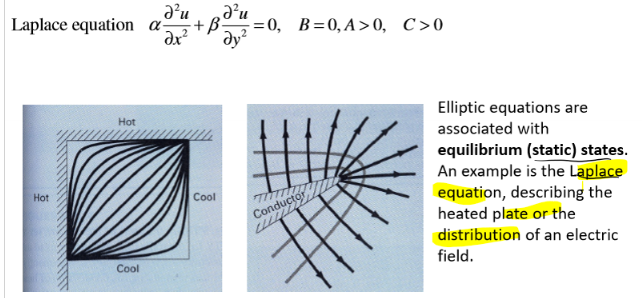

#### Parabolic Equation
- $B^2-4AC = 0$
- Inital state -> Stationary state
- Relaxaition to equilibrium
  
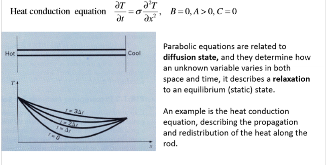

#### Hyperbolic Equation
- $B^2-4AC \gt 0$
- Oscillatiing or vibrating systems
- Describe Propagation problems
- Example is wave eqaution, of vibrating spring

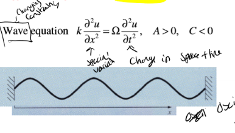

### Initial and Boundary Conditions
Can have both initial conidtions and boundary conditions. 

Boundary conditions, vital to specify the area we want. Conditions should specify all boundaries, and the region should be closed with respect to independent variables.

#### Dirichlet Conditions
- **Value of the dependent** variable u - specified at part of the boundary S1
- $u(x,y) = C(x,y)$ for all x,y on the boundary where C(x,y) is often a constant (in engineering)
- Example:
  - Constandt temperature of side edges
  - 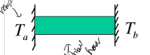

#### Neumann Conditions
- **Gradient** of the dependent variable
  - The derivate of the dependent variable u in a direction normal, n to the boundary, specified on part of the boundary S2.
- $ \frac{\partial u(x,y)}{\partial n} = C(x,y)$ for all x,y on the boundary S2 where C(x,y) is often a constant (in engineering)
- Example:
  - Heat flux via top and bottom edges
  - Note zero flux, means C=0, reflective boundary condition.
    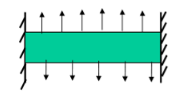

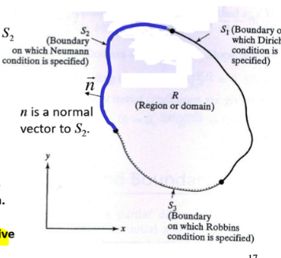

#### Robin / Mixed (Generalised Neumann)
- Combination of Dirichlet and Neumann
- Linear combination of the dependant variable and its gradient specified on part of the boundary. (S3)
- $ \frac{\partial u(x,y)}{\partial n} + r u(x,y) = C(x,y)$ for all x,y on the boundary S3 where C(x,y) is often a constant (in engineering)
- Example:
  - Constant temperature of side edges, and flow through the edge.
- 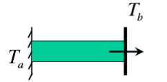

## Finite Difference Approach

### Elliptic PDE
Approach:
- Finite difference approximation of PDE
- Implementation of boundary conditions
- Solving linear Matrix equation.

#### Problem
- Given equation, IE possion
- Given boundary conditions
- Given region $R$.

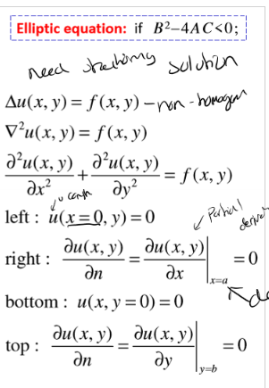

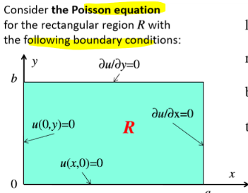

#### Introduce Grid
- Divide rectangular domain R:
  - m equal spaced points in x direction
  - n equal spaced points in y direction
- $\Delta x = \frac{L_x}{m}$ and $\Delta y = \frac{L_y}{n}$
- Denote coordinates at mesh points $(x_i,y_j)$
- Consider interior point as reference point (i,j)

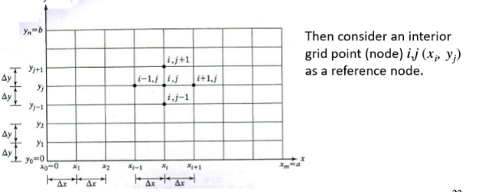

#### Finite Difference Scheme
- Consider reference node i, j $(x_i, y_j)$:  $u(x_i,y_j) = u_{i,j} $, $f(x_i,y_j) = f_{i,j}$
- Use finite difference approximations for the derivitatves
- In this case using *central-difference formulea for second derivateve*
  - As highest accuracy compared to backward and forward
- Substitute into PDE
- The error is combination of the error for central difference for x and y.
- The error is of order $O(\Delta x^2 + \Delta y^2)$

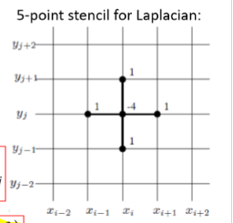

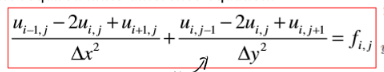

#### Implementation of boundary conditions
- Equation is only valid for interior nodes (i=1, m-1 and j=1, n-1)
- Convert boundary conditions to finite difference scheme. 

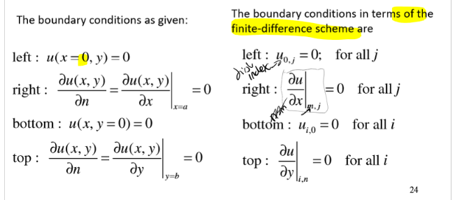

- Dirichlet boundary - Where u is specified
  - Where u is specified, we can use the value of u at the boundary for i=1 and j=1
  - As can sub in and use.
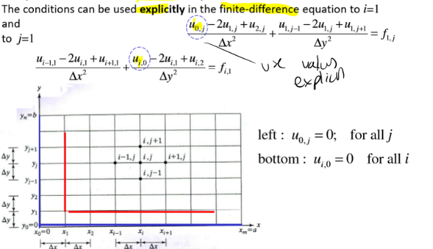

- Neumann boundary - Where the gradient is specified
  - Many ways to use, we consider backward-difference scheme - to approximate first order derivatives at these boundaries.
  - Use the finite difference scheme for the gradient, and sub in the value of u at the boundary.
  - As can use thes boundary conditions.
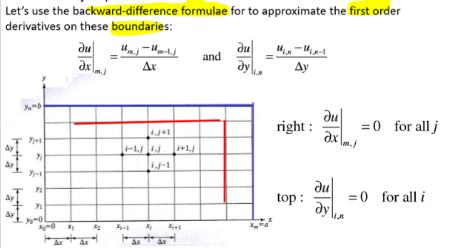

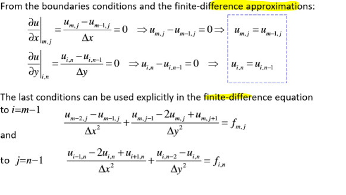

#### Algebraic Equations
Leads to equations for interior nodes: All linear.
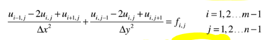

Option to via direct (exact), via matrix operation. But not easy, also sparse so poor computational efficiency.

Other option is iterative:
- Approximate
- Simple but have finite error
- The finite-difference approximation has a descretisation error of $O(\Delta x^2 + \Delta y^2)$ so as long as the iterative error is smaller than the discretisation error it is fine.