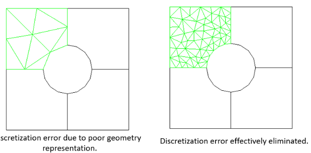

# PDEs

<equation-table>

| [Partial Differential Equations (PDEs)](#partial-differential-equations-pdes) |                                                                                                                                    |
|-------------------------------------------------------------------------------|------------------------------------------------------------------------------------------------------------------------------------|
| [Genereal form](#genereal-form)                                               | $A \frac{\partial^2 u}{\partial x^2} + B \frac{\partial^2 u}{\partial x \partial y} + C \frac{\partial^2 u}{\partial y^2} + D = 0$ |
| [Categories](#categories)                                                     | Defined by the                                                                                                                     |
| [Elliptic Equation](#elliptic-equation)                                       |                                                                                                                                    |
| [Parabolic Equation](#parabolic-equation)                                     |                                                                                                                                    |
| [Hyperbolic Equation](#hyperbolic-equation)                                   |                                                                                                                                    |
| [Dirichlet Conditions](#dirichlet-conditions)                                 |                                                                                                                                    |
| [Neumann Conditions](#neumann-conditions)                                     |                                                                                                                                    |
| [Robin / Mixed (Generalised Neumann)](#robin--mixed-generalised-neumann)      |                                                                                                                                    |

| [Finite Difference Approach](#finite-difference-approach)                       |                                                                                                                                                                |
|---------------------------------------------------------------------------------|----------------------------------------------------------------------------------------------------------------------------------------------------------------|
| [Problem](#problem)                                                             |                                                                                                                                                                |
| [Introduce Grid](#introduce-grid)                                               |                                                                                                                                                                |
| [Finite Difference Scheme](#finite-difference-scheme)                           |                                                                                                                                                                |
| [Implementation of boundary conditions](#implementation-of-boundary-conditions) |                                                                                                                                                                |
| [Algebraic Equations](#algebraic-equations)                                     | Leads to equations for interior nodes: All linear.                                                                                                             |
| [Steps](#steps)                                                                 |                                                                                                                                                                |
| [Parabolic PDE Solution](#parabolic-pde-solution)                               | $u_{i,j+1} = \frac{\alpha \Delta t}{\Delta x^2} u_{i-1,j} + (1 - 2 \frac{\alpha \Delta t}{\Delta x^2}) u_{i,j} + \frac{\alpha \Delta t}{\Delta x^2} u_{i+1,j}$ |
| [Parabolic PDE Scheme Accuracy](#parabolic-pde-scheme-accuracy)                 | $O(\Delta x^2 + \Delta t)$                                                                                                                                     |
| [Stability](#stability)                                                         | The scheme is                                                                                                                                                  |
| [Steps](#steps-1)                                                               |                                                                                                                                                                |
| [Hyperbolic Scheme](#hyperbolic-scheme)                                         | $u^{k+1}$                                                                                                                                                      |
| [Hyberbolic Scheme Accuracy](#hyberbolic-scheme-accuracy)                       | $O(\Delta x^2 + \Delta t^2)$                                                                                                                                   |

| [Finite Element Method](#finite-element-method) |   |
|-------------------------------------------------|---|
| [Discretisation Error](#discretisation-error)   |   |
| [Forumlation Error](#forumlation-error)         |   |
| [Numerical Error](#numerical-error)             |   |

</equation-table>

## Partial Differential Equations (PDEs)

### Classification
- Differential equations, inlolving **more than one independent** variable are called **partial differential equations** (PDEs).
- May include two and more independent variables.
- Unlike ODE, there is no unified theory
  - Some equations have theories, others do not.
- **Order**:
  - Order of the highest derivative present in the equation.
- **Linear vs Nonlinear**:
  - PDE is linear if it is a **linear function** of the **depenednt** variable.
  - This module we consider linear PDEs only.
- Homogeneous vs Non-Homogeneous:
  - If there is a term that us a function of the independent variables, the equation is **non-homogeneous**.

#### Genereal form
$$
A \frac{\partial^2 u}{\partial x^2} + B \frac{\partial^2 u}{\partial x \partial y} + C \frac{\partial^2 u}{\partial y^2} + D = 0
$$
Used for engineering problems. Where A, B, C are functions of the independent variables (x and y), and D is a function of x, y, u, du/dx and du/dy.

This is **linear** **second order** **partial differentiiation equation**, with **two independent variables** (x, y)m and **one** dependent variable (u(x,y)). If D = 0, it is a **homogeneous** PDE.

#### Categories
Defined by the **type** of solutions of PDEs. Assuming general form, A, B, C are constants and D = 0.

- **Elliptic**:
  $B^2 - 4AC \lt 0$ - stationary solution
- **Parabolic**:
  $B^2 - 4AC = 0$ - relaxation solution
- **Hyperbolic**:
  $B^2 - 4AC \gt 0$ - oscillating solution

Note:
**Tricomi** is where the catagory differs depending on a independent variable.

#### Elliptic Equation
- $B^2-4AC \lt 0$
- Equilibirum (static) states
IE:

#### Parabolic Equation
- $B^2-4AC = 0$
- Inital state -> Stationary state
- Relaxaition to equilibrium
  

#### Hyperbolic Equation
- $B^2-4AC \gt 0$
- Oscillatiing or vibrating systems
- Describe Propagation problems
- Example is wave eqaution, of vibrating spring

### Initial and Boundary Conditions
Can have both initial conidtions and boundary conditions. 

Boundary conditions, vital to specify the area we want. Conditions should specify all boundaries, and the region should be closed with respect to independent variables.

#### Dirichlet Conditions
- **Value of the dependent** variable u - specified at part of the boundary S1
- $u(x,y) = C(x,y)$ for all x,y on the boundary where C(x,y) is often a constant (in engineering)
- Example:
  - Constandt temperature of side edges
  - 

#### Neumann Conditions
- **Gradient** of the dependent variable
  - The derivate of the dependent variable u in a direction normal, n to the boundary, specified on part of the boundary S2.
- $ \frac{\partial u(x,y)}{\partial n} = C(x,y)$ for all x,y on the boundary S2 where C(x,y) is often a constant (in engineering)
- Example:
  - Heat flux via top and bottom edges
  - Note zero flux, means C=0, reflective boundary condition.
    

#### Robin / Mixed (Generalised Neumann)
- Combination of Dirichlet and Neumann
- Linear combination of the dependant variable and its gradient specified on part of the boundary. (S3)
- $ \frac{\partial u(x,y)}{\partial n} + r u(x,y) = C(x,y)$ for all x,y on the boundary S3 where C(x,y) is often a constant (in engineering)
- Example:
  - Constant temperature of side edges, and flow through the edge.
- 

## Finite Difference Approach

### Elliptic PDE
Approach:
- Finite difference approximation of PDE
- Implementation of boundary conditions
- Solving linear Matrix equation.

#### Problem
- Given equation, IE possion
- Given boundary conditions
- Given region $R$.

#### Introduce Grid
- Divide rectangular domain R:
  - m equal spaced points in x direction
  - n equal spaced points in y direction
- $\Delta x = \frac{L_x}{m}$ and $\Delta y = \frac{L_y}{n}$
- Denote coordinates at mesh points $(x_i,y_j)$
- Consider interior point as reference point (i,j)

#### Finite Difference Scheme
- Consider reference node i, j $(x_i, y_j)$:  $u(x_i,y_j) = u_{i,j}$, $f(x_i,y_j) = f_{i,j}$
- Use finite difference approximations for the derivitatves
- In this case using *central-difference formulea for second derivateve*
  - As highest accuracy compared to backward and forward
- Substitute into PDE
- The error is combination of the error for central difference for x and y.
- The error is of order $O(\Delta x^2 + \Delta y^2)$

#### Implementation of boundary conditions
- Equation is only valid for interior nodes (i=1, m-1 and j=1, n-1)
- Convert boundary conditions to finite difference scheme. 

- Dirichlet boundary - Where u is specified
  - Where u is specified, we can use the value of u at the boundary for i=1 and j=1
  - As can sub in and use.

- Neumann boundary - Where the gradient is specified
  - Many ways to use, we consider backward-difference scheme - to approximate first order derivatives at these boundaries.
  - Use the finite difference scheme for the gradient, and sub in the value of u at the boundary.
  - As can use thes boundary conditions.

#### Algebraic Equations
Leads to equations for interior nodes: All linear.

Option to via direct (exact), via matrix operation. But not easy, also sparse so poor computational efficiency.

Other option is iterative:
- Approximate
- Simple but have finite error
- The finite-difference approximation has a descretisation error of $O(\Delta x^2 + \Delta y^2)$ so as long as the iterative error is smaller than the discretisation error it is fine.

### Parabolic PDE
Relaxation to an equilibirum

Approach:
- Finite difference approximation of PDE
- Implementation of boundary conditions
- Solving linear Matrix equation.

Very similar to eliptic.

- Given eqaution with second derivative and first derivative

$$
\alpha \frac{\partial ^2 u(x,t)}{\partial x^2} = \frac{\partial u(x,t)}{\partial t} \quad \text{where } \alpha \gt 0
$$
- Boundary and initial condiditons
- See lecture 10 for more detail

#### Steps
- Use central finite difference for the second derivative and forward finite difference for the first derivative.
- Substitute into PDE
- Rearrange for $u_{i, j+1}$
- Apply boundary conditions
- Apply initial coniditons
  - For first iteration - can sub in, therefore different equation
  - For all other iterations have general equation

#### Parabolic PDE Solution  
$$
u_{i,j+1} = \frac{\alpha \Delta t}{\Delta x^2} u_{i-1,j} + (1 - 2 \frac{\alpha \Delta t}{\Delta x^2}) u_{i,j} + \frac{\alpha \Delta t}{\Delta x^2} u_{i+1,j}
$$

#### Parabolic PDE Scheme Accuracy
$$
O(\Delta x^2 + \Delta t)
$$
- The error is combination of the error for central difference for x and t.

#### Stability
The scheme is **conditioanlly stable** for 
$$
1 - \frac{2\alpha \Delta t}{\Delta x^2} \geq 0 \quad \to \quad \Delta t \leq \frac{\Delta x^2}{2\alpha}
$$

Therefore, decreasing spatial interval leads to decreasing the time step at the cost of more computation. Thus room for improvement (with implcit methods).

### Hyperbolic PDE
Again similar, hyperbolic = oscilations

- Finite difference approximation of PDE
- Implementation of boundary conditions
- Solving linear Matrix equation.

- Given eqaution with two second derivative 
$$
A \frac{\partial ^2 u(x,t)}{\partial x^2} = \frac{\partial ^2 u(x,t)}{\partial t^2}
$$

#### Steps
- Repalce second derivatives with central finite difference approximations
- Rearrange for $u_{i,K+1}$ as looking for future time step (where k+1)
- Apply initial conditions
  - Need to use central difference for the first derivative and rearrange to get the scheme for the first iteration
  - As scheme uses time -1, so for time 0, cant have negative.
  - After k > 1, then we can use normal finte difference scheme.
- Apply boundary conditions
- 

#### Hyperbolic Scheme
$$
u^{k+1}_i = r(u^k_{i+1} + u^k_{i-1}) + 2(1-r)u^k_i - u_{i}^{k-1}
$$

Where $r = \frac{\alpha \Delta t^2}{\Delta x^2}$

First iteration:
$$
u_i^1 = r(u_{i+1}^0 + u_{i-1}^0) + 2(1-r)u_i^0 - (u_{i}^{1}-2i'_0(x_i) \Delta t)
$$

#### Hyberbolic Scheme Accuracy
$$
O(\Delta x^2 + \Delta t^2)
$$

### Hyperbolic Stability
$$
r = A \frac{\Delta t^2}{\Delta x^2} \leq 1
$$
Conditionally stable.

## Finite Element Method

### Framework
- Very important development in computer methods
- Has evolved to be use for many problems
- Advantages to a design engineer
  - Easilly applied to complex, irregular shaped objects (made of different matterials, with complex boundary conditions)
  - Applicable to steady-state, time depenent and eigenvalue problesm
  - Applicable to linear and nonlinear
- A complex region defining a **continuum** is **descretised** into simple geopmetric shapes called **elements**
- Properties and govenening relationships are assumed over the elements and expressed mathematically in terms of unknown values at specifci points **nodes**.

- Assembly process links the indivdual elements to the given system
- Using inital and boundary conditions, creats a set of linear / nonlinear algebraic equations
- Solution gives **approximate** behaviour

### FEM Features
- **Numerical procedure** - approximate solution
- **Piecewise approximation** - of physical field (continuum) on finite elements - essentia step
  - Tends to use simple approximating functions
  - Increasing the number of elements, increases the precision
- **Locality of approximation** - leads to sparse quations for discretized problem

 

- Therfore, a specifc numerical result is obtained for a specifc problem. 
- A general closed-from solutions ( which would allow you to examine system responses to various parameters ) is not produced.
- FEM is applied to an approximation of the mathematical model (source of inherited errors)
- So need expereince and judement to make good model
- Powerful computer and reliabel software required.
- Input and output data can be large and tedious to prepare and interpret..

### FEM Errors
3 sources of error

#### Discretisation Error
- Results from transforming physical system into finite element model
- Can be related to modeling the boundary shape, conditions etc

#### Forumlation Error
- From elements that dont precisily describe the behaviour of the physical problem
- Elements my be ill-conditioned or matematically unsuitable

#### Numerical Error
- Numerical caluclations - trncation erros + roundoff errors
- Therefore main concern for FEM vendors and developers
- Can be contributed to by user, say they do not give a constant to enough decimal places.
- So task of uncertainty quantification is to determine the effect of these errors on the final solution.

### Steps
1) Discretisation of the domain using a finite element
2) Selection of an interpolation or shape function for an element
3) Derivation of elemtn characteristic matrices and vectors. The use of PDEs and boundary and inital conditions.
   - Often the physcial problem can be formulated as the minimusation of a functional; then the **variational formulation** is used.
4) Assemblage of elelment charatcteris matrices and vectors
5) Soltuion of system equations.

### Matlab PDE
- PDE toolbox, GUI for solving the following types of PDE
- Solves using FEM.
- 

