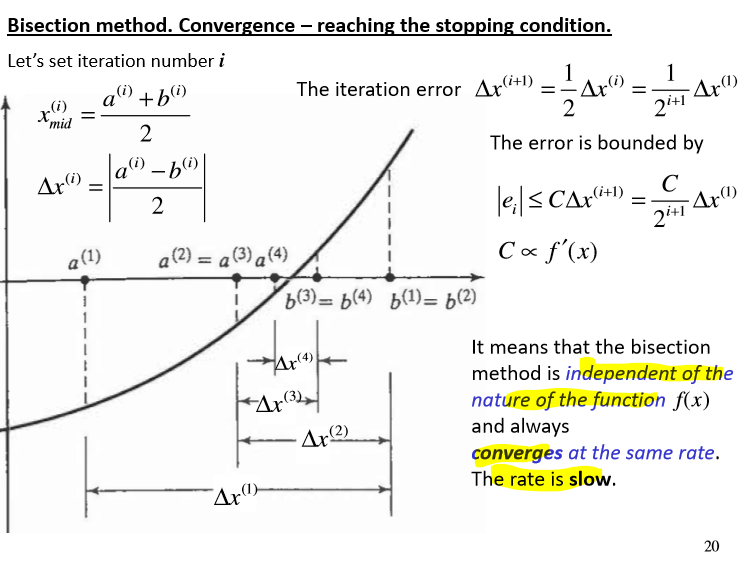
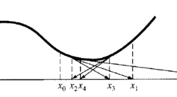

# Roots of Nonlinear Equations

<equation-table>

| [Polynomial Equations](#polynomial-equations)                                 |                                                                                                        |
| ----------------------------------------------------------------------------- | ------------------------------------------------------------------------------------------------------ |
| [General Eigenvalue problem](#general-eigenvalue-problem)                     | $Ax = \lambda x$                                                                                       |
| [Companion Matrix, A](#companion-matrix-a)                                    | Specifcy suitable matrix for the initial polynomal which have roots \lambda of...                      |
| [Characteristic polynomial equation](#characteristic-polynomial-equation)     | $\lambda^n + \frac{a_2}{a_1}\lambda^{n-1} + \ldots + \frac{a_n}{a_1}\lambda + \frac{a_{n+1}}{a_1} = 0$ |
| [Semi-analytical Roots via Polynomail](#semi-analytical-roots-via-polynomail) | Expand function f(x) in Taylor series around x_0, and rewrite expansion in p...                        |
| [Numerical Roots via Polynomial](#numerical-roots-via-polynomial)             | Introduce grid with nodes x_i and use  curve fitting to calculate coefficients...                      |

| [Bracketing Methods](#bracketing-methods)                                       |                                                                                     |
| ------------------------------------------------------------------------------- | ----------------------------------------------------------------------------------- |
| [Incremental Search](#incremental-search)                                       | $x_{i+1} = x_i + \Delta x $                                                         |
| [Bisection Iteration Error Convergence](#bisection-iteration-error-convergence) | $\Delta x^{(i+1)} = \frac{1}{2}\Delta x^{(i)} = \frac{1}{2^i}(x^{(1)})$             |
| [Bisection Limitations](#bisection-limitations)                                 | Initial interval of uncertainty must contain odd number of roots (otherwise has ... |

| [Open Methods](#open-methods)                                           |                                                                                     |
| ----------------------------------------------------------------------- | ----------------------------------------------------------------------------------- |
| [Fixed Point Iteration Convergence](#fixed-point-iteration-convergence) | Convergences to root. Modulus of deritvative of max function of error must be le... |
| [Fixed Point Iteration Divergence](#fixed-point-iteration-divergence)   | Diverges from root. Modulis of deritvative of function of error is be greater th... |
| [Newton Raphson Method Error](#newton-raphson-method-error)             | $error_{i+1} = \frac{f''(\epsilon)}{2f'(\epsilon)}error_i^2$                        |
| [Newton Raphson Method Pitfalls](#newton-raphson-method-pitfalls)       | Has the tendency to oscialte around local maximum or minium                         |
| [Newton Raphson Non Linear Matrix](#newton-raphson-non-linear-matrix)   | $\Delta X_k = -J^{-1}(X_k)F(X_k)$                                                   |

</equation-table>

Task is to solve non-linear equation (or system of. ) $f(x) = 0$ using the following methods:
- Roots via polynomials
  - Solve eigenvalue problem
  - Taylor series approximation
  - Numerically via polynomial interpolation
- Bracketing methods (bisection)
  - Function changes sign in the vicinity of a root
  - Initial interval of uncertainty must contain odd number of roots
  - Not applicable for tangency point (no difference between singularity and root)
- Open Methods
  - Fixed point iteration
    - Iterative formula, convergence is linear depends on function 
  - Newton-raphson method
    - Taylor series about point
    - Quadratic convergence, fast convergence
    - Derivative required
    - Can oscilate around local maximum or minimum

## Polynomial Equations

In from:
$$
f(x) = a_1x^n + a_2x^{n-1} + \ldots + a_n = 0
$$
where $a_i$ are the coefficients of the polynomial and $n$ is the degree of the polynomial.

Solution to reformaulate task to **Eignevalue problem**

#### General Eigenvalue problem
$$
Ax = \lambda x
$$

A is nxn matrix, x i 1xn vector and $\lambda$ is the eigenvalue (scaler). Task is to find eigen value.

Non trivial solution only exists if determinant is equal to zero. $\det(A - \lambda I) = 0$ where $I$ is the identity matrix.

#### Companion Matrix, A

Specifcy suitable matrix for the initial polynomal which have roots $\lambda$ of this matrix.

$$
A = \begin{pmatrix}
-a_2/a_1 & \ldots & -a_n/a_1  & -a_{n+1}/a_1 \\
1 & \ldots & 0 & 0 \\
\vdots & \ddots & \vdots & \vdots \\
0 & \ldots & 1 & 0 \\
\end{pmatrix}
$$

To solve:
$$
a_1x^n + a_2x^{n-1} + \ldots + a_nx + a_{n+1} = 0
$$

#### Characteristic polynomial equation

$$
\lambda^n + \frac{a_2}{a_1}\lambda^{n-1} + \ldots + \frac{a_n}{a_1}\lambda + \frac{a_{n+1}}{a_1} = 0
$$

Eg For equation

$$
a_1x^5 + a_2x^4 + a_3x^3 + a_4x^2 + a_5x + a_6 = 0
$$

Matlab `roots([a1 a2 a3 a4 a5 a6])`

All possible (including complex roots will be determined)

#### Semi-analytical Roots via Polynomail
Expand function $f(x)$ in Taylor series around $x_0$, and rewrite expansion in polynomial form. find all n roots using funciton `roots([a1 a2 a3 a4 ... an])`

Keep real roots only!

Pitfalls:
- Taylor series **approximate polynomial** so there is error
- However, error is *lagrange remainder* so can control the error by estimating the remainder and increasing $n$

#### Numerical Roots via Polynomial
Introduce grid with nodes $x_i$ and use  curve fitting to calculate coefficients and find the roots. **Keep** **real** roots only.

Accuracy of polynomial interpolation depends on step size h, and polynomial can be a poor representation of function f(x). Reducing h leads to larger number of points and less precise calculation of coefficients.

## Bracketing Methods

Real roots within an inteval. **Bracketing mathods** based on the fact that the function typically changes sign in the vincitiy of a root.

Therefore requires initial search of interval $[a,b]$ such that $f(a)f(b) < 0$.

#### Incremental Search
$$
x_{i+1} = x_i + \Delta x \\
f(x_i)f(x_{i+1}) < 0
$$
where $\Delta x$ is the step size.

### Bisection Method

Used after a initial serach of interval. Define the interval of *uncertainty* $[a,b]$.

Iterate:
1) Calculate midpoint $x_{mid} = \frac{a+b}{2}; \quad \Delta x = b-a$
2) Check functions $f(x_{mid}) = 0$ and if satisfied, then $x_{mid}$ is the root
3) If not, check the sign of $f(x_{mid})$ and update interval:
   - If $f(a)f(x_{mid}) < 0$, then set $b = x_{mid}$
   - Else set $a = x_{mid}$
4) Repeat until $\Delta x$ is smaller than the desired tolerance. **Stopping condition**
    $\mid{f(x_{mid})}\mid \leq \epsilon$ or $\Delta x \leq \epsilon$

$\epsilon$ is the tolerance. The smaller the tolerance, the more iterations required. Return means that the root is within the interval of size $\epsilon$.

#### Bisection Iteration Error Convergence
$$
\Delta x^{(i+1)} = \frac{1}{2}\Delta x^{(i)} = \frac{1}{2^i}(x^{(1)})
$$

#### Bisection Limitations
Initial interval of uncertainty must contain odd number of roots (otherwise has the same size). 

And cannot distinquish between singulatraity and root, and not applicable for tangency point. 

Only works for 1D

## Open Methods
Open methods are used to find roots of nonlinear equations without bracketing. Employ **iterative formula**

### Fixed Point Iteration

To solve $$ f(x) = 0$$, transform into

$$x = g(x); \quad g(x) = f(x) + x$$

- Iterative formula $x_{i+1} = g(x_i)$
- Initial value $x_0$
- Stopping condition
$$
\mid{f(x_{i+1})}\mid \leq \epsilon; \quad or \quad \mid{g(x_{i+1}) - x_{i+1}} \mid \leq \epsilon 
$$
- Or relative error 
$$ 
\mid \frac{x_{i+1}-x_i}{x_i} \rvert \leq \epsilon 
$$

- Can be vectorised for multidimensional case.
- Does not necessarily lead to root.
- Method is unstable depending on location of root

#### Fixed Point Iteration Convergence
Convergences to root. Modulus of deritvative of max function of error must be lest than 1. Where $g'(\epsilon{}_m) = \max_i g'(\epsilon_i)$.

Bascially if the fixed stationaly point on the map is fixed and stable.

Convergence is linear and depends on function $f(x)$.

#### Fixed Point Iteration Divergence
Diverges from root. Modulis of deritvative of function of error is be greater than 1

### Newton Raphson Method
Taylor series about arbitrary known point $x_0$. Truncate without lagrange remainder and rearrange.

- Quaratic convergence, method will converge if initial guiess is close to root.
- Fast convergence
- CAn be applied to multidiemensional problems
- Master method for finding roots
- Derivative required.

$$
 x_{i+1} = x_i - \frac{f(x_i)}{f'(x_i)}
$$

With stopping condition

$$

\mid \frac{x_{i+1}-x_i}{x_i} \rvert \leq \epsilon 
$$

#### Newton Raphson Method Error
$$
    error_{i+1} = \frac{f''(\epsilon)}{2f'(\epsilon)}error_i^2
$$

#### Newton Raphson Method Pitfalls
Has the tendency to oscialte around local maximum or minium

#### Newton Raphson Non Linear Matrix
$$
\Delta X_k = -J^{-1}(X_k)F(X_k)
$$

