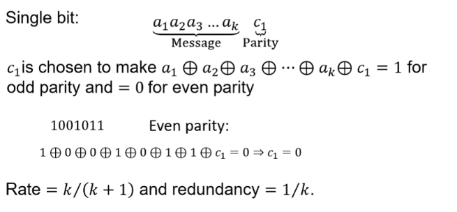

# Continuous Channel Capacity and Codes
- Continuous Additive Noise Channels; Additive White Gaussian Noise Channel 
- Shannon Formula Implications 
- Error Correction Coding 
- Block Coding; Parity-Check Coding 
- Vector Spaces and Subspaces 
- Hamming Distance and Minimum Distance 
- Finding dmin for Block Codes 
- Generator Matrix G; Parity Check Matrix H; Distance Theorem 
- Hamming Bound and Hamming Codes 

## Continuous Additive Noise Channels

### Channel Capacity

- Difficult to determine for continuous channels

Lecture 8, slide 2 derivation
- Gets us shannons famous formula:

$$ 
C = W \lg(1 + \frac{P_x}{P_n}) \text{ bits per second }
$$

## Implications of Shannon Formula
$$
P_x = E_b R
$$
- SEnding binary digits at rate R, bit duration of 1/R
- Noise of PSD of N_0/2
$$
\frac{R}{W} = \lg(1+ \frac{E_b}{N_0 W} R)
$$

- Shannons limit can then be found
- 
- -
- If signal to noise ration increases, then so does the capactiy (with no limit)
- Limit to capcity if increase bandwidth without limit, $W \to \infty$ $ \frac{P_x}{N_0} \lg e $ bits per second

- Upper bound of spectral efficiency if run at the Nyquist rate of 2W.
- 
- 
## Block Coding
- Source data segmented into blocks of lenght k information or message bits, which can represent $2^k$ different messages
- Block encoder transforms k bit data block into n bit coded block that can represent $2^n$ different codewords
- $n-k$ bits that the encoder adds are redunent bits, used for error detection and correction
- Ratio $(n-k)/n$ is the redundancy of the code
- $k/n$ is the rate of the code

### Parity-Check coding
- Linear sums of information bits for error detection.

#### Single Bit
- 
- 
- Error is equally likely, 
$$
P(j,n) = \binom{n}{j} p^j (1-p)^{n-j} 
$$

### Vector Subspaces
#### Definition
Some of the terms are similar to those used in compression and some are new. 
An alphabet is a finite set f with a number of elements $|F| = q$  and $q \geq 2$. 
Here, f will always be a finite field — we will say more 
about this later. 
A symbol or character is an element of f. 
A word is an element of F^n, i.e. a string of length n. 
A code is a non-empty subset of F^n, denoted by C. 

#### Vector Spaces
- 

#### Subspaces
- 
- 

## Minimum Distance and Properties

### Hamming Distance

- Hamming weight w(U) of a word U is the number of non-zero elements in U
- Hamming distance d(U,V) between two words U and V is the number of positions in which they differ
$$
d(U,V) = w(U \oplus V); \quad d(U,0) = w(U); \quad d(V,0) = w(V)
$$
-The nearest neibour of the word V is defined to be a word U such that d(U,V) is minimal.

#### Relative Distance
$$
\delta = \frac{d_{min}}{n}
$$

### Properties of Minimum Distance
1) With D errors, can be determined if not valid when $D \leq d_{min} - 1$ (as cannot be another codeword with distance less than dmin)
2) Number of errors t can be corrected
   - $t= \lfloor \frac{d_{min} - 1}{2} \rfloor \text{or} 2t+1 \leq d_{min}$ 
3) Singleton bound, $d_{min} \leq n- k+1$

## Matrix Representation

### Generator Matrix G

$$ T = A.G $$
-All rows of generator matrix are codewords 
- Can also be generated with polynomial. Must be monic (first term coefficient is 1)
### Decoding
- Use partity check matrix H
- G.H^T = 0
- 
## Distance Theorem
- C has minimum distance at least $d_{min}$ if and only if any $d_{min}-1$ columns of H are linearly independent, or d_min is minum number of depdent columns.

## Hamming Bound
- Generally open question, find bounds of number
- $|C| \leq \frac{2^n}{\sum_{i=0}^{t} \binom{n}{i}}$
- Codes that have eqaulity in the bound are known as **perfect**

## Hamming Codes
- First codes, Hamming codes defined for any m>2,
- $n = 2^m - 1$
- $k = 2^m - m - 1$
- So get (7,4), (15,11), (31,26) etc
- Therefore partity check coloumns will be binary counds from 1 to 2^m -1
  

### Trivial Codes
- 