## Exam Topics:
- **Classes of entropy**
- **Discrete Examples**
- **Continuous Entropy**
- Principle of Maximum Entropy
- **Conditional Entropy; Joint Entropy**
- **Chain Rules**
- Convex and COncave functions; Jensens inequality
- Relative Entropy

# Entropy
Entropy is the expected information given an alphabet and a probability distribution. Units: bits per symbol
$$
H(x) = -\sum_{i=1}^{n} p_i \lg (p_i)
$$

## Classes of Entropy
- Input
  - $H(X) = - \sum_{i=1}^{n} p(x) \lg (p(x))$
- Output
  - $H(Y) = - \sum_{i=1}^{n} p(y) \lg (p(y))$
- Joint
  - $H(X, Y) = - \sum_{i=1}^{n} p(x, y) \lg (p(x, y))$

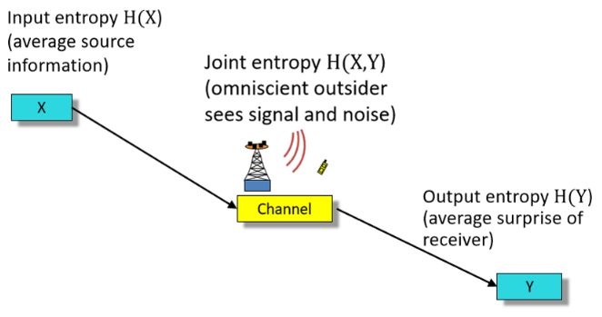

### Binary Entropy
- Bernoulli Distribution (Binary)
- $H(p) = -p \lg (p) - (1-p) \lg (1-p)$
- Rewritten as $H_b(p) = H((p, 1-p))$
- Max when lg(p) = lg(1-p) when p = 0.5
Varied with p:
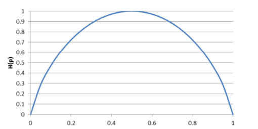

### Continuous Entropy
- Approximation of continious distribuitoon by probabilities at constant intervals
- To ensure sum is 1,$p(x_i) \Delta x$ is the area under the continuos pdf p(x) over the interval i.
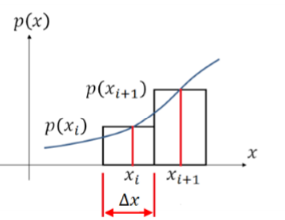

$$
H(x) = -\sum_{i=1}^{n} p(x_i) \Delta x \lg p(x_i)  - \lg \Delta x 
$$

- Take the limit as $\Delta x \to 0$
- But as x approaches 0, -lg 0 = $\infty$.
- Therefore Shanno defined **deifferential entorpy**

#### Differential Entropy
$$
h(X) = -\int_{-\infty}^{\infty} p(x) \lg p(x) dx
$$
- Retaiins most properties of discrete entropy
- Can be negative

For small $\Delta x$:
$$
H(X) = h(X) - \lg \Delta x
$$

- Then range of X is normalised to 1, $\Delta x = 2^{-n}$
- So $ H(X) = h(X) + n$
- So provides a lower bound for the mean length of useful source coding of continuous variables with nbit precision.

#### Examples
- If the probability is uniform beteween 0 and 1, then h(X) = 0. Therefore a block code of length n can reproduce X with n bit accruacy.
- If the probaiblity is uniform between 0 and 1/2, then h(X) = -1
  - Implies that a block code of lenght n-1 can reporeduce X with n bit accuracy.
  - This is because the first bit must be 0, and does not need to be encoded.
- If probability is exponetial $p(x) = \lambda e^{-\lambda x}$
  - Then do some maths (see L4 pg 17)
  - $h(X) = \lg e - \lg e \ln \lambda$ bits.

### Principle of Maximum Entropy (POME)
- To find the distribution with the maximum possible entorpy with constraints, use POME.
- **We do not need to memorise this!**

#### Discrete Case
- m constraints, A_x = {x1,.. x_n}, P_x = {p1,.. p_n}, E[g_k(x)] = ak, k = 1..m
- **Maximum entropy distribution**is given by:
$$
p_i = exp{\lambda_0 + \lambda_1 g_1(x_i) + \lambda_2 g_2(x_i) + ... + \lambda_m g_m(x_i)}
$$
- Parameters $\lambda_0, \lambda_1, ... \lambda_m$ are determined by the constraints
  - Including sum of probabilities = 1

**No Constraints:**
- Consider constraints
  - $g_k(x_i) = x_i^k$
- So with no constraints other than sum to 1 (lamda_1 plus, are all 0) 
- So $p_i = e^{\lambda_0}$
- So $\sum_{i=1}^{n} e^{\lambda_0} = 1$
- so $e^{\lambda_0} = \frac{1}{n} = p_i$
- Sub into entropy
- $H(X) = \lg n$
- So for **discrete** source with no contraints, the maximum entropy occurs when **all symbols are the same and equally likely** and is $\lg n$.

**Fixed Mean**
- Set mean to $1/p$
- $p_i = \sum_{i=0}^n e^{\lambda_0} e^{\lambda_1 x_i}$
- With the constraints
  - $e^{\lambda_0} \sum_{n=1}^{\infty} e^{\lambda_1 n} = 1$
  - $e^{\lambda_0} \sum_{n=1}^{\infty} n e^{\lambda_1 n} = 1$
- Solving these produces geoemetric distribution
- $f(n) = p(1-p)^{n-1}$

up to 26.

#### Continuous Case
Solution metho is the same, but **constraints are now continuous** - and need to use differential entorpy for continuous variables.

**Continuous Entropy Amplitude Limit**
- First bounding the amplitiude with +-A, (needed to lead to the maximum entropy )
- $\int_{-A}^{A} p(x) dx = 1$
- Modifies constraint (that dictates we have a valid pdf) - instead of adding new constraint
- so as $p(x) = e^{\lambda_0}$, in bounding constraint
  - $e^{\lambda_0} = \frac{1}{2A} = p(x)$
- 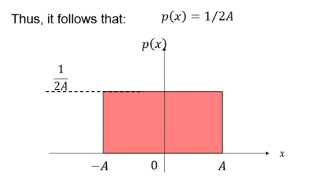
- $h(X) = \lg 2A$

**Continuous Entropy Fixed Mean**
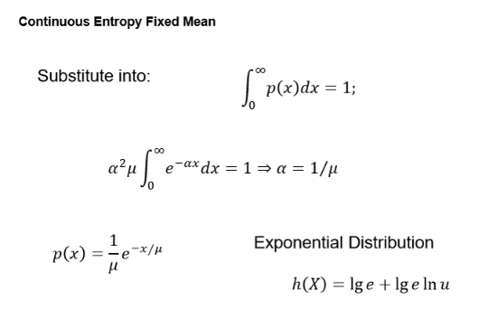

**Power Limit**
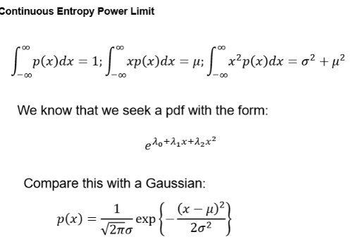

### Conditional Entropy
COndition X on one observed y
$$ 
H(X|y) = -\sum_{i=1}^{n} p(y) \lg p(x|y) 
$$

So over all y:
$$
H(X|Y) = -\sum_{y}^{n} p(y)  \sum_x p(x|y) \lg  p(x|y) = -\sum_{y,x} p(y) p(x|y) \lg  p(x|y) 
$$

#### Conditional Entropy Chain Rule
$$
H(Y|X) = H(X,Y) - H(X)
$$
Can be rearranged to:
$$
H(X,Y) = H(X) + H(Y|X)
$$

Therefore:
$$
H(X|Y) = -\sum_{x,y} p(x,y) \lg p(x|y) 
$$

### Joint Entropy
$$
H(X,Y) = H(X) + H(Y|X)
$$

or, can swap
$$
H(X,Y) = H(Y) + H(X|Y)
$$

$$
H(X,Y) = -\sum_{x,y} p(x,y) \lg p(x,y)
$$

#### Chain Rules
- Expression can be extended

$$
H(X_1, X_2, \ldots, X_n) = H(X_1) + H(X_2|X_1) + H(X_3|X_1, X_2) + \ldots + H(X_n|X_1, X_2, \ldots, X_{n-1})
$$

### Relative Entropy

#### Strictly Convex & Concave Functions
- f(x) is strictly convex over (a,b) if every chord of f(x) lies above the graph of f(x)
- Concave is the opposite

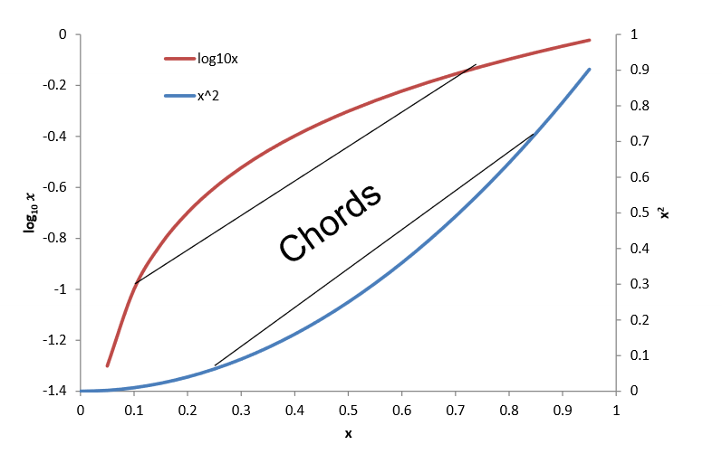
- Strictly convex (x>0) f(x) = x^2 and f(x) = e^x
- Strictly concave (x>0) f(x) = lnx and log_10 (x)

### Jensen's Inequality
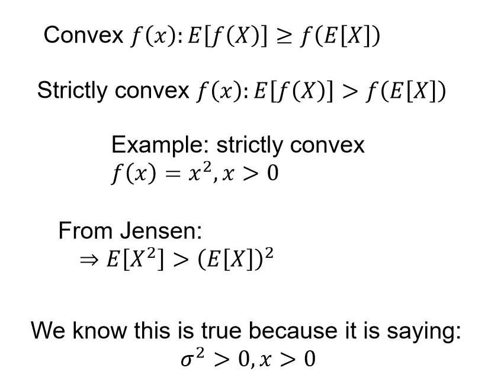

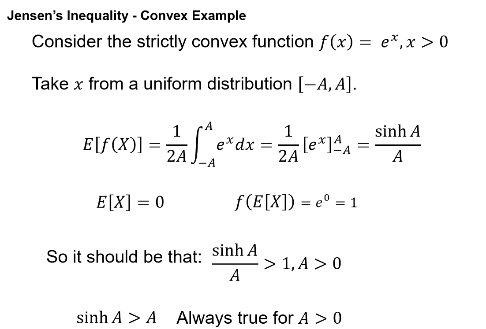

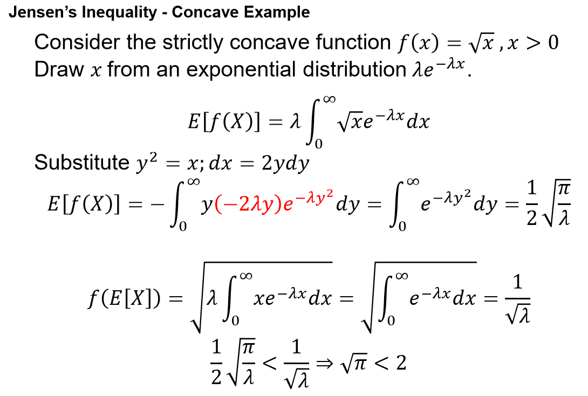

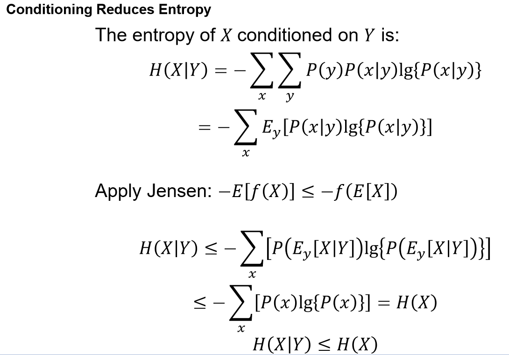