# Image and Video Compression

## Background on Colour and Image Compression

### Luminece
Total power

### Uncompressed
- Black and White - signle colour plane, 1 bit
- Grey scale - single colour plane, 8 bits 2^8 = 256 shades
- RGB - 3 colour planes, 8 bits each, 24 bits total, 2^24 = 16.7 million colours

### YUV
- Y - Luminance (brightness)
- UV Chrominance (colour)
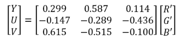
where R' is gamma corrected values

YCbCr
- Y - Luminance (brightness)
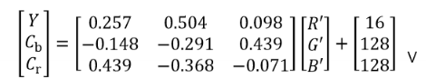

## JPEG
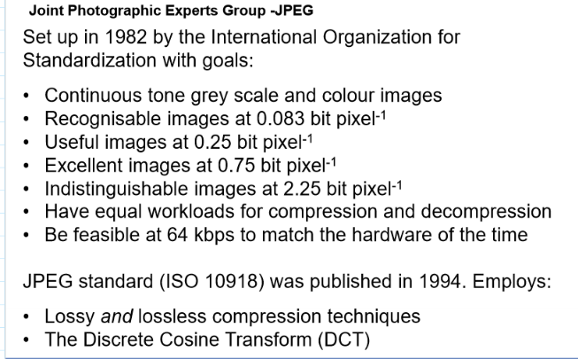

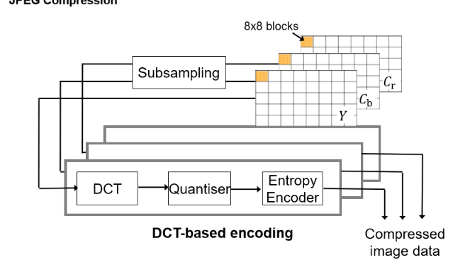
- Transofrm coder
- WIth chorminace subsampling

- RGB transformed to YCbCr - Luminance componentn is greyscale, two other axes colour informaiton
- As Y Cb Cr are less related than RGB, can compress individually betrer
- Can lose more info in Cb and Cr as human eye is less sensitive to colour than brightness

### Chrominance Subsampling
- Each 8 pixel blocks cosnidered as a set of 4 by 2 pixels.
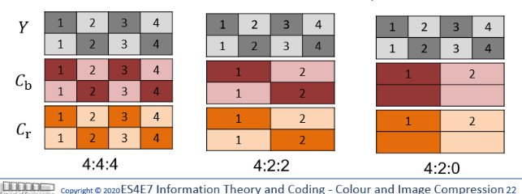
- Represents the relative widthe of th region to the number of chromaince samples in the first row and the number of changes between the first and second row.
- 4:2:0 - 4 samples in the first row of Y, 2 in the second row 0 in the third row 

### Image Preperation
- Divided into blocks usually 8x8 for use in Discrete cosine transform

### Image processing
- Shift values to be in the range of -128 to 127 (from 0 to 255)
- Forward DCT converts image from spatial to frequency domain
- **Intensity function -> weighted sum of periodic basis (cosine) functions**
- idendify bands of spectral infromation that can be thrown away without loss of quality
- Intensity values in each color plane often change slowly

### 1D Forward DCT
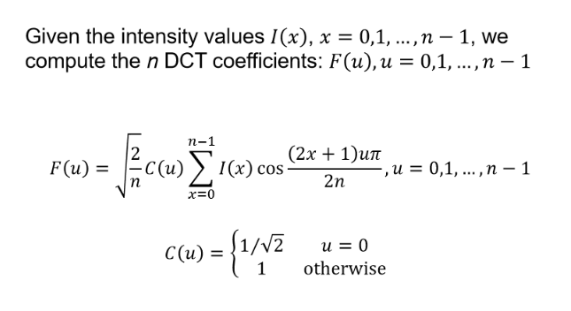

### 1D Inverse DCT
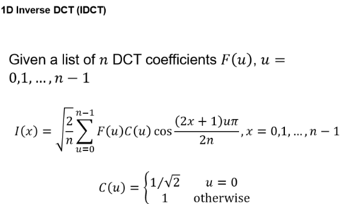

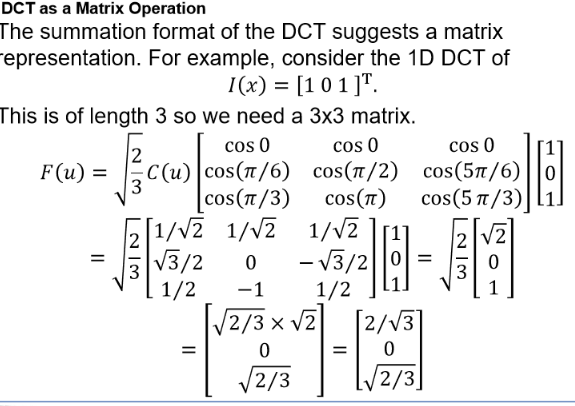

### 2D Forward DCT
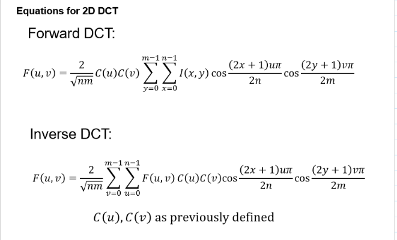

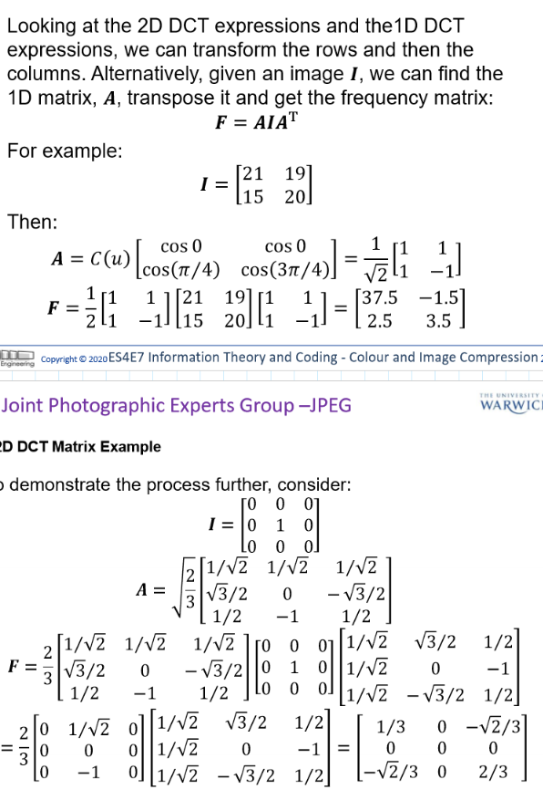

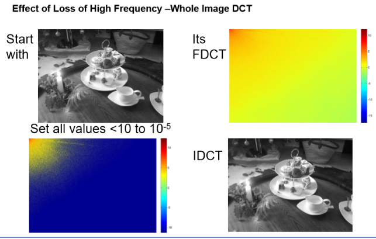

### Image Redudency
R = 1 -() Non redudent bits / totalbits)

### Quantization
- Quantization is the process of reducing the number of bits used to represent a value
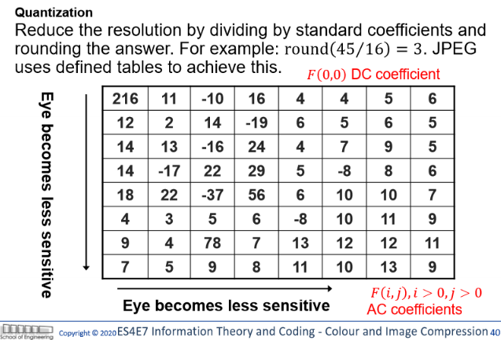
##
## MPEG
