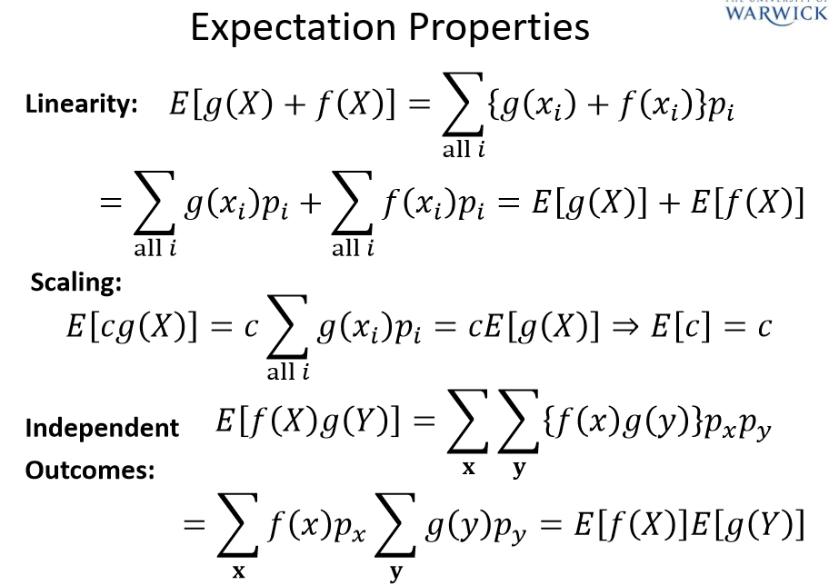

# Introduction and Mathematical Background

<equation-table>

| [Math Background](#math-background)             |                                                       |
|-------------------------------------------------|-------------------------------------------------------|
| [Lg (log base 2)](#lg-log-base-2)               | $lg(x) = \frac{log_{a}(x)}{log_{a}(2)}$               |
| [Decibles](#decibles)                           | $R_{dB} = 10 log_10(R) = 10 log{10}(\frac{P_1}{P_2})$ |
| [Amplitude](#amplitude)                         | $R_{dB} = 20log_{10}(\frac{A_1}{A_2})$                |
| [Bernoulii Disribution](#bernoulii-disribution) | $A_x = {0, 1}; \quad P_x = {p, 1-p}$                  |
| [Binomial Distribution](#binomial-distribution) | $A_x = {0, 1, 2, \ldots n}; \quad P(k|N,p) = \binom{N}{k} p^k (1-p)^{N-k}$ | 
| [Poisson Distribution](#poisson-distribution) | $P(k|\lambda) = \frac{e^{-\lambda} \lambda^k}{k!}$ | 
| [Discrete Random variables Expected Value](#discrete-random-variables-expected-value) | $E[g(X)] = \sum_{x \in A_x} g(x) P_x = \mu$ | 
| [Continuous Random variables Expected Value](#continuous-random-variables-expected-value) | $E[g(X)] = \int_{-\infty}^{\infty} g(x) p(x) dx = \mu$ | 
| [Expected Value Rules](#expected-value-rules) | See image | 
| [Variance](#variance) | $Var(X) = E[(X - \mu)^2] = E[X^2] - \mu^2$ | 

</equation-table>

# Exam Topics
- Randomness & Noise
- Historical Background
- Matehmatical Preliminaries
- Probabilty review
- Random Variables
- Information
- Quantisation
- **Digitial Source Encoding**

## Math Background

### Logs

EG base 10 tells us what power 10 needs to be raised to produce the given input
- log10(100) = 2 because 10^2 = 100

Log base 2 - **lg**

#### Lg (log base 2)
$$
lg(x) = \frac{log_{a}(x)}{log_{a}(2)}
$$

#### Decibles
$$
R_{dB} = 10 log_10(R) = 10 log{10}(\frac{P_1}{P_2})
$$

Ratio of two powers p1 and p2

#### Amplitude
$$
R_{dB} = 20log_{10}(\frac{A_1}{A_2})
$$

Since $P_n \propto A_n^2$

### Probabilty
- Ensemble: $X = \{x, A_x, P_x\}$
- $x$ is outcome (the event E)
- from alphabet $A_x = \{x_1, x_2\ldots x_n \}$ 
- Corresponding probabilities $P_x = \{p_1, p_2, \ldots p_n\}$
  

#### Bernoulii Disribution
$$
A_x = \{0, 1\}; \quad P_x = \{p, 1-p\}
$$
Two outcomes with probabilities p and 1-p
If p=0.5, then this is a coin toss.

#### Binomial Distribution
$$
A_x = \{0, 1, 2, \ldots n\}; \quad P(k|N,p) = \binom{N}{k} p^k (1-p)^{N-k}

$$

Series of N Bernoulli trails

#### Poisson Distribution
Models the number of event occurences within a given time interval (mean = $\lambda$)
$$
P(k|\lambda) = \frac{e^{-\lambda} \lambda^k}{k!}
$$

### Expected Value

#### Discrete Random variables Expected Value
$$
E[g(X)] = \sum_{x \in A_x} g(x) P_x = \mu
$$

#### Continuous Random variables Expected Value
$$
E[g(X)] = \int_{-\infty}^{\infty} g(x) p(x) dx = \mu
$$
where p(x) is the probability density function (PDF)

#### Expected Value Rules
See image

#### Variance

$$
Var(X) = E[(X - \mu)^2] = E[X^2] - \mu^2
$$

if x and y are independent, then
$$
Var(X + Y) = Var(X) + Var(Y)
$$

For discrete random variables

$$
Var(X) = \sum_{x \in A_x} (x - \mu)^2 P_x
$$

For continuous random variables, zero mean for uniform distribution
$$
Var(X) = \int_{-\infty}^{\infty} (x)^2 p(x) dx
$$

