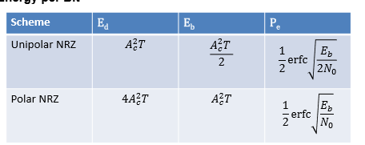

# Noise, Coding and Errors

<equation-table>

| [Noise](#noise)                                                                                 |                                                                                                                                     |
| ----------------------------------------------------------------------------------------------- | ----------------------------------------------------------------------------------------------------------------------------------- |
| [Zero Mean Additive Gaussian White Noise (AWGN)](#zero-mean-additive-gaussian-white-noise-awgn) | Gaussian proability distribution with                                                                                               |
| [ercf function](#ercf-function)                                                                 | $\text{erfc}(x) \approx \frac{e^{-x^2}}{xsqrt{\pi} }$                                                                               |
| [Error Probability](#error-probability)                                                         | $P_e = \frac{1}{2} \text{erfc}\left(\frac{d-A_0}{sqrt{2\sigma}}\right) = \frac{1}{2} \text{erfc}\left(sqrt{\frac{E_b}{N_0}}\right)$ |
| [Matched Filter](#matched-filter)                                                               | In rreal noisy channel, know pulse shape but not how big or exaclty when it will...                                                 |
| [Calculation of Energy per Bit E_b](#calculation-of-energy-per-bit-e_b)                         | Digital communications use the ratio fo enery per bit to the ones sided Power sp...                                                 |

| [Error Correction Coding](#error-correction-coding)                                       |                                                                   |
| ----------------------------------------------------------------------------------------- | ----------------------------------------------------------------- |
| [Binary Symmetric Channel (BSC)](#binary-symmetric-channel-bsc)                           | Discrete Memoryless.                                              |
| [General Repetition Code Probabily of Error](#general-repetition-code-probabily-of-error) | $P_e(M) = \sum_{m=\frac{M+1}{2}}^{M} \binom{M}{m} p^m(1-p)^{M-m}$ |
| [Repetition Code Performance](#repetition-code-performance)                               | See image                                                         |
| [Run Length Encoding Image Comrpression](#run-length-encoding-image-comrpression)         | Idea to remove redundancy of images using run length encoding     |
| [Ad Hoc Image compression](#ad-hoc-image-compression)                                     | Straight run length encoding of the original image                |
| [More adhoc Image compression](#more-adhoc-image-compression)                             | Can divide into segements, but in some will expand the image.     |
| [Compression limits](#compression-limits)                                                 |                                                                   |
| [Mean Length Sparese Files](#mean-length-sparese-files)                                   | $\hat{l} = 3 + 4P(\text{block is not one of the six})$            |

</equation-table>

## Exam Topics
- **Noise and Errors**
- **Probability of Error**
- **Energy per bit**
- **Binary Symmetric Channel**
- **Repetition Codes**
- Run length encoding
- Compression
- Some rules of probability

## Noise

Probability of error per transmitted digit = measurement of performance from sampling sginglas.

Consider gaussian distributions $p_0(v)$ and $p_1(v)$, that have the same varience. Probability of getting 0 and 1 respectivly. 2 guassians with the same varience can be combined.

#### Zero Mean Additive Gaussian White Noise (AWGN)
Gaussian proability distribution with **zero mean** and unifirom power spectral density (contains all frequencies equally)

$$
p(v) = \frac{1}{\sqrt{2\pi \sigma}} e^{-\frac{v^2}{2\sigma^2}}
$$

#### ercf function
$$
\text{erfc}(x) \approx \frac{e^{-x^2}}{x\sqrt{\pi} } 
$$
Approximated for exams

#### Error Probability
$$
P_e = \frac{1}{2} \text{erfc}\left(\frac{d-A_0}{\sqrt{2\sigma}}\right) = \frac{1}{2} \text{erfc}\left(\sqrt{\frac{E_b}{N_0}}\right)

$$

Second equation using polar non-return to zero signalling. Where E_b is the energy per bit and N_0 is the noise power spectral density.

See L3 page 6 for derivation.

#### Matched Filter
In rreal noisy channel, know pulse shape but not how big or exaclty when it will arrive.

Therefore use filter before detection so noise is limited and decreased so P_e will be reduced. Optimum filter is matched filter.

$$
P_e = \frac{1}{2} \text{erfc}\left(\sqrt{\frac{\text{SNR}}{8}}\right) = \frac{1}{2} \text{erfc}\left(\sqrt{\frac{\Delta^2}{8}}\right)
$$

Where:

$$
\Delta^2 = \frac{2}{N_0} E_d; \quad E_d = \int_{-\infty}^{\infty} [s_1^2(t) + s_0^2(t) - 2s_1(t)s_0(t)] dt
$$

E_d is difference engery.

#### Calculation of Energy per Bit E_b
Digital communications use the ratio fo enery per bit to the ones sided Power spectral density (PSD) N_0 as a figure of merrit.

## Error Correction Coding

#### Binary Symmetric Channel (BSC)
Discrete Memoryless.

- Binary - Two inputs and two outputs
- Symmetric - Probability of transmitting a 0 and receiving a 1 is the same as the probability of transmitting a 1 and receiving a 0
- Discrete - Either 1 or 0
- Memoryless - Probability of error for each bit is independent of the previous bits transmitted.

### Error Correction Coding
Coding permits *detection* of errors, and some cases *correction* of errors.
- By adding delibertate redundancy
- Extra bits which carry no messahe omfpr,atopm/
- Errors are caused by unpredictable random rnoise.

### Repetition Code
Repeats the bit n times
- If the majority of the bits are 1, then the bit is 1
- If the majority of the bits are 0, then the bit is 0
  

#### General Repetition Code Probabily of Error
$$
P_e(M) = \sum_{m=\frac{M+1}{2}}^{M} \binom{M}{m} p^m(1-p)^{M-m} 
$$

Sum all the ways that more than half of the bits are corrupt. Where M is M bit message.

#### Repetition Code Performance
See image

### Run Length Encoding (RLE)

Replace a run of $n$ symbols of $x$ with a packet of $n$ and $x$.

Consider 8 bit items (7 bit items, 1 bit data or run)
- Data packets: seven bit count followed by up to 127 bytes of data
- Run packets: seven bit count followed by data bye representing repeadeted value

Most Significant bit (MSB) - packet is data packet or run packet. 

Can get good compression if the data is highly correlated.

#### Run Length Encoding Image Comrpression
Idea to remove redundancy of images using run length encoding
- After the first row of pixels, the system looks for differences between each row and the next
- A row is stored as a bitmap containing ones at the byte positions where the line differes from the previous line
- The values of the bytes that differ are appeneded to this bitmap and the resulting structure is run length encoded.
  
#### Ad Hoc Image compression
Straight run length encoding of the original image
- Assuming each byte pair indicates the number of instances of the next byte pair (hex)

IE:
19 zeooes = 0x13 0x00

In some cases can compress image better

#### More adhoc Image compression
Can divide into segements, but in some will expand the image.

Also have to consider if compressing is recoverable (lossless) or not (lossy).

Stream of independednt 1s and zeros, maximum compression is 71% (see later for detail). Relationships between pixels can make more than this possible.

We do not know the actual message at the time of the design ,so the system bust operate fro every possible selectuion

#### Compression limits
- File of N bits in length, ocompressed to X of original
- $2^N$ possible messages
- $\approx 2^{X\times N}$ possible files
- So very small
- To be effective, compression algorthim needs to examine the data and find redundencies.

### Sparse Files
- Long binary vector consisting mainly of zeros
- Bits drwan independently
- Recall Bernoulii distribution
- EG Prob of 1 occuring is low, $p=0.1$, so compress large file by taking blocks of size N
- Occurance of 1s follow binomial distribution, therfore mose linkely blcoks will be no 1s or a single 1.
- Therefore Most for N = 5, 6 most likely blocks = 00000 00001 00010 00100 01000 10000  
- Can enode these 6 symbols with 3 bits (000 001 010 011 100 101)
- But need to accomodoate other blocks using the remaining (2^5 - 6) = 26 blocks
- Remaining 3 bits (2 remiaing codes 110 111) plus 4 bits for 13
  
#### Mean Length Sparese Files
$$
\hat{l} = 3 + 4P(\text{block is not one of the six})
$$

Expected code length

