# Noisy Channels and Channel Capacity

## Noisy Channels
- Noise applied during discrete channel between the transmitter and receiver
- We assume:
  - **Stationary** Properties do not vary with time 
  - **Memoryless** properties do not vary with previsou symbols
  - **Synchronised** (we know which y maps to which x)
  
  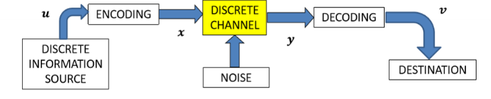

### Matrix Representation
- The channel can be represented as a matrix

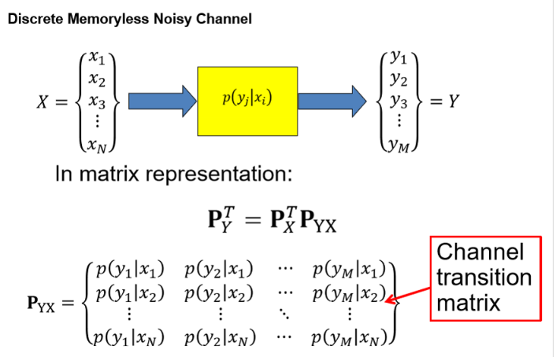
- Calculate $p(y_j)$, $p(x_i|y_j)$ and Probability of error $P_e$

<!-- $$
% P_{YX} = \begin{bmatrix}
$$ -->
- Use Bayes theorem to calculate the probability of the output given the input
$$
p(y_i) = \sum_{j=1}^{M} p(x_i) p(y_j|x_i)
$$
$$
p(x_i|y_j) = \frac{p(y_j|x_i)p(x_i)}{p(y_j)}
$$
- Correctly received symbols:
  - $ p(y_0|x_0)$, $p(y_1|x_1)$ 
- Incorrectly received symbols:
  - $p(y_0|x_1)$, $p(y_1|x_0)$
  - 

### Binary Symmetric Channel
- Equal probabilities
- 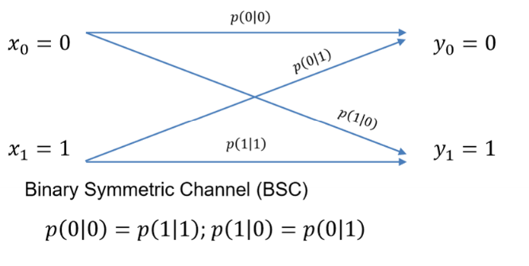
- Gives the following ransition matrix
- 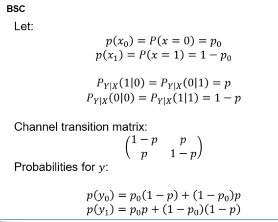
- Poor BSC
  - When the probabilies are poorly distributed
  - Choice of input distribtuion is cruicla
  - Cannot change the nature of the source but we can use an encode to modify the input probabilies
  - Need mathmatical tools to calculate the channels capabilitiy to convey infomration

### Pre Processing
- 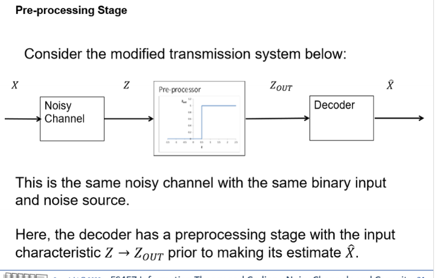
- Preproecssor has the same noisy channel with the same binary input and nosie source
- Preporcessing stage has the input charactersitic Z -> Z_out prior to making it's estimate $\hat{X}$
- eg:
- 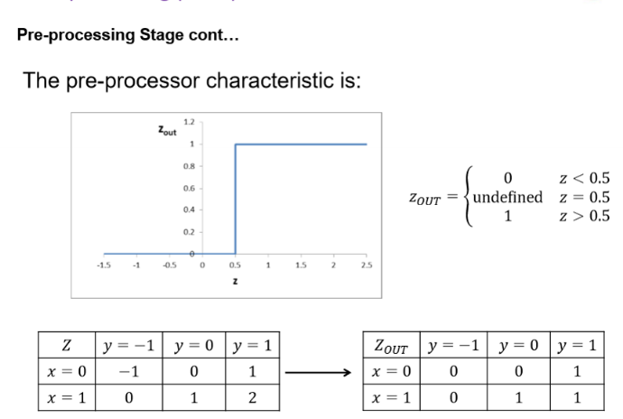
- 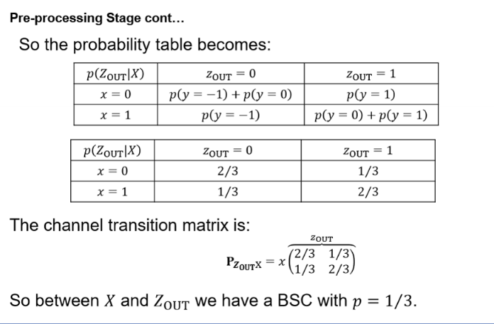

## Mutal Information
- Omniciscient outsider has more information that an observer at either end
- But outsider does not have more information that the sum of both ends
- Difference is the mutual information
$$
I(X;Y) = H(X) + H(Y) - H(X,Y) \\
I(X;Y) = \sum_{x,y} p(x,y) \lg \frac{p(x,y)}{p(x)p(y)} \\
I(X;Y) \geq 0
$$

- But if X and Y are independent, then ofcourse no information shared, $I(X;Y) = 0$

### Chain Rule
- $I(X;Y;Z) = I(X;Y) + I(X;Z|Y)$
or
$I(X;Y,Z) = I(X;Y) + I(X;Z|Y)$

### For BSC
- $I(X;Y) = H(X) - H(X|Y)$
- Symetric
- Therefore binary entropy function
$$
H(X) = -p \lg p - (1-p) \lg (1-p)
$$

## Channel Capacity
- Channel Capacity, C
- Maximum achievable system mutal information amongs all the possible input distributions
- Can be very hard to find closed form expression - but simplified channels it is possible
$$
C = \max_{p(x)} I(X;Y)
$$

### Capacity of BSC
- $C = 1 - H_b(p)$ bits per channel use
- Maximum value of H(Y) is when the probabilties are equal, so some quick maths and thats what we get

### Binary Erasure Channel (BEC) Capacitty
- Channel where bits either arrive correctly or get lost / erased
- 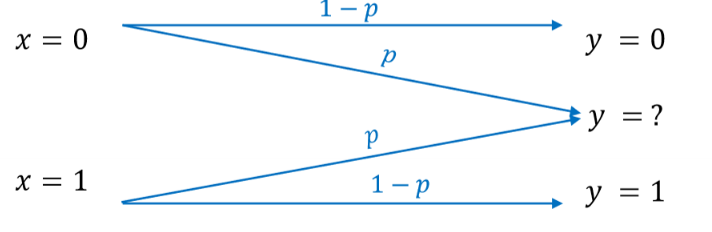
- $C_{BEC} = 1 - p$ bits per channel use
- 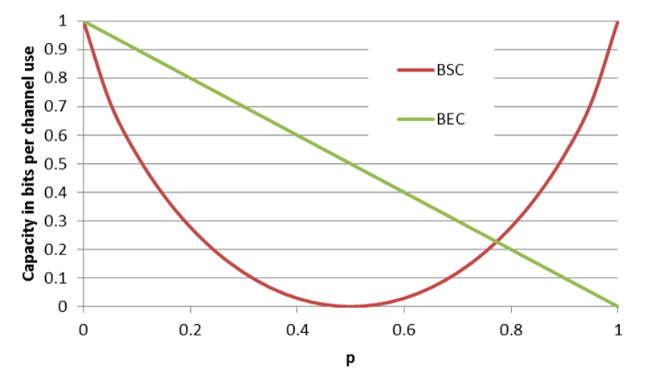

### Discrete Additive Noise Channel
- Additive noise
- uses Mod N artithmetic
- C = H(Y) - H(Y|X)

### Noiseless Channels
- Even with absence of noise, there is a limit on the transmission capacity dependt on the source
- Absence of noise, H(X|Y) = 0
- So C = max(H(X))
- Given by lg n bits per symbol or bits per channel use
- Since each symbol requires one channel use

### Channel Capacity Nyquist
- Nyquist rate
- States that for a baseband signal with bandwidth B, the maximum data rate is 2B
- $f_s \gt 2B$

### Hartley Rate
- Maximum number of distinguishable pulse levels, M that can be transmitted and recieved reliable over a communications channel to the range of the input signal -A, A and the repcision with which the distinguis amplitude levels $\pm \Delta V: M = 1 + A / \Delta V$
- So derived line rate  limit:
- $R \leq 2B \lg M$
- Hartely rate is the capacity of an errorless M-ary channel

### Shannons Channel Coding Theroem
If BER of Pe is accaptble, the max rate is:
$R(P_e) = \frac{C}{1 +H_b(P_e)}$
For any Pe rates greater than R(Pe) are not possible

### Limits of BSC
- Can rearrange
- $H_b(P_e) = 1 - \frac{C}{R(P_e)}$
- Represents a boundary
- 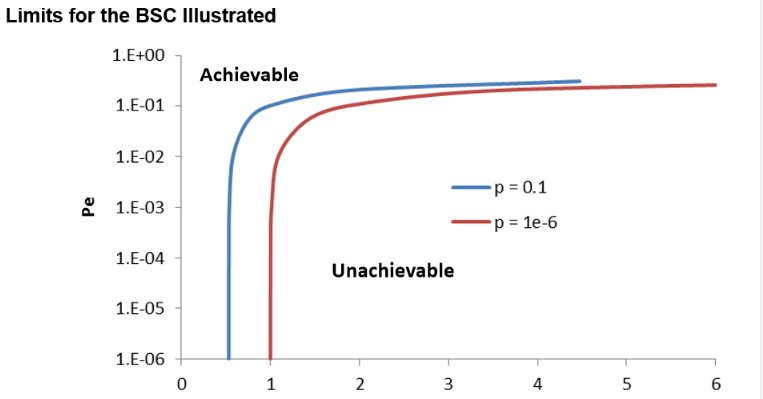
- When Pe is small, Hb(Pe) is small so rate is close to C
- But if rate is too much is too large, Hb(Pe) goes to 1, so P
- 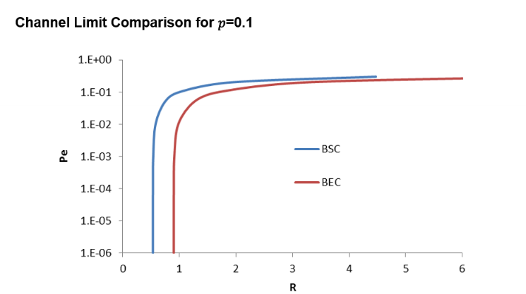

### Markov Process
- Implies X and Z are conditionally independent given y
- $p(x,z|y) = p(x|y)p(z|y)$  

## Data Processing Inequality
- Processing in the deconder cannot add new information about X
- See from equilviland chain rules of mutal information
- 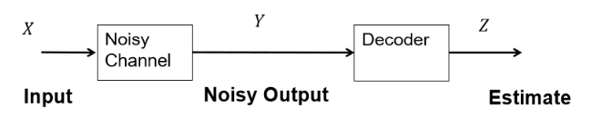
- $I(X;Y) = I(X;Z) + I(X;Y|Z)$

- Also applies to functions
- 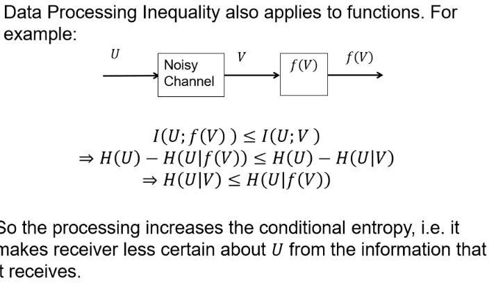

### Cascading Capacity
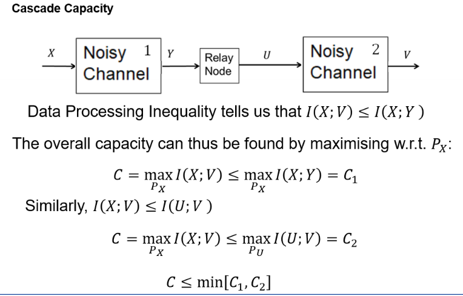
$C \leq min(C_1, C_2)$

## Fano's Inequality
- $H(X|Y) \leq H_b(P_e) + P_e \lg (|X|-1)$
- SLide 68 week 7
- 