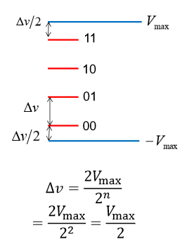

# Probability and Information

<equation-table>

| [Information](#information)                                                     |                                                                                                                                          |
| ------------------------------------------------------------------------------- | ---------------------------------------------------------------------------------------------------------------------------------------- |
| [Coding](#coding)                                                               |                                                                                                                                          |
| [Source / Channel Seperation Theroum](#source--channel-seperation-theroum)      | If a source can be transmitted over a channel in any way, it can be transmitted ...                                                      |
| [Outcomes and information](#outcomes-and-information)                           | $r = 2^n$                                                                                                                                |
| [Hartley Information Definition](#hartley-information-definition)               | $I_{\text{hartley}}(U) = \log{}_b r$                                                                                                     |
| [Shannons Information](#shannons-information)                                   | Measure of information =                                                                                                                 |
| [Entorpy](#entorpy)                                                             |                                                                                                                                          |
| [Entropy of equal probability](#entropy-of-equal-probability)                   | $H(X) = \lg n$                                                                                                                           |
| [Transmission error probability](#transmission-error-probability)               | $P_e \sim e^{-kE_b}$                                                                                                                     |
| [Signal Power](#signal-power)                                                   | $\text{Power} = E_b R_b$                                                                                                                 |
| [Quantisation:](#quantisation)                                                  | Divide the range from v_{min} to v_{max} into number of levels 2^n where c...                                                            |
| [Quantisation Error](#quantisation-error)                                       | $\text{Quantisation Error, } Q = \text{quantised signal} - \text{original signal}$                                                       |
| [Signal to Quantised Noise Ratio (SQNR)](#signal-to-quantised-noise-ratio-sqnr) | $\text{SQNR} = \frac{P_{signal}}{P_{noise}} = \frac{E[V^2]}{E[Q^2]} = \frac{v_m^2 E[\hat{V}^2]}{\frac{v_m^2}{3N^2}} = 3N^2 E[\hat{V}^2]$ |

</equation-table>

## Information

### Communications

Focus of the module is on Source coding, error correction, and channel coding.

#### Coding
- Matching the source to the channel / storage medium using source encoding
- Ensure efficieny in transmission / storage (minimum transmission time / space by eliminating reducnecy or unwanted detail)
- Preserving infomration secrecy (source encryption / decryption
- Ensuring reliable transmission (error correction / detection)

#### Source / Channel Seperation Theroum
If a source can be transmitted over a channel in any way, it can be transmitted using a binary interface.

- Digital is cheap, relaibel fast ans small
- Implementaiton is standardised
- Newtorking is simplified

### Bits
- Binary digit
- Amount of information neede to chose between two equally probably alternatives.
- 

#### Outcomes and information

r outcomes, n binary choices, = n bits of information
$$
r = 2^n
$$

$$
n = \log_2(r) = \lg(r)
$$

### Hartley Information

#### Hartley Information Definition

$$
I_{\text{hartley}}(U) = \log{}_b r
$$

$U$ is the random result

$r$ is the number of possible outcomes
$b$ is the base of the logarithm
- $b=2$ is binary
- $b=10$ is decimal
- $b=e$ is natural

### Shannon Information
Defined information for an outcome with probability $p$.

No difference for equally likely outcomes, but does for other probabiluit distributions.

$$
I(p) = -\lg p = \lg (\frac{1}{p})
$$

#### Shannons Information 
Measure of information = *average hartley information*. 

Exclude events with **zero probability**
$$
-\sum_{i=1}^{r} p_i \lg p_i = \sum_{i=1}^{r} p_i lg(\frac{1}{p_i})
$$

#### Entorpy
- Measure of information generated by a random (proabilitsic) source X.
- Unit of measuremetn is *bit*
- Represented the **expected shannon information.**

$$
H(X) = \sum_{i=1}^{n} p_i I(p_i) = -\sum_{i=1}^{n} p_i \lg p_i
$$

Where source X has alphabet of size $n$, $A_x = \{x_1, x_2, \ldots x_n\}$ and probabilities $P_x = \{p_1, p_2, \ldots p_n\}$

#### Entropy of equal probability
$$
H(X) = \lg n
$$

Where n is the number of outcomes. This is because the maths simplfiies.

### Transmission Errors
Communcation not gennerally error free. Has a probability of error $P_e$.

Energy per bit: $E_b$ [J/bit] 
Bit Rate: $R_b$ [bits/sec]

#### Transmission error probability
$$
P_e \sim e^{-kE_b} 
$$
Probabilty of error varies with energy per bit. Decreased P_e with increased energy per bit.

#### Signal Power
Watts or J/sec
$$
\text{Power} = E_b R_b
$$

Increased rate means need to increase power to keep same P_e.

### Digital Signals

#### Quantisation:
Divide the range from $v_{min}$ to $v_{max}$ into number of levels $2^n$ where coded by n bits.

- Each level is represented by a binary code.
- Can be varied to optimise

$$
\Delta v = \frac{v_{max} - v_{min}}{2^n -1}
$$

For Symetrical quantisation (VMax = - Vmin), the levels are equally spaced.
$$
\Delta v = \frac{V_{max}}{2}
$$

#### Quantisation Error
$$
\text{Quantisation Error, } Q = \text{quantised signal} - \text{original signal} 
$$

The more bits used to quantise, the smaller the quantisation error.

Max error is half the quantisation step size.
$$
Q_{max} = \frac{\Delta v}{2}
$$

Can be mapped as uniform distribtuion with mean and varience calculated easily.

Second moment of E[Q^2] is the variance of the quantisation error, and in electrical signals, the square relates to power. So used to relate to power.

$$
\mu_Q = E[Q] = 0; \quad \sigma^2 = E[Q^2] = \frac{\Delta v^2}{12}

$$

#### Signal to Quantised Noise Ratio (SQNR)
$$
\text{SQNR} = \frac{P_{signal}}{P_{noise}} = \frac{E[V^2]}{E[Q^2]} = \frac{v_m^2 E[\hat{V}^2]}{\frac{v_m^2}{3N^2}} = 3N^2 E[\hat{V}^2]
$$

Where $\hat{V}$ is normalated to v_m.

$$ 
E[V^2] = E[(v_m \hat{V})^2]

$$

