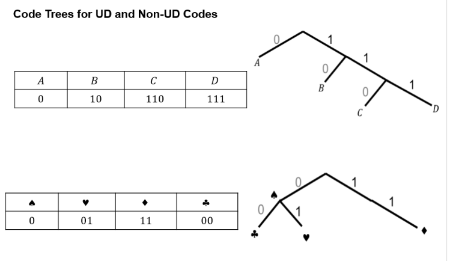
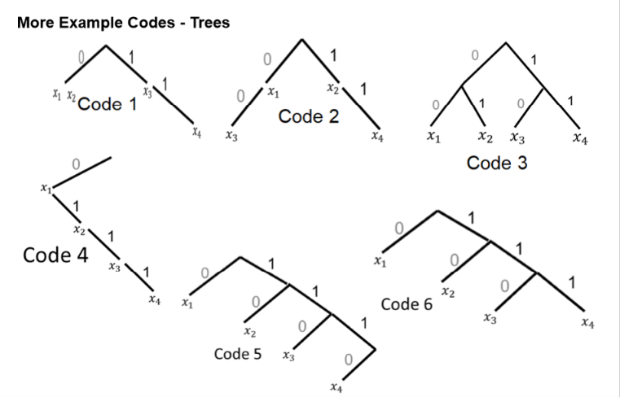
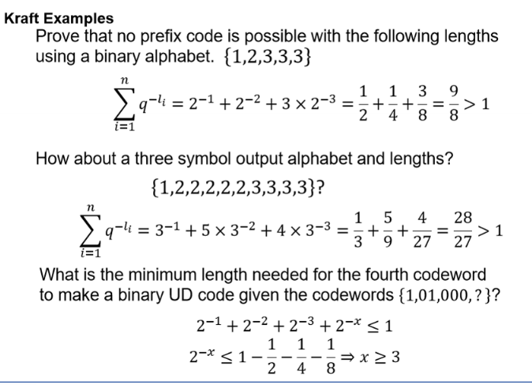
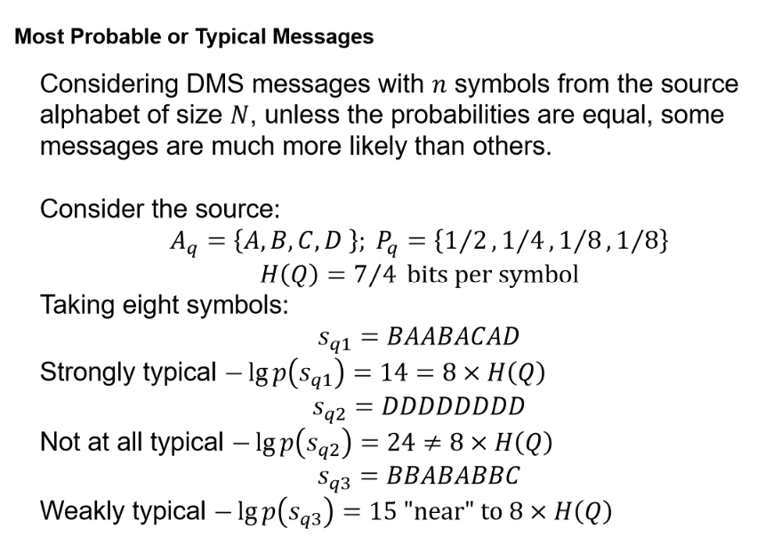

# Source Coding

## Exam Content
- Discrete Information Sources; Strings
- **Codes: UD; Instantaneous; Prefix; Kraft Inequality**
- **Source Coding Theroem**
- **Compression Ratio**
- **Extension of a DMS**
- **Encoding with the Source Coding Theroem**
- Most Probable messages
- Asymptotic Equipartition Property

## Discrete Information Sources
- Discrete information source emits symbols from a finite alphabet
- Each symbol has a probability of occurrence
- Different from random variable s the outcomes need not be numbers

### Discrete Memoryless Source (DMS)
- A discrete information source that emits **statistically independent symbols** from it's alphabet.
- Each symbol is emitted with a fixed probability
- The probability of a sequence of symbols is the product of the probabilities of the individual symbols
  
### Strings
- String $w$ is a finite seuqence of symbols
- Length denoted by $|w|$
- Prefix is a symbol sequence from the start of the string
- Suffix is a symbol sequence from the end of the string

## Codes
Code maps from source outcomes from Alphabet $A$ to another set of strings with a length $l_i$ for symbols of probability $p_i$.
Therefore:

### Mean Length of Code:
$$
\bar{l} = \sum_{i=1}^{n} p_i l_i
$$

### Unique Decoding (UD)
- Codes that every recieved sequence maps to only one possible message sequence.
- Look at code tree and see that tthere are no internal nodes

$$ \bar{l} \geq H(X)$$

### Instantaneous Codes
- Code is decodable as soon as the symbol arrives
- No need to wait for the next symbol to see

### Prefix Codes
- A prefix code has no codes that are prefixies of other codes
- Only leaves are labelled with input symbols
- Therefore uniqiely decodable
- It is better to encode the most probable symbols with the shortest code
  - THis is because the most probable symbols will be used more often, therefore reduce the average length of the code
 

 ### Example Codes:
 
 

### Kraft Inequality
For a set of codewords with lengths for the given q-uary code, the following inequality must hold:
$$
\sum_{i=1}^{n} q^{-l_i}\leq 1
$$

#### Kraft Examples:

#### Choosing Code Word Lengths
Try to make directly proportional with a negative cosntant of proportionality to make legnth positive;
$$
l_i = \lceil -\lg p_i \rceil
$$
Cannot have a fractional code length, so round up to the next integer

## Source Coding Theorem
$$
\frac{H(X)}{\lg q} \leq \bar{l} \leq \frac{H(X)}{\lg q} + 1
$$

Where $q$ is the number of symbols used (binary = 2);

### Relative Entropy
Kullback-Leibler Divergence (?)
$$
D_{KL}(q||p) = \sum_{n} q_n \lg \frac{q_n}{p_n} 
$$
Measure of the **inefficiency** of assume that distributuion is $q_n$ when it is $p_n$.

Therefore set the code lengths to be:
$$
s_n = \lceil -\lg q_n \rceil
$$
For some distribution $q_n$ when the real distribution is $p_n$.

#### Relative Entropy Mean Length
Mean length will be at least:
$$
E[S] = H(X) + D_{KL}(q||p)
$$ 

Or because of the cieling fucntion, it could be one more so:

$$
H(X) + D_{KL}(q||p) \leq E[S] \leq H(X) + D_{KL}(q||p) + 1
$$

### Compression Ratio
Denoted by $\rho$; Often defined in different ways. Most common for mean length $\bar{l}$ and a source with an alphabet of size $M$ (often as a percentage).
$$
\rho = \frac{\bar{l}}{\lg M}
$$

#### Coding Efficiency
Denoted by $\eta$, defined for a code alhpabet of size $q$
$$
\eta = \frac{\text{min}\{\bar{l}\}}{\bar{l} \lg q} = \frac{H(X)}{\bar{l} \lg q}
$$

### Extension of a DMS
- A binary code DMS (discrete memoryless source) $S$ cannot be compressed as 0 -> 0, 1 -> 1 or 0 -> 1, 1 -> 0
- Therefore need to consider symbols of length $n$. ($n^{th}$ extension of $S$)
- EG: $2^{nd} = 00, 01, 10, 11$

#### Extension Probabilities
- Extension probabilies are just product of indidviudal symbol probabilties. 
- 
- (Slide 43 L Source Coding)
- CAn apply chain rule for n sumbols from arbritayr distribution
- But **source is memoryless** 
- So Same prabably for each symbol
- Also also symbols are from the same alphabet, therefore
$$

H_{\text{nth extension}}(S) = n H(S)
$$

#### Compression of Nth Extension
- Lower source coding bound, best we can do is
$$
\rho = \frac{n H(X)}{n} = H(X)
$$

Upper bound, there is a prefix code which aschieves compression ration at least as good as.

$$
\rho = \frac{1 + n H(x)}{n} = \frac{1}{n} + H(X)
$$
The 1/n can be made small by making n big enough. Therefore close to lower bound by taking large extensions

### Most Probable Messages

Lecture Source Coding Slide 55

### Asymptotic Equipartition Property (AEP)
- Captures property linked to most probable messages (slide 56)
- Not massive focus of exam so should proably understand a bit better
