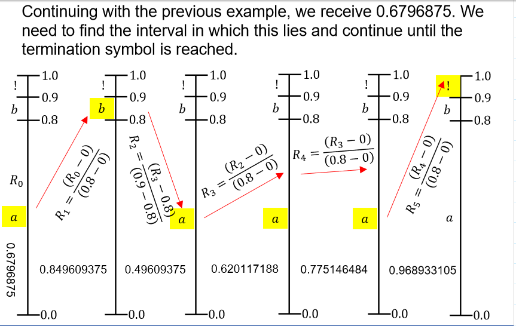
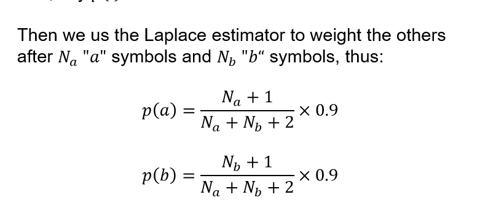

# Symbol and Stream Codes

Topics:
- Introduction
- Lossless Lossy Compression
- Symbol codes and Entropy encoders
- Fano Codes
- Shannon Codes
- **Huffman codes**
- **Arithmetic coding**
- **Obtaining probabilities**
  - **Laplace Estimator**
  - **Maximum Likelihood Estimator**
- **Sources with Memory**
- **Example of Dictionary Codes: Lempel- ZIV**

## Introduction
- Compression motivated by the need to imrpove:
  - Storage efficiency
  - Transmission bandwidth useage
  - Transmission time
- Compression enables more efficient use of exisitng resources, reducing costs

### Lossless Lossy Compression
- Lossless compression
  - No loss of information
  - Can be decompressed to the original data
  - Examples: Text, numeric data, source code
- Lossy compression
  - Loss of information (can be insiginificant details)
  - Cannot be decompressed to the original data
  - Compression ratio: tradeoff between quality and size
  - Examples: Audio, video, images
  

### Symbol codes
- In compressions codes created with expected lengths close to source entropy
- Means in general, codes are used for compression arent uniform

## Entropy Encoders
- Entropy encoders use simple algorithms to construct suitable Unique Decoding (UD) codes.
- Source Coding Tehroem - word k, prob p_k, it's lenght should be:
- $l_k  = - \lg p_k$
- But implementing directly is poor. 
- So use other algorithms

### Fano Code
- Top down approach
- Steps:
  - Arrange symbols in order of decreasing probability
  - Divide ordered list into two parts with the probabilities of each being as close to equal as possible
  - Assign the binary digit 0 to one side and 1 to the other
  - Recurisvily apply steps 2 and 3 until source is coded.
  - 
  

### Shannon Code
- After ordering symbols in fano code, the ith code word with probability p_i is given by:
- $ F_i = \sum_{j=1}^{i-1} p_j$
- **(in binary form)**
- Number of positions in expansion limited to:
- $ l_i = \lceil -\lg p_i \rceil$

### Huffman codes
- Instead built form bottom up
- Steps:
  - Arrange symbols in order of decreasing probability
  - Combine two least proable into new node
  - if there is only one node left, stop Otherwise go to step 1
  - Draw tree and assign binary digits
  -  

- Often better than Shannon codes - Optimal to convey sequence of outcomes from fixed source one symbol at a time
- Disadvantage:
  - To deal with changing probabilities, have to adapt the data - causes problem for all codes
  - Fundemental problem arises with $H(x) \leq \bar{l} \leq H(X) + 1$
  - Overehead between 0 and 1 bit per symbol
  - Given entropy often small, thica n be signficuant - therefore **extending source!**

### Huffman Extension
- For sparsse soruce 
- 
- Leads to artihmetic coding (to be feasible)

#### Obtaining probabilities
- Eg Simple biased coin:
  - p, 1-p
  - $ p = \frac{N_0}{N_0 + N_1}$
  - Maximum Likelihood Estimator (MLE) 
- Maximum a Posteriori (MAP)
  - Applies principle to estime p based on abserved data **and prior assumptions** 
  - $p = \frac{N_o + n_0}{N_0 + N_1 + n_0 + n_1}$
  - n_0, n_1 are imagined flips based on waht we know. Ie: for p = 0.6, 6 zeros and 4 ones. 
  - The larger the n, the slower it will converge when we are wrong.
- Laplace Estimator
  - MAP with n = 1
  - Absance of prior knowledge (assume equal probability)?
  - $p = \frac{N_0 + 1}{N_0 + N_1 + 2}$
 - $1-p = \frac{N_1 + 1}{N_0 + N_1 + 2}$  
 - Can be extented to more outcomes:

##### Laplace Estimator for N outcomes
$$
p_i = \frac{N_i + 1}{\sum_{i=1}^q(N_i + 1)} = \frac{N_i + 1}{\sum_{i=1}^N N_i + q}
$$

### Aritmetic Coding
- Deals with a stream of symbols and uses a probabilistic model
- Possible to use fixed symbol probabilities but arithmatic coding can adapt t osymbols as they arrive.
- Encoder uses model's predictions to create a binary string, and an identical model used at the reciever for decodfing
- 

#### Intervals
- Set of numbers between lower bound and upper bound
- Closed interval: [lower, upper] - inclusive of both bounds
- Open interval: (lower, upper) - exclusive of both bounds
- Half open interval: [lower, upper) - inclusive of lower, exclusive of upper
- Therefore idea of arithmetic coding is to maintain **real interval** that represents the message encoded so far, and whose width is the probability of that message.

#### Algorithm
- Current encoder interval $[LB, UB)$
- Interval for next input symbol $[lb,ub)$ where $ub - lb = p$ (probability of symbol to be encoded) 
- Repeat:
  - New encoder interval is $[LB + (UB - LB) * lb, LB + (UB - LB) * ub)$
  - Update probabilties
- Repeat until all symbols are encoded
- Output any number within the interval

- Code transmitted is binary equivalent of a number that falls in the interval (without zero, decimal point and trailing zeros)
- To convert decminal fractional number to binary, multuply by 2 and take resulatn interger part as next binary digit before discarding
- Need to pick shortest binary number between bounds binary representation
- Needs to have enough bits for ideal arithmetic coder output equation

##### Encoder Operation
- Maintains an interval intially set to [0, 1)
- Source symbols assocoiated with non-overlapping source intervals having widths equal to their probabilities
- Encoder begins wiht an interval equal to the probablility of the first symbol
- The next one is the the width of p1p2.
- Therefore final interval is the product of all the symbols is of width:
  
$$
p_1 p_2 p_3 \cdots p_N = \prod_{i=1}^N p_i
 $$

##### Ideal Arithemtic Coder Output Lenght
$$
l_{out} = \lceil -\lg \prod_{i=1}^N p_i \rceil = \lceil -\sum_{i=1}^N \lg p_i \rceil
$$

##### Arithmetic Decoding
- Keeps track of single real number, R and must determine in which interval this falls.
- Determine interval $[lb_n , ub_n)$ corresponding to current symbol
- Then adjust R
- $R_{n+1} = \frac{R_n - lb_n}{ub_n - lb_n}$
- Where $R_0$ is the number received
- Repeat until all symbols are decoded

#### Arithmetic Wihtout Known Probabilies
- Assume EOL (!) is rare
- Then use laplace estimator to weight the others as letters arrive
- 
- Probabilites wont be correct and length with be at least 1 more than when the probabilites are known
  

## Sources with Memory
- Presence of memoyr can be modelled bt Markov process where the current symbol $s_k$ depends on a finite number of previous symbols
$$ 
P(s_k) = P(X_k = s_k | X_{k-1} = s_{k-1}, X_{k-2} = s_{k-2}, \cdots, X_{k-n} = s_{k-n})
$$

### First Order Markov Source
Described by:
$$
P(s_k) = P(X_k = s_k | X_{k-1} = s_{k-1})
$$
- Two state model:
  - Made from prior probabilities (p0 and p1 - how liekly to be in the state)
  - Transition probabilities (p00, p01, p10, p11 - how likely to go from one state to another)
- 
- See W6 - Slide 61

### Markov Source Entropy
- Source consits of two states with transistion probabilies that are weighhted with their probability of occurance
- Each sate is binary so has binary entropy $H_b(p_{00})$ and $H_b(p_{11})$
- Overall entropy is:
$$
H(X) = p_0 H_b(p_{00}) + p_1 H_b(p_{11})
$$

### Assumed DMS
- If a source is assumed to have DMS, then would be incompressible (entropy 0.999 bits per symbol)
- But if theres clearly patterns in data
- Then can take memory into accoutn and use huffman code to deliver compression

## Dictionary Codes

### Lempel-Ziv
- Dictionary based compression
- Maintains a list of all phrases seen so far and assosciates with pointers
- No transmission of the dictionary as both encoder and decoder maintain directories
- 

#### Algorithm
- Input alphabet
- Get next symbol
- If symbol and word is in directiory, output the word
- Else indext next and save the code pair to directory
- 

#### Exmaple

